# Praxisprojekt Bericht Jonathan Bach

---

## Inhaltsverzeichnis
- [1. Einleitung](#1-einleitung)
  - [1.1 Problemstellung](#11-problemstellung)
  - [1.2 Zielsetzung](#12-zielsetzung)
  - [1.3 Herangehensweise](#13-herangehensweise)
    - [1.3.1 Technologie-Stack](#131-technologie-stack)
    - [1.3.2 Datengrundlage](#132-datengrundlage)
    - [1.3.3 Softwarearchitektur](#133-softwarearchitektur)
    - [1.3.4 Entwicklungsprozess](#134-entwicklungsprozess)

- [2. Grundlagen](#2-grundlagen)
  - [2.1 Finanzmarktgrundlagen](#21-finanzmarktgrundlagen)
    - [2.1.1 Grundlegende Begriffe](#211-grundlegende-begriffe)
    - [2.1.2 Wichtige Finanzkennzahlen](#212-wichtige-finanzkennzahlen)
    - [2.1.3 Zeitreihenanalyse im Finanzkontext](#213-zeitreihenanalyse-im-finanzkontext)
  - [2.2 Machine Learning Grundlagen](#22-machine-learning-grundlagen)
    - [2.2.1 Lernparadigmen](#221-lernparadigmen)
    - [2.2.2 Datenaufteilung und Preprocessing](#222-datenaufteilung-und-preprocessing)
    - [2.2.3 Machine Learning-Algorithmen](#223-machine-learning-algorithmen)
  - [2.3 Large Language Models (LLMs)](#23-large-language-models-llms)
    - [2.3.1 Grundlagen von Large Language Models](#231-grundlagen-von-large-language-models)
    - [2.3.2 Ollama als lokale LLM-Infrastruktur](#232-ollama-als-lokale-llm-infrastruktur)
    - [2.3.3 LLMs im Finanzkontext](#233-llms-im-finanzkontext)

- [3. Datenbeschreibung](#3-datenbeschreibung)
  - [3.1 Datenquellen](#31-datenquellen)
  - [3.2 Datenumfang](#32-datenumfang)
  - [3.3 Datenpipeline und Speicherung](#33-datenpipeline-und-speicherung)
  - [3.4 Datenaufbereitung](#34-datenaufbereitung)
  - [3.5 Datenqualität und Limitationen](#35-datenqualität-und-limitationen)

- [4. Implementierung](#4-implementierung)
  - [4.1 Systemarchitektur und Technologie-Stack](#41-systemarchitektur-und-technologie-stack)
    - [4.1.1 Architekturkonzept](#411-architekturkonzept)
    - [4.1.2 Technologie-Stack](#412-technologie-stack)
    - [4.1.3 Projektstruktur](#413-projektstruktur)
  - [4.2 Dateninfrastruktur](#42-dateninfrastruktur)
    - [4.2.1 Datenbankdesign und -struktur](#421-datenbankdesign-und--struktur)
      - [4.2.1.1 alphavantage.db (Rohdaten)](#4211-alphavantagedb-rohdaten)
      - [4.2.1.2 alphavantage_processed.db (Verarbeitete Daten)](#4212-alphavantage_processeddb-verarbeitete-daten)
      - [4.2.1.3 yfinance.db (Yahoo Finance Daten)](#4213-yfinancedb-yahoo-finance-daten)
      - [4.2.1.4 system_config.db (Persistente Konfiguration)](#4214-system_configdb-persistente-konfiguration)
      - [4.2.1.5 users_database.db (Nutzerdaten)](#4215-users_databasedb-nutzerdaten)
      - [4.2.1.6 Datenbankzugriff via SQLAlchemy](#4216-datenbankzugriff-via-sqlalchemy)
    - [4.2.2 API-Integration](#422-api-integration)
      - [4.2.2.1 Alpha Vantage API (av_connect.py)](#4221-alpha-vantage-api-av_connectpy)
      - [4.2.2.2 Yahoo Finance API (yf_connect.py)](#4222-yahoo-finance-api-yf_connectpy)
    - [4.2.3 Datenverarbeitung (ETL-Pipeline)](#423-datenverarbeitung-etl-pipeline)
      - [4.2.3.1 Alpha Vantage Processing](#4231-alpha-vantage-processing)
      - [4.2.3.2 Daten-Update-Orchestrierung (scheduler.py)](#4232-daten-update-orchestrierung-schedulerpy)
  - [4.3 Backend-Implementierung](#43-backend-implementierung)
    - [4.3.1 Datenbankschicht](#431-datenbankschicht)
      - [4.3.1.1 Zentrale Datenzugriffsschicht (db_functions.py)](#4311-zentrale-datenzugriffsschicht-db_functionspy)
      - [4.3.1.2 Nutzerdatenbank-Verwaltung (users_database.py)](#4312-nutzerdatenbank-verwaltung-users_databasepy)
      - [4.3.1.3 Utility-Funktionen (database_utils.py)](#4313-utility-funktionen-database_utilspy)
    - [4.3.2 Machine Learning Pipeline](#432-machine-learning-pipeline)
    - [4.3.3 LLM-Integration](#433-llm-integration)
      - [4.3.3.1 Verbindungs-Management (llm_functions.py)](#4331-verbindungs-management-llm_functionspy)
    - [4.3.4 Hilfsfunktionen und Konfiguration](#434-hilfsfunktionen-und-konfiguration)
      - [4.3.4.1 Zentrale Datenstrukturen (data_model.py)](#4341-zentrale-datenstrukturen-data_modelpy)
      - [4.3.4.2 Markdown-Content (markdown.py)](#4342-markdown-content-markdownpy)
      - [4.3.4.3 Anwendungsstart (launch.py)](#4343-anwendungsstart-launchpy)
  - [4.4 Frontend-Implementierung](#44-frontend-implementierung)
    - [4.4.1 Streamlit-Architektur](#441-streamlit-architektur)
    - [4.4.2 Seitenstruktur](#442-seitenstruktur)
      - [4.4.2.1 Startseite (Start.py)](#4421-startseite-startpy)
      - [4.4.2.2 Datenmanagement (1 Data.py)](#4422-datenmanagement-1-datapy)
      - [4.4.2.3 Machine Learning (2 Machine Learning.py)](#4423-machine-learning-2-machine-learningpy)
      - [4.4.2.4 LLM Playground (3 LLM Playground.py)](#4424-llm-playground-3-llm-playgroundpy)
      - [4.4.2.5 Assistent (4 Assistant.py)](#4425-assistent-4-assistantpy)
      - [4.4.2.6 Einstellungen (5 Settings.py)](#4426-einstellungen-5-settingspy)
    - [4.4.3 Asset-Management](#443-asset-management)
  - [4.5 Containerisierung und Deployment](#45-containerisierung-und-deployment)
    - [4.5.1 Dockerfile](#451-dockerfile)
    - [4.5.2 Docker Compose](#452-docker-compose)
    - [4.5.3 Dependency Management](#453-dependency-management)
    - [4.5.4 Deployment-Prozess](#454-deployment-prozess)
  - [4.6 Performance](#46-performance)
    - [4.6.1 SQLite-Performance bei großen Datensätzen](#461-sqlite-performance-bei-großen-datensätzen)
    - [4.6.2 Streamlit Session State vs. Persistenz](#462-streamlit-session-state-vs-persistenz)
    - [4.6.3 LLM-Integration: Modellgröße vs. Hardware](#463-llm-integration-modellgröße-vs-hardware)
  - [4.7 Code-Qualität und Wartbarkeit](#47-code-qualität-und-wartbarkeit)
    - [4.7.1 Error Handling](#471-error-handling)
    - [4.7.2 Code-Dokumentation](#472-code-dokumentation)
    - [4.7.3 Modularität und Wiederverwendbarkeit](#473-modularität-und-wiederverwendbarkeit)

- [5. Resultate (Dashboard)](#5-resultate-dashboard)
  - [5.1 Ergebnisübersicht: Was ist entstanden?](#51-ergebnisübersicht-was-ist-entstanden)
  - [5.2 Nutzererlebnis: Einstieg und typischer User Flow](#52-nutzererlebnis-einstieg-und-typischer-user-flow)
    - [5.2.1 Erster Einstieg (Onboarding)](#521-erster-einstieg-onboarding)
    - [5.2.2 Navigationsprinzip und Seitenübersicht](#522-navigationsprinzip-und-seitenübersicht)
    - [5.2.3 Typischer Arbeitsablauf](#523-typischer-arbeitsablauf)
  - [5.3 Data-Seite: Analyse- und Datenmanagement als Dashboard-Erlebnis](#53-data-seite-analyse--und-datenmanagement-als-dashboard-erlebnis)
    - [5.3.1 Sidebar: Kontrollpanel für Datenupdates und Datenimport](#531-sidebar-kontrollpanel-für-datenupdates-und-datenimport)
    - [5.3.2 Analyse-Tab: Interaktive Exploration einzelner Symbole](#532-analyse-tab-interaktive-exploration-einzelner-symbole)
    - [5.3.3 Compared Stock Analysis: Mehrfachvergleich im selben Dashboard](#533-compared-stock-analysis-mehrfachvergleich-im-selben-dashboard)
    - [5.3.4 Tab „Data Settings": Transparenz über Datenhaltung](#534-tab-data-settings-transparenz-über-datenhaltung)
  - [5.4 Machine Learning Studio: Ergebnisorientiertes Training im Dashboard](#54-machine-learning-studio-ergebnisorientiertes-training-im-dashboard)
    - [5.4.1 Sidebar als Trainings-Konsole](#541-sidebar-als-trainings-konsole)
    - [5.4.2 Hauptfläche: Datenkontrolle und Modellbildung](#542-hauptfläche-datenkontrolle-und-modellbildung)
    - [5.4.3 Ergebnisdarstellung: Metriken und Visualisierung](#543-ergebnisdarstellung-metriken-und-visualisierung)
    - [5.4.4 Modell-Speicherung und Saved Models](#544-modell-speicherung-und-saved-models)
  - [5.5 LLM Playground: Datenbasierte Analyse als Text-Resultat](#55-llm-playground-datenbasierte-analyse-als-text-resultat)
    - [5.5.1 Sidebar: Ollama-Konfiguration und Datenquelle](#551-sidebar-ollama-konfiguration-und-datenquelle)
    - [5.5.2 Hauptfläche: Feature/Target-Auswahl und Analysekonfiguration](#552-hauptfläche-featuretarget-auswahl-und-analysekonfiguration)
    - [5.5.3 Analyse starten und Ergebnisdarstellung](#553-analyse-starten-und-ergebnisdarstellung)
  - [5.6 Assistant: Nutzerunterstützung als Dashboard-Komponente](#56-assistant-nutzerunterstützung-als-dashboard-komponente)
    - [5.6.1 Funktionsumfang und Interaktion](#561-funktionsumfang-und-interaktion)
    - [5.6.2 Chat-Interface](#562-chat-interface)
    - [5.6.3 Typische Use Cases](#563-typische-use-cases)
  - [5.7 Settings: Konfiguration als Ergebnis für Wartbarkeit und Steuerbarkeit](#57-settings-konfiguration-als-ergebnis-für-wartbarkeit-und-steuerbarkeit)
    - [5.7.1 Strukturierung in Expander-Bereiche](#571-strukturierung-in-expander-bereiche)
    - [5.7.2 Global Settings](#572-global-settings)
    - [5.7.3 Data Settings](#573-data-settings)
    - [5.7.4 Machine Learning Settings](#574-machine-learning-settings)
    - [5.7.5 Assistant Settings](#575-assistant-settings)
  - [5.8 Zusammenfassung der Ergebnisse und Bewertung aus Nutzersicht](#58-zusammenfassung-der-ergebnisse-und-bewertung-aus-nutzersicht)
    - [5.8.1 Erreichte Anforderungen](#581-erreichte-anforderungen)
    - [5.8.2 Stärken des Dashboards aus Nutzersicht](#582-stärken-des-dashboards-aus-nutzersicht)
    - [5.8.3 Ergebnischarakter](#584-ergebnischarakter)
  - [5.9 Beispielworkflow: Analyse einer Aktie aus Nutzersicht](#59-beispielworkflow-analyse-einer-aktie-aus-nutzersicht)
    - [5.9.1 Ausgangssituation und Zielsetzung](#591-ausgangssituation-und-zielsetzung)
    - [5.9.2 Start und initiale Konfiguration](#592-start-und-initiale-konfiguration)
    - [5.9.3 Datenbeschaffung und -vorbereitung](#593-datenbeschaffung-und--vorbereitung)
    - [5.9.4 Explorative Datenanalyse](#594-explorative-datenanalyse)
    - [5.9.5 Vergleichende Aktienanalyse](#595-vergleichende-aktienanalyse)
    - [5.9.6 Machine Learning-basierte Analyse](#596-machine-learning-basierte-analyse)
    - [5.9.7 LLM-gestützte Finanzanalyse](#597-llm-gestützte-finanzanalyse)
    - [5.9.8 Interaktive Hilfestellung durch den Assistenten](#598-interaktive-hilfestellung-durch-den-assistenten)
    - [5.9.9 Zusammenfassung und Erkenntnisgewinn](#599-zusammenfassung-und-erkenntnisgewinn)
  - [5.10 Workflow-Grafik](#510-workflow-grafik)

- [6. Diskussion](#6-diskussion)
  - [6.1 Interpretation der Resultate: Zielerreichung und Funktionsumfang](#61-interpretation-der-resultate-zielerreichung-und-funktionsumfang)
    - [6.1.1 Übergeordnetes Projektziel](#611-übergeordnetes-projektziel)
    - [6.1.2 Erreichte Kernergebnisse](#612-erreichte-kernergebnisse)
    - [6.1.3 Gesamtbewertung der Zielerreichung](#613-gesamtbewertung-der-zielerreichung)
    - [6.1.4 Abgrenzung zu kommerziellen Lösungen](#614-abgrenzung-zu-kommerziellen-lösungen)
  - [6.2 Threats to Validity: Limitationen und Einschränkungen](#62-threats-to-validity-limitationen-und-einschränkungen)
    - [6.2.1 Datenqualität und -verfügbarkeit](#621-datenqualität-und--verfügbarkeit)
    - [6.2.2 Machine Learning Methodik](#622-machine-learning-methodik)
    - [6.2.3 LLM-Integration](#623-llm-integration)
    - [6.2.4 Performance und Skalierbarkeit](#624-performance-und-skalierbarkeit)
    - [6.2.5 Usability und Fehleranfälligkeit](#625-usability-und-fehleranfälligkeit)
    - [6.2.6 Relationale Datenbank vs. Dokumentenbasierte Alternativen](#626-relationale-datenbank-vs.-dokumentenbasierte-alternativen)
    - [6.2.7 Zusammenfassung der Threats to Validity](#627-zusammenfassung-der-threats-to-validity)
  - [6.3 Ausblick und Verbesserungspotenziale](#63-ausblick-und-verbesserungspotenziale)
- [7. Fazit der Diskussion und Abschluss](#7-fazit-der-diskussion-und-abschluss)

- [Literatur](#literatur)

---

# 1. Einleitung

### 1.1 Problemstellung

Die Analyse von Aktien und anderen Anlagemöglichkeiten stellt für viele Privatanleger eine erhebliche Herausforderung dar. Insbesondere Einsteiger stoßen auf mehrere grundlegende Probleme:

Erstens fehlt es häufig an einer fundierten Datengrundlage und dem notwendigen Fachwissen, um fundierte Investitionsentscheidungen zu treffen. Die Komplexität der Finanzmärkte und die Vielzahl verfügbarer Kennzahlen überfordern unerfahrene Anleger und erschweren den Einstieg in die eigenständige Aktienanalyse.

Zweitens werden zunehmend Large Language Models (LLMs) für finanzielle Entscheidungen und Investitionsempfehlungen herangezogen, ohne dass ein systematischer Vergleich mit etablierten quantitativen Analysemethoden vorliegt. Es besteht ein Bedarf, die Leistungsfähigkeit von LLMs im Vergleich zu traditionellen Machine Learning-Algorithmen im Kontext der Finanzmarktanalyse zu evaluieren.

Drittens mangelt es vielen Interessierten an Kenntnissen über die Implementierung und Anwendung von Machine Learning-Algorithmen für die Analyse von Finanzdaten. Die technische Einstiegshürde verhindert, dass potenzielle Nutzer von den Möglichkeiten moderner Analysemethoden profitieren können.

### 1.2 Zielsetzung

Ziel dieses Praxisprojekts ist die Entwicklung einer webbasierten Analyseplattform, die Nutzern einen niedrigschwelligen Zugang zur datengestützten Aktienanalyse ermöglicht. Die Plattform verfolgt folgende Kernziele:

1. **Datenintegration und -bereitstellung**: Implementierung einer Funktionalität zum automatisierten Download und zur Verwaltung von Finanzdaten, um Nutzern eine solide Datengrundlage für ihre Analysen zu bieten.

2. **Standardisierte Finanzanalyse**: Bereitstellung grundlegender Analysewerkzeuge und Kennzahlen, die eine erste Bewertung von Aktien ohne tiefgreifende Vorkenntnisse ermöglichen.

3. **Machine Learning-Integration**: Implementierung vorgefertigter Machine Learning-Algorithmen, die es Nutzern erlauben, sowohl heruntergeladene Finanzdaten als auch eigene Datensätze zu trainieren und auszuwerten, ohne selbst Programmierkenntnisse besitzen zu müssen.

4. **Vergleichende Evaluation von Analysemethoden**: Entwicklung einer Funktionalität zum Training und Vergleich von traditionellen Machine Learning-Modellen und Large Language Models auf identischen Datensätzen. Dabei soll insbesondere die Möglichkeit geschaffen werden, zusätzliches Kontextwissen (z.B. politische Informationen) in die LLM-Analyse zu integrieren.

5. **Nutzerunterstützung durch Conversational AI**: Integration eines Chatbot-basierten Sprachassistenten, der Nutzer bei der Bedienung der Plattform unterstützt und den Umgang mit den verschiedenen Analysewerkzeugen erleichtert.

Durch die Kombination dieser Komponenten soll eine Plattform entstehen, die sowohl als Lernumgebung für Einsteiger als auch als praktisches Analysewerkzeug für fortgeschrittene Nutzer dient und gleichzeitig einen empirischen Vergleich verschiedener Analysemethoden im Finanzkontext ermöglicht. Die Plattform wird auf Englisch bereitgestellt, da Englisch die führende Sprache in Wirtschaft und Finanzwesen ist und so eine breite, internationale Nutzung ermöglicht.

### 1.3 Herangehensweise

Die Entwicklung der Analyseplattform erfolgt in einem iterativen Prozess und basiert auf einer modularen Softwarearchitektur, die eine klare Trennung zwischen Frontend, Backend und Datenverarbeitung gewährleistet.

#### 1.3.1 Technologie-Stack

Für die Realisierung des Projekts wird ein moderner Technologie-Stack eingesetzt:

- **Frontend**: Das Benutzerinterface wird mit Streamlit implementiert, einem Framework für die schnelle Entwicklung von datenorientierten Webanwendungen in Python. Dies ermöglicht eine intuitive Bedienoberfläche ohne umfangreiche Webentwicklungskenntnisse.

- **Datenvisualisierung**: Zur grafischen Darstellung von Finanzdaten und Analyseergebnissen wird Plotly verwendet, das interaktive und professionelle Visualisierungen ermöglicht.

- **Machine Learning**: Für die Implementierung der Machine Learning-Algorithmen dient Scikit-Learn als primäres Framework, das eine breite Palette standardisierter Algorithmen und Werkzeuge für das Training und die Evaluation von Modellen bereitstellt.

- **Large Language Model Integration**: Die LLM-Funktionalität wird über Ollama realisiert, das sowohl lokal auf dem System des Nutzers als auch in einem Docker-Container betrieben werden kann.

- **Deployment**: Die gesamte Anwendung wird als Docker-Container bereitgestellt, um Plattformunabhängigkeit und eine unkomplizierte Installation ohne manuelle Konfiguration von Abhängigkeiten zu gewährleisten. Der Quellcode wird über GitHub versioniert und öffentlich zugänglich gemacht.

#### 1.3.2 Datengrundlage

Die Plattform integriert Finanzdaten aus zwei Hauptquellen:

1. **Alpha Vantage API**: Ermöglicht den Zugriff auf umfassende Finanzdaten und erfordert einen individuellen API-Schlüssel, den Nutzer (eingeschränkt) kostenlos beziehen können.

2. **Yahoo Finance API**: Dient als ergänzende, frei zugängliche Datenquelle für historische und aktuelle Marktdaten.

Die verfügbaren Daten umfassen:
- **OHLCV-Daten** (Open, High, Low, Close, Volume) für historische Kursentwicklungen
- **Unternehmensmetriken** wie Kennzahlen zur Fundamentalanalyse
- **Aktuelle Preisinformationen**, die auf Abruf aktualisiert werden können
- **Nutzerdefinierte Datensätze**, die Anwender für eigene Analysen hochladen können

#### 1.3.3 Softwarearchitektur

Das Projekt folgt einer klaren Strukturierung in Frontend und Backend:

- **Backend**: Umfasst die Datenverarbeitungslogik, Datenbankanbindungen, API-Services und die Implementierung der Machine Learning-Algorithmen. Diese Komponenten sind modular aufgebaut und voneinander entkoppelt, um Wartbarkeit und Erweiterbarkeit zu gewährleisten.

- **Frontend**: Das Streamlit-basierte Dashboard greift auf die Backend-Funktionen zu und stellt die Ergebnisse benutzerfreundlich dar.

- **Datenverwaltung**: Alle persistenten Daten werden strukturiert in einem dedizierten Data-Ordner gespeichert, wobei eine Datenbankstruktur die effiziente Verwaltung und Abfrage von Finanzdaten ermöglicht.

#### 1.3.4 Entwicklungsprozess

Die Implementierung erfolgt in folgenden Schritten:

1. **Datenschicht**: Aufbau der Datenbankstruktur und Implementierung der API-Anbindungen für den automatisierten Datenimport.

2. **Backend-Funktionalität**: Entwicklung der Datenverarbeitungslogik und Implementierung der Machine Learning-Algorithmen sowie der LLM-Integration.

3. **Frontend-Entwicklung**: Gestaltung des Streamlit-Dashboards mit Zugriff auf alle Backend-Funktionen und intuitive Nutzerführung.

4. **Integration und Testing**: Verbindung aller Komponenten und Sicherstellung der Funktionalität über verschiedene Deployment-Szenarien (lokal, Docker-Container).

--- 

# 2. Grundlagen

Der folgende Abschnitt beschreibt die theoretischen und fachlichen Grundlagen, die für das Verständnis dieses Projektes notwendig sind. Dabei werden sowohl finanzwirtschaftliche Konzepte als auch technische Grundlagen erläutert, die in der Implementierung der Analyseplattform zur Anwendung kommen.

### 2.1 Finanzmarktgrundlagen

Da diese Plattform auf die Analyse von Finanzdaten ausgelegt ist, ist ein grundlegendes Verständnis zentraler Begriffe und Konzepte der Finanzwirtschaft erforderlich. Die nachfolgend erläuterten Begriffe und Kennzahlen bilden die Basis für die im Dashboard implementierten Analysefunktionen und werden sowohl für grundlegende Datenvisualisierungen als auch als Input für Machine Learning-Algorithmen verwendet.

#### 2.1.1 Grundlegende Begriffe

**OHLCV-Daten**

OHLCV steht für "Open, High, Low, Close, Volume" und bezeichnet die fundamentalen Preisdaten, die die Kursentwicklung einer Aktie innerhalb eines definierten Zeitraums beschreiben. Diese Datenstruktur ist der Standard für die Darstellung von Kursbewegungen an Finanzmärkten:

- **Open**: Der Eröffnungskurs der Aktie zu Beginn der betrachteten Zeitperiode
- **High**: Der höchste Kurs, den die Aktie während der Zeitperiode erreicht hat
- **Low**: Der niedrigste Kurs, den die Aktie während der Zeitperiode erreicht hat
- **Close**: Der Schlusskurs der Aktie am Ende der Zeitperiode
- **Volume**: Die Anzahl der gehandelten Aktien während der Zeitperiode

Diese Datenpunkte werden typischerweise in Form von Candlestick-Charts (Kerzencharts) visualisiert, die eine kompakte Darstellung der Kursbewegungen ermöglichen (Murphy, 1999). OHLCV-Daten bilden die Grundlage für technische Analysen und sind essenziell für die Anwendung von Machine Learning-Algorithmen auf Finanzzeitreihen.

**Aktien**

Aktien (englisch: Stocks oder Shares) sind Unternehmensanteile, die von Kapitalgesellschaften ausgegeben und an Börsen gehandelt werden. *Wenn ein Unternehmen selbst neue Aktien ausgibt und an Investoren verkauft, geschieht dies über den Primärmarkt. Nach dieser ersten Transaktion zwischen den Unternehmen und den Investoren werden die Aktien am Sekundärmarkt unter den Investoren gehandelt, und zwar ohne Mitwirken der Aktiengesellschaft. Wenn man beispielsweise 100 Aktien von Starbucks Coffee kaufen möchte, platziert man eine Order an einer Börse, an der Starbucks unter dem Tickersymbol SBUX gehandelt wird. Man würde die Aktien von jemandem erwerben, der bereits Aktien von Starbucks hält, und nicht von Starbucks selbst.* (Berk & DeMarzo, 2015, S. 32).

Für die vorliegende Plattform sind insbesondere die am Sekundärmarkt gehandelten Aktien relevant, da die verwendeten APIs historische und aktuelle Kursdaten dieser Sekundärmarkttransaktionen bereitstellen.

**Ticker-Symbole**

Ticker-Symbole (oder kurz: Tickers) sind standardisierte Abkürzungen, die zur eindeutigen Identifikation von Wertpapieren an Börsen verwendet werden. Diese Kürzel ermöglichen eine effiziente Referenzierung und Abfrage von Finanzdaten über APIs. Beispiele für Ticker-Symbole sind AMZN (Amazon), GOOGL (Alphabet/Google) oder MSFT (Microsoft). Die Verwendung von Ticker-Symbolen ist zentral für die Datenbeschaffung in dieser Plattform, da sowohl die Alpha Vantage API als auch die Yahoo Finance API Ticker-Symbole als primären Identifikator verwenden.

**Adjusted Close**

Der bereinigte Schlusskurs (Adjusted Close) ist eine Modifikation des regulären Schlusskurses, die Kursanpassungen aufgrund von Dividendenausschüttungen, Aktiensplits und anderen Kapitalmaßnahmen berücksichtigt. Diese Bereinigung ist für historische Analysen von großer Bedeutung, da sie eine verzerrungsfreie Betrachtung der tatsächlichen Wertentwicklung ermöglicht (Yahoo Finance, 2024). Für Machine Learning-Anwendungen wird daher empfohlen, Adjusted Close-Werte anstelle der nominalen Schlusskurse zu verwenden, um Modellverzerrungen zu vermeiden.

#### 2.1.2 Wichtige Finanzkennzahlen

Finanzielle Kennzahlen (Key Performance Indicators, KPIs) dienen der quantitativen Bewertung von Unternehmen und werden sowohl in der Fundamentalanalyse als auch als Features für Machine Learning-Modelle eingesetzt.

**Marktkapitalisierung (Market Capitalization)**

Die Marktkapitalisierung gibt den Börsenwert eines Unternehmens an. *Der Unternehmenswert von börsennotierten Unternehmen zeigt sich im Börsenwert (auch Marktkapitalisierung genannt), der dem Gesamtwert aller börsennotierten Aktien der Aktiengesellschaft entspricht* (Amely & Immenkötter, 2023). 

Die Berechnung erfolgt nach der Formel:

**Marktkapitalisierung = Aktienkurs × Anzahl ausstehender Aktien**

Die Marktkapitalisierung dient als Indikator für die Unternehmensgröße und wird häufig zur Kategorisierung von Aktien verwendet (Large-Cap, Mid-Cap, Small-Cap).

**Kurs-Gewinn-Verhältnis (KGV / P/E Ratio)**

*Das Kurs-Gewinn-Verhältnis (KGV), oder auch Price-Earnings-Ratio (PER), ist der am häufigsten verwendete Multiplikator. Es setzt die Marktkapitalisierung ins Verhältnis zum Jahresüberschuss beziehungsweise – auf eine Aktie bezogen – den Aktienkurs zum Gewinn je Aktie. Das KGV sagt aus, mit dem Wievielfachen des Gewinns ein Unternehmen an der Börse gehandelt wird. Das KGV teilt also Aktionären mit, wie viele Jahre das Unternehmen den angesetzten Gewinn erwirtschaften und ausschütten müsste, bis sie ihren Kaufpreis wieder »reinbekommen«* (Amely & Immenkötter, 2023).

Die Interpretation des KGV ist kontextabhängig: Ein hohes KGV kann auf hohe Wachstumserwartungen hindeuten, während ein niedriges KGV eine Unterbewertung oder geringe Wachstumsaussichten signalisieren kann.

**Kurs-Buchwert-Verhältnis (Price-to-Book Ratio, P/B)**

Das Kurs-Buchwert-Verhältnis vergleicht den aktuellen Börsenkurs einer Aktie mit ihrem bilanziellen Buchwert (Eigenkapital pro Aktie). Die Interpretation erfolgt wie folgt:

- **P/B ≈ 1**: Der Markt bewertet das Unternehmen etwa zu seinem bilanziellen Eigenkapitalwert
- **P/B > 1**: Der Markt erwartet einen Mehrwert durch immaterielle Faktoren wie Markenwert, Wachstumspotenzial oder hohe Profitabilität
- **P/B < 1**: Kann auf eine Unterbewertung, operative Probleme oder bilanzielle Besonderheiten hindeuten

Es ist zu beachten, dass der Buchwert stark von Bilanzierungsvorschriften abhängt und insbesondere bei wissensintensiven Unternehmen mit hohen immateriellen Vermögenswerten weniger aussagekräftig sein kann (Damodaran, 2012).

**Eigenkapitalrendite (Return on Equity, ROE)**

Die Eigenkapitalrendite gibt an, wie effizient ein Unternehmen das eingesetzte Eigenkapital verzinst. Ein höherer ROE indiziert eine höhere Profitabilität im Verhältnis zum Eigenkapital. Die Berechnung erfolgt nach:

**ROE = (Jahresüberschuss / Eigenkapital) × 100%**

Der ROE ist eine zentrale Kennzahl zur Bewertung der Rentabilität und wird häufig im Branchenvergleich herangezogen (Eayrs et al., 2011; Investopedia, 2024a).

**Gewinnmarge (Profit Margin)**

Die Gewinnmarge gibt an, welcher Anteil des Umsatzes als Gewinn verbleibt, nachdem alle Kosten berücksichtigt wurden. Sie wird typischerweise in Prozent ausgedrückt und berechnet sich als:

**Gewinnmarge = (Nettogewinn / Umsatz) × 100%**

Je nach Betrachtung kann zwischen verschiedenen Gewinnmargen unterschieden werden: Bruttogewinnmarge (Gross Margin), operative Gewinnmarge (Operating Margin) und Nettogewinnmarge (Net Profit Margin). Höhere Gewinnmargen deuten auf eine effiziente Kostenstruktur und starke Preissetzungsmacht hin (Investopedia, 2024b).

**Beta-Faktor**

Der Beta-Faktor misst die systematische Volatilität einer Aktie im Verhältnis zu einem Referenzmarkt oder Index. Die Interpretation erfolgt wie folgt:

- **Beta = 1**: Die Aktie schwankt im Durchschnitt genau wie der Referenzindex
- **Beta > 1**: Die Aktie weist höhere Volatilität auf und reagiert stärker auf Marktbewegungen (höheres Risiko)
- **Beta < 1**: Die Aktie ist weniger volatil als der Markt (defensiver Charakter)

*Ein Beta-Faktor (auch kurz Beta oder β) gibt an, wie stark die Aktie im Vergleich zum Markt beziehungsweise zu einem Index schwankt. Man sagt auch, er misst also die Schwankungsintensität (Volatilität) einer Aktie im Vergleich zu einem Index. Hat eine Aktie ein Beta von 1, so verhält sie sich genau wie der Index. Ist das Beta größer als 1, so reagiert die Aktie stärker als der Index. Bei einem Beta zwischen 0 und 1 würde die Aktie auch steigen, wenn der Markt an Wert gewinnt. Der Kursanstieg der Aktie wäre jedoch nicht so groß. Bei einem negativen Beta verhalten sich Index und Aktie gegenläufig: Wenn der Index steigt, verliert die Aktie an Wert und anders herum. Diesen Fall werden Sie aber nur sehr selten antreffen. Beta-Faktoren werden aus der Historie abgeleitet. Sie geben also wieder, wie sich die Aktie in der Vergangenheit im Vergleich zum Markt verhalten hat. Das bedeutet aber nicht, dass dies in Zukunft genauso sein muss* (Amely & Immenkötter, 2023).

Wichtig zu beachten ist, dass der Beta-Faktor vom gewählten Referenzindex, der Branchenzugehörigkeit des Unternehmens und dem betrachteten Zeitraum abhängt. Für Machine Learning-Anwendungen kann Beta als Feature zur Risikoquantifizierung genutzt werden.

#### 2.1.3 Zeitreihenanalyse im Finanzkontext

Finanzdaten weisen typischerweise eine zeitliche Struktur auf, wodurch Zeitreihenanalysemethoden für ihre Verarbeitung besonders relevant sind. Aktienkurse, Handelsvolumina und Finanzkennzahlen werden in regelmäßigen Intervallen erfasst und bilden somit Zeitreihen, deren Analyse spezifische statistische und algorithmische Ansätze erfordert.

Zeitreihenprognosen gehören zu den klassischen Anwendungsfällen des Machine Learning im Finanzbereich. *Eine weitere verbreitete Anwendung ist die Vorhersage von Zeitreihen (wie etwa Aktienkursen)* (Müller & Guido, 2017). Die Besonderheit von Finanzzeitreihen liegt in ihrer Nicht-Stationarität, ihrer hohen Volatilität und der Präsenz von Autokorrelationen, die bei der Modellierung berücksichtigt werden müssen (Box et al., 2015).

Für die vorliegende Plattform sind insbesondere folgende Aspekte der Zeitreihenanalyse relevant:

- **Historische Datenmuster**: Die Identifikation von Trends, Saisonalität und zyklischen Mustern in historischen Kursdaten
- **Feature Engineering**: Die Ableitung zeitabhängiger Features wie gleitende Durchschnitte, Momentum-Indikatoren oder Volatilitätsmaße
- **Sequenzielle Datenverarbeitung**: Die Berücksichtigung der zeitlichen Reihenfolge bei der Modellierung, insbesondere bei der Aufteilung in Trainings- und Testdaten

Diese Konzepte bilden die Grundlage für die Implementierung sowohl der traditionellen Machine Learning-Algorithmen als auch der LLM-basierten Analysen in der Plattform.

Hier ist die überarbeitete und erweiterte Version des Machine Learning-Abschnitts:

---

### 2.2 Machine Learning Grundlagen

Machine Learning (maschinelles Lernen) bezeichnet Verfahren, bei denen Computer aus Daten lernen, ohne explizit programmiert zu werden. Für die vorliegende Plattform sind sowohl die grundlegenden Konzepte des maschinellen Lernens als auch spezifische Algorithmen relevant, die zur Analyse und Prognose von Finanzdaten eingesetzt werden.

#### 2.2.1 Lernparadigmen

**Supervised Learning (Überwachtes Lernen)**

Beim überwachten Lernen wird ein Modell mit bereits gelabelten Daten trainiert, das heißt, zu jedem Eingabedatenpunkt existiert eine bekannte Zielgröße (Label). Das Modell lernt die Beziehung zwischen Eingabemerkmalen und Zielgröße und kann anschließend Vorhersagen für neue, unbekannte Daten treffen (Müller & Guido, 2017). Diese Trainingsmethode eignet sich besonders für Regressionsaufgaben (z.B. Kursprognosen) und Klassifikationsaufgaben (z.B. Auf-/Abwärtsbewegungen von Aktienkursen).

Im Kontext dieser Plattform werden überwachte Lernverfahren eingesetzt, um historische Finanzdaten mit bekannten Kursentwicklungen zu nutzen, um zukünftige Entwicklungen vorherzusagen.

**Unsupervised Learning (Unüberwachtes Lernen)**

Im Gegensatz zum überwachten Lernen erhält das Modell beim unüberwachten Lernen keine vorgegebenen Labels. Stattdessen versucht der Algorithmus, eigenständig Strukturen und Muster in den Daten zu identifizieren (Müller & Guido, 2017). Typische Anwendungen sind Clustering-Verfahren, bei denen Datenpunkte nach Ähnlichkeit gruppiert werden, oder Dimensionsreduktionsverfahren zur Extraktion relevanter Features.

Für Finanzanalysen kann unüberwachtes Lernen beispielsweise zur Gruppierung ähnlicher Aktien nach Verhaltensmustern oder zur Identifikation anomaler Marktbewegungen genutzt werden.

#### 2.2.2 Datenaufteilung und Preprocessing

**Trainings-, Validierungs- und Testdaten**

Eine zentrale Praxis im Machine Learning ist die Aufteilung des verfügbaren Datensatzes in separate Teilmengen. Die **Trainingsdaten** (typischerweise 60-80% des Gesamtdatensatzes) dienen zum Training des Modells. Die **Testdaten** (20-40%) werden ausschließlich zur finalen Evaluation verwendet und bleiben dem Modell während des Trainings unbekannt (Hastie et al., 2009).

Diese strikte Trennung ist essentiell, um Data Leakage zu vermeiden – ein Phänomen, bei dem Informationen aus den Testdaten unbeabsichtigt in den Trainingsprozess einfließen und somit zu überschätzten Leistungsmetriken führen. Für Zeitreihendaten, wie sie bei Finanzdaten vorliegen, ist zusätzlich zu beachten, dass die zeitliche Reihenfolge bei der Aufteilung gewahrt bleiben muss: Trainingsdaten stammen aus einem früheren Zeitraum als Testdaten, um realistische Prognoseszenarien zu simulieren.

**Feature-Skalierung**

Merkmale (Features) in Datensätzen können stark unterschiedliche Wertebereiche aufweisen. Während beispielsweise das Handelsvolumen einer Aktie in Millionen gemessen wird, können prozentuale Renditen im Bereich von wenigen Dezimalpunkten liegen. Diese Heterogenität kann die Konvergenz vieler Machine Learning-Algorithmen verlangsamen oder zu suboptimalen Ergebnissen führen (Géron, 2019).

Feature-Skalierung adressiert dieses Problem durch Transformation aller Merkmale in einen einheitlichen Wertebereich, typischerweise [0, 1] bei Min-Max-Skalierung oder auf Standardnormalverteilung (Mittelwert 0, Standardabweichung 1) bei Standardisierung. Dies ermöglicht eine schnellere Konvergenz und verbesserte Modellperformance, insbesondere bei distanzbasierten Algorithmen und neuronalen Netzen.

**Overfitting und Underfitting**

Ein fundamentales Problem beim maschinellen Lernen ist das Finden der Balance zwischen Modellkomplexität und Generalisierungsfähigkeit. **Overfitting** (Überanpassung) tritt auf, wenn ein Modell die Trainingsdaten zu genau lernt, einschließlich Rauschen und zufälliger Schwankungen, wodurch es auf neuen Daten schlecht abschneidet. Das Modell hat die spezifischen Beispiele "auswendig gelernt", statt allgemeine Muster zu erkennen (Müller & Guido, 2017).

**Underfitting** (Unteranpassung) hingegen liegt vor, wenn ein Modell zu einfach ist, um die zugrundeliegenden Strukturen in den Daten zu erfassen. Es generalisiert zwar gut, aber mit schlechter Gesamtperformance, da es selbst auf den Trainingsdaten keine ausreichende Genauigkeit erreicht.

Die Herausforderung besteht darin, ein Modell zu entwickeln, das komplex genug ist, um relevante Muster zu erkennen, aber nicht so komplex, dass es auf trainingsspezifische Besonderheiten überreagiert. Regularisierungstechniken, Cross-Validation und die Überwachung von Trainings- und Validierungsmetriken helfen, dieses Gleichgewicht zu finden.

#### 2.2.3 Machine Learning-Algorithmen

Im Folgenden werden die in der Plattform implementierten Machine Learning-Algorithmen erläutert, die zur Analyse von Finanzdaten eingesetzt werden.

**Lineare Regression**

Die lineare Regression ist ein grundlegendes Regressionsverfahren, das versucht, eine lineare Beziehung zwischen Eingabemerkmalen und einer kontinuierlichen Zielgröße zu modellieren. *Lineare Modelle zur Regression lassen sich als Regressionsmodelle beschreiben, bei denen die Vorhersage bei einem Merkmal eine Gerade ist, bei zwei Merkmalen ist sie eine Ebene und bei mehr Dimensionen eine Hyperebene* (Müller & Guido, 2017).

Obwohl die Annahme linearer Zusammenhänge restriktiv erscheinen mag, können lineare Modelle bei hochdimensionalen Datensätzen mit vielen Features erstaunlich leistungsfähig sein. *Insbesondere wenn Sie mehr Merkmale als Trainingsdatenpunkte haben, lässt sich jede Zielgröße y ausgezeichnet als lineare Funktion modellieren (auf den Trainingsdaten)* (Müller & Guido, 2017). Im Finanzkontext wird lineare Regression häufig zur Trendidentifikation und als Baseline-Modell für komplexere Verfahren verwendet.

**Decision Tree (Entscheidungsbaum)**

Entscheidungsbäume sind hierarchische Modelle, die auf einer Sequenz von binären Entscheidungen basieren. *Entscheidungsbäume sind weitverbreitete Modelle für Klassifikations- und Regressionsaufgaben. Im Wesentlichen erlernen sie eine hierarchische Folge von Ja/Nein-Fragen, die zu einer Entscheidung führen. Diese Fragen sind ähnlich zu denen im Spiel »20 Fragen«* (Müller & Guido, 2017).

Der Algorithmus teilt den Merkmalsraum rekursiv in Regionen auf, wobei jede Teilung durch eine einfache Entscheidungsregel bestimmt wird (z.B. "Ist der gleitende 50-Tage-Durchschnitt größer als der aktuelle Kurs?"). Diese intuitive Struktur macht Entscheidungsbäume interpretierbar, birgt jedoch die Gefahr des Overfittings, insbesondere bei tiefen Bäumen (Breiman et al., 1984).

**Random Forest**

Random Forest ist ein Ensemble-Verfahren, das die Schwächen einzelner Entscheidungsbäume durch Kombination vieler Bäume adressiert. *Ein Random Forest ist im Wesentlichen eine Menge von Entscheidungsbäumen, wobei sich jeder Baum ein wenig von den übrigen unterscheidet. Die Idee bei Random Forests ist, dass jeder Baum eine recht gute Vorhersage treffen kann, aber voraussichtlich einen Teil der Daten overfittet. Wenn wir viele Bäume konstruieren, die alle gut funktionieren und auf unterschiedliche Weise overfitten, können wir durch Mitteln der Ergebnisse das Overfitting reduzieren* (Müller & Guido, 2017).

Die Diversität der Bäume wird durch zwei Mechanismen erreicht: (1) Jeder Baum wird auf einer zufälligen Teilmenge der Trainingsdaten trainiert (Bootstrap-Sampling), und (2) bei jeder Teilung wird nur eine zufällige Auswahl der verfügbaren Features betrachtet. Durch Aggregation der Vorhersagen aller Bäume (Mittelwertbildung bei Regression, Mehrheitsentscheidung bei Klassifikation) entsteht ein robustes Modell mit hoher Generalisierungsfähigkeit (Breiman, 2001).

**Logistische Regression**

Trotz der irreführenden Bezeichnung handelt es sich bei der logistischen Regression um ein Klassifikationsverfahren, nicht um einen Regressionsalgorithmus. *Die zwei beliebtesten linearen Algorithmen zur Klassifikation sind logistische Regression, die in der Klasse linear_model.LogisticRegression implementiert ist, sowie lineare Support Vector Machines (lineare SVMs), implementiert als svm.LinearSVC (SVC steht für Support Vector Classifier). Trotz seines Namens handelt es sich bei LogisticRegression um ein Klassifikationsverfahren und keinen Regressionsalgorithmus, und wir sollten ihn keinesfalls mit LinearRegression verwechseln* (Müller & Guido, 2017).

Die logistische Regression modelliert die Wahrscheinlichkeit der Zugehörigkeit zu einer Klasse mittels der logistischen Funktion (Sigmoid-Funktion). Im Finanzkontext wird sie häufig für binäre Klassifikationsprobleme eingesetzt, beispielsweise zur Vorhersage, ob eine Aktie steigen oder fallen wird.

**Richtungsklassifikation**

Ein spezifischer Anwendungsfall im Finanzbereich ist die Richtungsklassifikation, bei der vorhergesagt wird, ob der Kurs einer Aktie in einem definierten Zeitraum steigt (Label: 1) oder fällt (Label: 0). Dies transformiert das Regressionsproblem der Kursprognose in ein binäres Klassifikationsproblem. Als Features können technische Indikatoren, Momentum-Kennzahlen oder fundamentale Unternehmenskennzahlen dienen. Die Richtungsklassifikation ist besonders relevant für Handelsstrategien, bei denen die Richtung der Kursbewegung wichtiger ist als die exakte Höhe der Veränderung (Atsalakis & Valavanis, 2009).

### 2.3 Large Language Models (LLMs)

Large Language Models stellen eine zentrale Komponente dieser Plattform dar und ermöglichen einen innovativen Vergleich zwischen traditionellen Machine Learning-Verfahren und modernen generativen KI-Ansätzen für die Finanzanalyse. Im Folgenden werden die grundlegenden Konzepte von LLMs sowie die verwendete Infrastruktur erläutert.

#### 2.3.1 Grundlagen von Large Language Models

Large Language Models sind auf Basis neuronaler Netze trainierte Modelle, die darauf spezialisiert sind, natürliche Sprache zu verstehen und zu generieren. Diese Modelle basieren überwiegend auf der Transformer-Architektur, die 2017 von Vaswani et al. eingeführt wurde und die Verarbeitung sequenzieller Daten durch Attention-Mechanismen revolutionierte (Vaswani et al., 2017).

**Funktionsweise und Architektur**

LLMs generieren Text durch probabilistische Vorhersage des nächstwahrscheinlichsten Tokens (Wort oder Wortfragment) basierend auf dem vorherigen Kontext. Dieser Prozess wird autoregressive Textgeneration genannt, bei der das Modell iterativ Wahrscheinlichkeitsverteilungen über mögliche nächste Tokens berechnet (Brown et al., 2020). Die Modelle werden mit riesigen Textkorpora trainiert, die oft hunderte Milliarden bis Billionen von Tokens umfassen, und bestehen aus Milliarden von Parametern – Gewichtungen in den neuronalen Netzen, die während des Trainings optimiert werden.

**Fähigkeiten und Anwendungen**

Moderne LLMs zeigen bemerkenswerte Fähigkeiten, die über einfache Textgenerierung hinausgehen:

- **Sprachverständnis und -generierung**: Fähigkeit, menschenähnliche Texte zu produzieren und komplexe sprachliche Strukturen zu verstehen
- **Reasoning und Problemlösung**: Durchführung logischer Schlussfolgerungen und Lösung mathematischer Aufgaben durch im Training erworbene Muster (Wei et al., 2022)
- **Kontextverarbeitung**: Verarbeitung und Integration von Informationen über längere Textpassagen hinweg
- **Few-Shot und Zero-Shot Learning**: Anpassung an neue Aufgaben mit wenigen oder ohne spezifische Trainingsbeispiele (Brown et al., 2020)

Im Kontext dieser Plattform werden LLMs genutzt, um Finanzdaten zu analysieren, Muster zu identifizieren und textbasierte Insights zu generieren. Ein wesentlicher Vorteil gegenüber traditionellen ML-Algorithmen ist die Fähigkeit, zusätzliches Kontextwissen wie politische Ereignisse, Nachrichtenmeldungen oder Unternehmensberichte in die Analyse zu integrieren.

**Abgrenzung zu anderen neuronalen Netzarchitekturen**

Während LLMs auf Textverarbeitung spezialisiert sind, existieren weitere spezialisierte Architekturen für andere Modalitäten:

- **Convolutional Neural Networks (CNNs)**: Optimiert für Bilderkennung und -klassifikation durch hierarchische Feature-Extraktion (LeCun et al., 1998)
- **Generative Adversarial Networks (GANs)**: Bestehend aus Generator und Diskriminator zur Generierung neuer Bilder durch adversariales Training (Goodfellow et al., 2014)
- **Diffusionsmodelle**: Generieren Bilder durch iterative Entrauschung, beginnend von Zufallsrauschen (Ho et al., 2020)

Die Transformer-Architektur, auf der die meisten modernen LLMs basieren, hat sich aufgrund ihrer Skalierbarkeit und der Effizienz des Attention-Mechanismus als besonders erfolgreich für Sprachmodellierung erwiesen (Devlin et al., 2019).

#### 2.3.2 Ollama als lokale LLM-Infrastruktur

Die Größe moderner LLMs stellt eine erhebliche Herausforderung für deren Einsatz dar. Modelle wie GPT-3 mit 175 Milliarden Parametern oder größere Open-Source-Modelle können mehrere hundert Gigabyte Speicherplatz beanspruchen und erfordern für die Inferenz erhebliche Rechenressourcen, typischerweise spezialisierte GPU-Hardware (Brown et al., 2020). Dies macht den Einsatz solcher Modelle auf consumer-grade Hardware ohne weitere Optimierungen praktisch unmöglich.

**Ollama: Lokale LLM-Ausführung**

Ollama ist eine Open-Source-Plattform, die es ermöglicht, Large Language Models lokal auf Standard-Hardware auszuführen. Die Plattform abstrahiert die technische Komplexität der Modellausführung und implementiert verschiedene Optimierungstechniken, um LLMs auch auf weniger leistungsfähiger Hardware nutzbar zu machen (Ollama, 2024).

**Optimierungstechniken**

Ollama nutzt mehrere Verfahren zur Reduktion der Ressourcenanforderungen:

1. **Quantisierung**: Reduzierung der numerischen Präzision der Modellparameter von typischerweise 32-Bit oder 16-Bit Gleitkommazahlen auf 8-Bit, 4-Bit oder sogar niedrigere Präzision. Dies reduziert den Speicherbedarf und beschleunigt Berechnungen bei nur geringem Genauigkeitsverlust (Dettmers et al., 2022). Beispielsweise kann ein Modell mit 7 Milliarden Parametern durch 4-Bit-Quantisierung von circa 28 GB auf etwa 4 GB komprimiert werden.

2. **CPU-Fallback**: Ollama ermöglicht die Ausführung von Modellen auf CPUs, wenn keine GPU verfügbar ist, wenngleich mit reduzierter Inferenzgeschwindigkeit. Dies erweitert den Nutzerkreis erheblich, da keine spezialisierte Hardware vorausgesetzt wird.

3. **Dynamische Ressourcenverwaltung**: Intelligente Verwaltung des verfügbaren Arbeitsspeichers und Auslagerung nicht aktiv genutzter Modellteile zur Optimierung der Ressourcennutzung.

**Integration in die Plattform**

In der vorliegenden Plattform wird Ollama sowohl als lokale Installation auf dem System des Nutzers als auch als containerisierte Lösung innerhalb der Docker-Umgebung unterstützt. Dies bietet Nutzern Flexibilität in der Deployment-Strategie und ermöglicht den Einsatz von LLMs ohne Abhängigkeit von Cloud-basierten API-Services, was Datenschutz- und Kostenvorteile mit sich bringt.

Die Wahl des spezifischen LLM-Modells liegt beim Nutzer und sollte basierend auf den verfügbaren Hardwareressourcen getroffen werden: Kleinere Modelle (z.B. 7 Milliarden Parameter) laufen auf Standard-Hardware mit 16-32 GB RAM, während größere Modelle (13+ Milliarden Parameter) entsprechend leistungsfähigere Systeme erfordern.

#### 2.3.3 LLMs im Finanzkontext

Die Anwendung von LLMs für Finanzanalysen ist ein aufstrebendes Forschungsgebiet. Im Gegensatz zu traditionellen Machine Learning-Modellen, die primär numerische Features verarbeiten, können LLMs sowohl quantitative Daten als auch qualitative Textinformationen integrieren. Dies ermöglicht beispielsweise die Berücksichtigung von Earnings Call Transcripts, Nachrichtenartikeln oder Unternehmensberichten in der Analyse (Wu et al., 2023).

Ein weiterer Vorteil liegt in der Few-Shot-Lernfähigkeit: LLMs können durch geeignete Prompt-Gestaltung (Prompt Engineering) auf spezifische Analyseaufgaben ausgerichtet werden, ohne dass ein vollständiges Retraining notwendig ist. Dies senkt die Einstiegshürde für Nutzer ohne tiefgreifende Machine Learning-Kenntnisse erheblich.

Die vorliegende Plattform nutzt diese Eigenschaften, um Nutzern einen direkten Vergleich zwischen quantitativen ML-Ansätzen und qualitativ-angereicherten LLM-Analysen zu ermöglichen. Dabei bleibt zu beachten, dass LLMs keine deterministischen Prognosen liefern, sondern probabilistische Ausgaben generieren, deren Interpretation Domänenwissen erfordert.

---
# 3. Datenbeschreibung

### 3.1 Datenquellen

Die im Finanzdashboard verarbeiteten Daten stammen aus (i) externen Marktdaten- und Fundamentaldatenquellen sowie (ii) nutzerseitig bereitgestellten Dateien. Als externe Anbieter werden **Yahoo Finance**, **Alpha Vantage** und **Financial Modeling Prep (FMP)** eingesetzt. Die externen Quellen liefern primär **historische Kurszeitreihen** in Form von **OHLCV-Daten** (Open, High, Low, Close, Volume). Abhängig vom Anbieter stehen darüber hinaus **Unternehmensmetadaten** und **fundamentale Kennzahlen** zur Verfügung (z. B. Unternehmenskennzahlen über Alpha Vantage).

- **Yahoo Finance**: Bereitstellung historischer OHLCV-Zeitreihen sowie ausgewählter Unternehmensinformationen (z. B. Stammdaten/Profilinformationen, abhängig von der Abfrage).
- **Alpha Vantage**: Bereitstellung zeitnaher (daily) Kursdaten und zusätzlicher Unternehmensmetriken/Fundamentaldaten (anbieter- und endpointabhängig).
- **FMP**: Es liegen JSON-Datensätze aus FMP vor. Diese sind im aktuellen Implementierungsstand **noch nicht produktiv in die Datenpipeline integriert**, können jedoch bei Bedarf über eine entsprechende Import- und Harmonisierungsschicht angebunden werden.

Zusätzlich können Nutzerinnen und Nutzer eigene Datensätze im Format **CSV** oder **Excel (XLS/XLSX)** hochladen, um individuelle Analysen durchzuführen oder alternative Datenquellen einzubinden.


### 3.2 Datenumfang

Der standardmäßig konfigurierte Download-Zeitraum umfasst **1995 bis 2020**. Dieser Zeitraum ist als Default in der Applikation hinterlegt, kann jedoch über eine **Settings-Seite** durch die Nutzerin bzw. den Nutzer angepasst werden. Als Ausgangsuniversum stehen derzeit **ca. 400 Aktien (Ticker-Symbole)** zur Verfügung, für die Daten auf Knopfdruck initial heruntergeladen und gespeichert werden können. Diese liegen als python Liste im Backend vor.

Die Datenbeschaffung erfolgt **nicht automatisiert über einen Scheduler**, sondern wird **manuell** durch Nutzerinteraktion (Button-Klick) ausgelöst. Eine zeitgesteuerte Aktualisierung (z. B. täglich/weekly) ist als mögliche Erweiterung vorgesehen.

Hinsichtlich der Aktualität werden die Quellen im Projekt derzeit unterschiedlich verwendet:
- **Alpha Vantage** wird für **tagesaktuelle (daily) Preisdaten** herangezogen (sofern verfügbar und API-Limits dies zulassen).
- **Yahoo Finance** wird primär für den **historischen Zeitraum (Default 1995–2020)** genutzt.

Nutzerseitig hochgeladene Daten unterliegen in der aktuellen Version **keiner inhaltlichen Plausibilitätsprüfung** (z. B. Vollständigkeit, Datentypen, Frequenz), sondern werden grundsätzlich als „gegeben“ übernommen. Dies ist bewusst so gewählt, um maximale Flexibilität zu ermöglichen, stellt jedoch eine Einschränkung hinsichtlich Datenqualität und Reproduzierbarkeit dar (siehe Abschnitt 3.5).


### 3.3 Datenpipeline und Speicherung

Der Datenimport wird innerhalb der Streamlit-Anwendung durch einen **manuellen Start** (Button-Klick) initiiert. Anschließend erfolgt der Abruf über die jeweiligen APIs, wobei die Verarbeitung in einer iterativen Schleife über definierte Ticker erfolgt. Nach dem Abruf werden die Rohdaten in ein einheitliches Persistenzmodell überführt und dauerhaft gespeichert.

Für die Speicherung wird eine lokale relationale Datenbank (**SQLite**) verwendet. Das Datenbankschema wird über **SQLAlchemy** modelliert und verwaltet. Dadurch werden die Daten
- **persistent** abgelegt (wiederholbar abrufbar),
- **strukturiert** gespeichert (Tabellenmodell),
- und können in nachgelagerten Verarbeitungsschritten (z. B. Feature Engineering, Modelltraining, Dashboard-Visualisierung) effizient abgefragt werden.

### 3.4 Datenaufbereitung

Die Datenaufbereitung ist im aktuellen Projektstand **quell- und datenartabhängig** umgesetzt:

- **Yahoo Finance**: Die über Yahoo Finance bezogenen Daten werden überwiegend als **Rohzeitreihen (OHLCV)** sowie als **Unternehmensinformationen** genutzt und werden in der derzeitigen Version **nur minimal transformiert** (z. B. Format-/Typkonvertierungen beim Import). Eine weitergehende Aufbereitung (z. B. Bereinigung, Outlier-Handling, Harmonisierung auf ein einheitliches Handelskalender-Regime) erfolgt derzeit nicht automatisiert.

- **Alpha Vantage**: Für Alpha-Vantage-Daten existiert ein **Processing-Skript**, das die Rohdaten aus der Datenbank extrahiert und eine Selektion/Filterung vornimmt. Dabei werden insbesondere Ticker/Datenreihen entfernt, die keine ausreichende Datenabdeckung aufweisen (z. B. fehlende Rückgaben für bestimmte Endpunkte). Die bereinigten Daten werden anschließend in eine „bereinigte“ Datenbankstruktur überführt, um sie konsistent für Modellierung und Auswertung bereitzustellen.

- **Umgang mit fehlenden Werten**: Fehlende Werte werden im aktuellen Workflow **in späteren Schritten** (z. B. im Machine-Learning-Skript) weiter behandelt, indem unvollständige Datensätze (Nullwerte) gefiltert bzw. ausgeschlossen werden. Dies reduziert das Risiko fehlerhafter Modellinputs, kann jedoch zu einer Verringerung der Datenbasis führen.

### 3.5 Datenqualität und Limitationen

Durch die Nutzung mehrerer externer Datenanbieter können systematische Unterschiede auftreten, insbesondere hinsichtlich
- **Berechnungsmethoden** (z. B. Adjustments für Splits/Dividenden),
- **Zeitzonen und Handelskalendern**,
- **Aggregationslogiken** (z. B. Definition von Tages-Schlusskursen bei unterschiedlichen Börsenplätzen),
- sowie **Datenlücken** durch API-Restriktionen.

Zusätzlich unterliegen die externen Datenquellen **API-Limits** (z. B. Request-Limits pro Zeiteinheit) und einer anbieterabhängigen **Aktualisierungsfrequenz**. Dies kann die Reproduzierbarkeit von Abrufen (Zeitpunktabhängigkeit) sowie die Vollständigkeit der Daten beeinträchtigen.

Eine weitere Einschränkung besteht darin, dass **nicht für alle Instrumente oder Zeiträume „Adjusted Close“-Preise** verfügbar sind. Je nach Analyseziel (z. B. Renditeberechnung über lange Horizonte) kann dies die Vergleichbarkeit von Zeitreihen beeinflussen. Insgesamt ist die Leistungsfähigkeit der Anwendung daher in hohem Maße von Datenzugang, API-Berechtigungen und Verfügbarkeit der jeweiligen Endpunkte abhängig.
Es werden für die meiste Analyse die adjusted_close Preise verwendet um eine möglichst unverzerrte Datengrundlage zu gewährleisten.

**Regionale Abdeckung**: Bei der Interpretation ist zu berücksichtigen, dass **Alpha Vantage** in der verwendeten Konfiguration primär **US-börsennotierte** Werte zuverlässig abdeckt. Europäische Titel können abhängig vom Symbolschema und der Datenverfügbarkeit unvollständig sein. Dies ist insbesondere relevant, wenn im Dashboard ein gemischtes Universum (USA/EU) betrachtet wird.

**Datentypen:** Viele der gespeicherten Werte werden zunächst als Strings aus den API-Antworten übernommen und in dieser Form in der Datenbank persistiert. Dies kann in späteren Verarbeitungsschritten (z. B. bei Berechnungen oder Modelltraining) zu Problemen führen. Daher werden die betroffenen Felder in der Machine-Learning-Vorverarbeitung in numerische Datentypen konvertiert. Es ist entsprechend zu berücksichtigen, dass Rohdaten teilweise in String-Form in der Datenbank vorliegen **können**.

### Mini-Schema (Tabellarische Übersicht)

| Tabelle | Quelle | Zweck | Primärschlüssel / Eindeutigkeit | Wichtige Spalten (Auszug) |
|---|---|---|---|---|
| `AV_RAW` | Alpha Vantage | Rohdaten zu Unternehmen (Overview) + ausgewählte Finanzabschluss-Positionen (Cashflow, Balance Sheet, Income Statement) | **Empfohlen:** `symbol` eindeutig (falls pro Symbol nur letzter Stand gespeichert wird) | `symbol`, `asset_type`, `name`, `description`, `cik`, `exchange`, `currency`, `country`, `sector`, `industry`, `address`, `official_site`, `fiscal_year_end`, `latest_quarter`, `market_capitalization`, `ebitda_overview`, `pe_ratio`, `peg_ratio`, `book_value`, `dividend_per_share`, `dividend_yield_raw`, `eps`, `revenue_ttm`, `gross_profit_ttm`, `return_on_equity_ttm`, `beta_raw`, `week_52_high`, `week_52_low`, `moving_average_50_day`, `moving_average_200_day`, `shares_outstanding`, `shares_float`, `percent_insiders`, `percent_institutions`, `dividend_date`, `ex_dividend_date`,  `fiscal_date_ending_cf`, `reported_currency_cf`, `operating_cashflow_raw`, `capital_expenditures_raw`, `dividend_payout`, `change_in_cash_and_cash_equivalents`, `net_income_cf`, `inventory_raw`, `total_liabilities_raw`, `total_shareholder_equity_raw`, `long_term_debt`, `retained_earnings`,`fiscal_date_ending_inc`, `reported_currency_inc`, `total_revenue_raw`, `operating_income_raw`, `ebit`, `ebitda_inc`, `net_income_raw` |
| `AV_PRICING` | Alpha Vantage (`TIME_SERIES_DAILY_ADJUSTED`) | Speicherung des zuletzt verfügbaren Tagesdatensatzes (Daily Adjusted) pro Symbol | **Empfohlen:** Unique (`symbol`, `date`) | `symbol`, `date`, `open`, `high`, `low`, `close`, `adjusted_close`, `volume`, `dividend_amount`, `split_coefficient` |
| `YF_COMPANY_INFO` | Yahoo Finance | Unternehmens-Stammdaten/Profilinformationen | **Empfohlen:** `symbol` eindeutig | `symbol`, `longName`, `shortName`, `sector`, `industry`, `longBusinessSummary`, `address1`, `city`, `state`, `zip`, `country`, `website`, `irWebsite`, `phone`, `fullTimeEmployees`, `companyOfficers`, `overallRisk`, `auditRisk`, `boardRisk`, `compensationRisk`, `shareHolderRightsRisk`, `exchange`, `fullExchangeName`, `region`, `language` |
| `YF_OHLCV` | Yahoo Finance | Historische Kurszeitreihe (OHLCV) | **Empfohlen:** Unique (`symbol`, `date`) | `symbol`, `date`, `open`, `high`, `low`, `close`, `volume`,`adj_close` |


---

# 4. Implementierung

Die Implementierung der Finanzanalyse-Plattform erfolgte auf Basis einer modularen Softwarearchitektur mit klarer Trennung zwischen Datenhaltung, Backend-Logik und Frontend-Präsentation. Im Folgenden werden die technische Umsetzung, zentrale Designentscheidungen und die Struktur der implementierten Komponenten beschrieben.

## 4.1 Systemarchitektur und Technologie-Stack

### 4.1.1 Architekturkonzept

Die Plattform folgt einer **Drei-Schichten-Architektur**. Diese Architekturentscheidung ermöglicht eine unabhängige Entwicklung und Wartung einzelner Komponenten sowie eine flexible Erweiterbarkeit des Systems.

```
┌─────────────────────────────────────────────────────────┐
│              Präsentationsschicht                       │
│                  (Streamlit UI)                         │
│  - Start.py, Data.py, Machine Learning.py               │
│  - LLM Playground.py, Assistant.py, Settings.py         │
└────────────────────┬────────────────────────────────────┘
                     │
┌────────────────────▼────────────────────────────────────┐
│              Logikschicht (Backend)                     │
│  ┌──────────────────────────────────────────────────┐   │
│  │   API Services (yf_connect, av_connect, ollama)  │   │
│  └──────────────────────────────────────────────────┘   │
│  ┌──────────────────────────────────────────────────┐   │
│  │   Data Processing (alphavantage_processed)       │   │
│  └──────────────────────────────────────────────────┘   │
│  ┌──────────────────────────────────────────────────┐   │
│  │   Database Layer (db_functions, users_database)  │   │
│  └──────────────────────────────────────────────────┘   │
│  ┌──────────────────────────────────────────────────┐   │
│  │   Machine Learning (ML-Module)                   │   │
│  └──────────────────────────────────────────────────┘   │
│  ┌──────────────────────────────────────────────────┐   │
│  │   Orchestrierung (scheduler, llm_functions)      │   │
│  └──────────────────────────────────────────────────┘   │
└────────────────────┬────────────────────────────────────┘
                     │
┌────────────────────▼────────────────────────────────────┐
│           Datenhaltungsschicht (SQLite)                 │
│  - alphavantage.db, alphavantage_processed.db           │
│  - yfinance.db, system_config.db, users_database.db     │
└─────────────────────────────────────────────────────────┘
```

Die Wahl einer Schichtenarchitektur bietet mehrere Vorteile: Änderungen in der Datenbankstruktur können isoliert in der Datenhaltungsschicht vorgenommen werden, ohne Frontend-Code anzupassen. Die Backend-Logik kann unabhängig von der UI getestet werden, und einzelne Komponenten lassen sich bei Bedarf durch alternative Implementierungen ersetzen.

### 4.1.2 Technologie-Stack

Die Auswahl der Technologien erfolgte unter Berücksichtigung der Projektanforderungen, der Verfügbarkeit von Bibliotheken für Finanzanalysen und der Entwicklungsgeschwindigkeit:

| Komponente | Technologie | Version | Begründung |
|------------|-------------|---------|------------|
| **Programmiersprache** | Python | 3.x | De-facto-Standard für Data Science und ML, umfangreiches Ökosystem |
| **Frontend-Framework** | Streamlit | - | Rapid Prototyping für datengetriebene Anwendungen ohne JavaScript-Kenntnisse erforderlich |
| **Datenbank** | SQLite | 3.x | Embedded Database ohne separate Installation, ausreichend für Prototyp-Umfang |
| **ORM** | SQLAlchemy | - | Abstraktionsschicht für Datenbankzugriffe, Schutz vor SQL-Injection |
| **ML-Framework** | Scikit-Learn | - | Standardisierte API, breite Algorithmenauswahl, gut dokumentiert |
| **Visualisierung** | Plotly | - | Interaktive Charts mit JavaScript-Rendering, native Streamlit-Integration |
| **API-Client (Finanzdaten)** | yfinance, Alphavantage | - | Bewährte Bibliotheken für Finance, kostenlos und ohne API-Key + API-Key pflichtig |
| **HTTP-Client** | requests | - | Standard-Bibliothek für HTTP-Anfragen (Alpha Vantage API) |
| **LLM-Framework** | Ollama | - | Lokale LLM-Ausführung, datenschutzfreundlich, keine Cloud-Abhängigkeit |
| **Containerisierung** | Docker, Docker Compose | - | Reproduzierbare Deployment-Umgebung, vereinfachte Installation |

Die Entscheidung für SQLite als Datenbanksystem basiert auf der Eignung für Einzelnutzer-Anwendungen und die Vermeidung zusätzlicher Infrastrukturanforderungen. Für produktive Multi-User-Szenarien wäre eine Migration zu PostgreSQL oder MySQL zu empfehlen.

Streamlit wurde gegenüber Alternativen wie Dash oder Flask bevorzugt, da es die schnellste Entwicklung interaktiver Dashboards ermöglicht und eine native Integration von Data Science-Bibliotheken bietet (Streamlit Inc., 2024).

### 4.1.3 Projektstruktur

Die Implementierung folgt einer hierarchischen Ordnerstruktur, die eine klare Trennung von Verantwortlichkeiten gewährleistet:

```
PRAXISP_SOURCE/
├── data/                          # Persistente Datenhaltung
│   ├── alphavantage.db
│   ├── alphavantage_processed.db
│   ├── yfinance.db
│   ├── system_config.db
│   └── users_database.db
│
├── saved_models/                  # Persistierte ML-Modelle
│
├── src/
│   ├── backend/
│   │   ├── api_services/          # Externe API-Anbindungen
│   │   │   ├── yf_connect.py
│   │   │   ├── av_connect.py
│   │   │   └── ollama_connect.py
│   │   ├── data_processing/       # ETL-Pipeline
│   │   │   └── alphavantage_processed.py
│   │   ├── database/              # Datenzugriffsschicht
│   │   │   ├── db_functions.py
│   │   │   ├── database_utils.py
│   │   │   └── users_database.py
│   │   ├── machine_learning/      # ML-Algorithmen
│   │   ├── data_model.py          # Zentrale Datenstrukturen
│   │   ├── launch.py              # Anwendungsstart
│   │   ├── llm_functions.py       # LLM-Hilfsfunktionen
│   │   ├── markdown.py            # UI-Textinhalte
│   │   └── scheduler.py           # Daten-Update-Orchestrierung
│   │
│   └── frontend/
│       └── st/
│           ├── assets/            # Statische Ressourcen
│           ├── pages/             # Streamlit-Seiten
│           │   ├── 1 Data.py
│           │   ├── 2 Machine Learning.py
│           │   ├── 3 LLM Playground.py
│           │   ├── 4 Assistant.py
│           │   └── 5 Settings.py
│           └── Start.py           # Einstiegspunkt
│
├── docker-compose.yml             # Container-Orchestrierung
├── Dockerfile                     # Container-Definition
└── requirements.txt               # Python-Dependencies
```

Diese Struktur implementiert das **Package-by-Feature-Prinzip** auf oberster Ebene (Backend/Frontend) und das **Package-by-Layer-Prinzip** innerhalb des Backends (API Services, Data Processing, Database, ML). Dies erleichtert den Zugriff auf einzelne Komponenten.

---

## 4.2 Dateninfrastruktur

### 4.2.1 Datenbankdesign und -struktur

Die Datenhaltung basiert auf **fünf separaten SQLite-Datenbanken**, die jeweils unterschiedliche Datendomänen abdecken. Diese Aufteilung ermöglicht eine klare Trennung von Rohdaten, verarbeiteten Daten, Nutzerdaten und Systemkonfigurationen.

#### 4.2.1.1 alphavantage.db (Rohdaten)

Diese Datenbank dient als Speicher für unverarbeitete Daten aus der Alpha Vantage API und enthält zwei Haupttabellen:

**Tabelle: `alphavantage_daily_pricing`**
- Funktion: Speicherung von Kurszeitreihen
- Struktur: OHLCV-Format (Open, High, Low, Close, Volume) plus Adjusted Close
- Primary Key: Composite Key aus `(symbol, date)`
- Datenherkunft: Alpha Vantage API Endpoint `TIME_SERIES_DAILY_ADJUSTED`

**Tabelle: `alphavantage_raw_kpi`**
- Funktion: Speicherung fundamentaler Unternehmenskennzahlen
- Inhalt: Diverse KPIs im Rohformat ohne Vorverarbeitung
- Primary Key: `symbol`
- Besonderheit: Enthält zahlreiche Spalten, von denen viele überwiegend NULL-Werte aufweisen

Die bewusste Trennung zwischen Kurs- und KPI-Daten folgt dem Prinzip der **Normalisierung** und vermeidet Wiederholungen, da Kursdaten eine Zeitreihendimension besitzen, während KPIs typischerweise statisch für ein Unternehmen sind.

#### 4.2.1.2 alphavantage_processed.db (Verarbeitete Daten)

Diese Datenbank enthält bereinigte Varianten der Alpha Vantage-Rohdaten:

**Tabelle: `alphavantage_pricing_processed`**
- Funktion: Bereinigte Kursdaten
- Verarbeitung: Entfernung NaN-dominierter Spalten, Duplikat-Eliminierung
- Constraint: `UNIQUE(symbol, date)` verhindert doppelte Einträge auf Datenbankebene

**Tabelle: `alphavantage_processed_kpi`**
- Funktion: Bereinigte Unternehmenskennzahlen
- Verarbeitung: Entfernung von Spalten mit >80% NULL-Werten
- Rationale: Reduzierung des Datenvolumens und Fokussierung auf tatsächlich verfügbare Kennzahlen

Die Existenz einer separaten "processed"-Datenbank implementiert das **Data Lake vs. Data Warehouse**-Konzept im Kleinen: Rohdaten bleiben unverändert erhalten (Data Lake), während verarbeitete Daten für Analysen optimiert werden (Data Warehouse).

#### 4.2.1.3 yfinance.db (Yahoo Finance Daten)

Dies ist die umfangreichste Datenbank mit historischen Daten für die Initial-Ticker-Liste von ca. 400 Aktien:

**Tabelle: `yf_pricing_history`**
- Funktion: Historische Kursdaten
- Struktur: OHLCV-Format mit Adjusted Close
- Zeitraum: Ab 1995 bis aktuell (konfigurierbar)
- Datenmenge: Mehrere Millionen Datensätze je nach Zeitraum
- Primary Key: `(symbol, date)`
- Besonderheit: Auto-Adjusted Kurse standardmäßig aktiviert

**Tabelle: `yf_company_info`**
- Funktion: Unternehmensmetadaten
- Inhalt: Name, Sektor, Industrie, Land, Kurzbeschreibung
- Primary Key: `symbol`
- Verwendung: Kontextualisierung in der Data-Analyseansicht

Die Größe dieser Datenbank (mehrere Millionen Datensätze) erfordert besondere Aufmerksamkeit hinsichtlich Query-Performance, wofür SQLite-Indizes auf den Primary Keys automatisch angelegt werden.

#### 4.2.1.4 system_config.db (Persistente Konfiguration)

Diese Datenbank implementiert einen **Key-Value-Store** für anwendungsweite Einstellungen:

**Tabelle: `global_config`**
- Struktur: `ID` (Integer, Primary Key), `name` (TEXT), `Value` (TEXT), `Tag` (Bool)
- Funktion: Persistierung von Einstellungen über Streamlit-Neustarts hinweg
- Typische Inhalte:
  - Button-Status-Flags (technische Absicherung gegen Session State-Verlust)
  - Ausgewähltes LLM-Modell für Assistenten
  - Modifizierte Initial-Ticker-Liste (als JSON-String)
  - Ollama-Verbindungskonfiguration
  - ML-Training-Parameter (z.B. Zeilenlimits)

Die Implementierung eines eigenen Konfigurationssystems war notwendig, da Streamlit's Session State bei jedem Neustart zurückgesetzt wird. Durch Speicherung kritischer Konfigurationen in SQLite wird Persistenz gewährleistet, während gleichzeitig der Session State für transiente UI-Zustände verwendet werden kann (Hybridansatz).

#### 4.2.1.5 users_database.db (Nutzerdaten)

Diese Datenbank enthält dynamisch erstellte Tabellen aus Nutzer-Uploads:

- Funktion: Speicherung von CSV/Excel-Importen
- Schema: Dynamisch basierend auf importierten Daten
- Spaltennamen: Automatisch normalisiert (Leerzeichen entfernt, lowercase, Unterstriche)
- Besonderheit: Ermöglicht Nutzern das Einbringen eigener Datensätze für Analysen

Die Trennung der Nutzerdatenbank von Systemdatenbanken folgt dem **Principle of Least Privilege**: Nutzer können nur in ihrer eigenen Datenbank Tabellen anlegen/löschen, ohne Systemdaten zu gefährden.

#### 4.2.1.6 Datenbankzugriff via SQLAlchemy

Alle Datenbankoperationen erfolgen ausschließlich über SQLAlchemy als Object-Relational Mapping (ORM) Framework. Dies bietet mehrere Vorteile:

1. **SQL-Injection-Prävention**: Parametrisierte Queries verhindern Injection-Angriffe
2. **Datenbankabstraktion**: Potenzielle Migration zu anderen DBMS vereinfacht
3. **Pythonic API**: Datenbankzugriffe folgen Python-Konventionen
4. **Automatische Typkonvertierung**: Mapping zwischen SQL- und Python-Typen

Die hauptsächliche zentrale Abstraktion erfolgt über das Modul [`db_functions.py`](src/backend/database/db_functions.py), das alle CRUD-Operationen kapselt und dem Frontend eine konsistente Schnittstelle bietet.

### 4.2.2 API-Integration

#### 4.2.2.1 Alpha Vantage API (av_connect.py)

Die Alpha Vantage API dient als Quelle für fundamentale Unternehmenskennzahlen und historische Kursdaten. Die Implementierung befindet sich in [`av_connect.py`](src/backend/api_services/av_connect.py).

**Authentifizierung:**
Der API-Key wird aus dem Streamlit Session State ausgelesen (`st.session_state.api_key_av`) und nicht persistent gespeichert. Diese Designentscheidung erhöht die Sicherheit, da sensible Zugangsdaten nicht in Konfigurationsdateien oder Datenbanken abgelegt werden. Allerdings erfordert dies eine erneute Eingabe nach jedem Neustart der Anwendung.

**Rate Limiting:**
Alpha Vantage limitiert kostenlose Accounts auf:
- 25 Anfragen pro Tag
- 5 Anfragen pro Minute

Die Implementierung enthält Schutzmechanismen zur Einhaltung dieser Limits und zur Vermeidung unnötiger API-Belastung. Die genaue Strategie (z.B. Sleep zwischen Requests, Request-Counter) ist im Code hinterlegt.

**Orchestrierung:**
API-Calls werden nicht direkt aus [`av_connect.py`](src/backend/api_services/av_connect.py) initiiert, sondern über das zentrale Orchestrierungsmodul [`scheduler.py`](src/backend/scheduler.py). Dies zentralisiert die Kontrolle über Daten-Updates.

**Verwendete Funktionen:**
- [`create_av_raw_entry()`](src/backend/database/db_functions.py): Speichert Rohdaten in `alphavantage.db`
- [`create_av_pricing_entry()`](src/backend/database/db_functions.py): Speichert Pricing-Daten

#### 4.2.2.2 Yahoo Finance API (yf_connect.py)

Die Yahoo Finance API wird über die Python-Bibliothek `yfinance` angebunden und erfordert keine Authentifizierung. Die Implementierung befindet sich in [`yf_connect.py`](src/backend/api_services/yf_connect.py).

**Zentrale Funktionen:**

**[`download_yf_pricing_raw_timeperiod()`](src/backend/api_services/yf_connect.py):**
- Zweck: Download von Kursdaten für definierten Zeitraum
- Parameter: Liste von Symbolen, Startdatum (2024-01-01), Enddatum (2025-01-01)
- Besonderheit: Zeitgrenzen sind aktuell hart codiert
- Speicherung: Direkt in `yf_pricing_history`-Tabelle

**[`download_yf_pricing_raw_newest()`](src/backend/api_services/yf_connect.py):**
- Zweck: Aktualisierung auf neueste verfügbare Daten
- Parameter: Symbol, Period (Standard: "1d")
- Verwendung: Inkrementelle Updates einzelner Ticker

**[`download_price_history()`](src/backend/api_services/yf_connect.py):**
- Zweck: Initiales Befüllen der Datenbank
- Zeitraum: Ab 1995 bis 2020
- Verarbeitung: Batch-Processing für Ticker-Liste
- Verwendung: Einmalig beim Setup

**[`download_yf_company_info()`](src/backend/api_services/yf_connect.py):**
- Zweck: Download von Unternehmensmetadaten
- Quelle: `yfinance.Ticker.info`-Dictionary
- Speicherung: In `yf_company_info`-Tabelle

**Auto-Adjusted Kurse:**
Alle Funktionen verwenden standardmäßig `auto_adjust=True`, um automatisch für Splits und Dividenden bereinigte Kurse zu laden. Dies ist essentiell für korrekte historische Analysen, da nominale Kurse durch Splits verzerrt wären (Yahoo Finance, 2024).

**Verbindungsmanagement:**

**[`check_connection()`](src/backend/llm_functions.py):**
- Zweck: Prüfung der Erreichbarkeit der Ollama-Instanz
- Implementierung: HTTP-Request an Ollama-Healthcheck-Endpoint
- Rückgabe: Boolean (True wenn erreichbar)

**[`ensure_model()`](src/backend/llm_functions.py):**
- Zweck: Sicherstellung der Modellverfügbarkeit
- Prüfung: Abfrage der installierten Modelle via Ollama API
- Verwendung: Vor LLM-Anfragen zur Fehlervermeidung

**[`base_url_from_choice()`](src/backend/llm_functions.py):**
- Zweck: Ermittlung der korrekten Ollama-URL basierend auf Deployment-Szenario
- Optionen:
  - `'local'`: `http://localhost:11434` (lokale Installation)
  - `'host'`: `http://host.docker.internal:11434` (Container greift auf Host zu)
  - `'container'`: `http://ollama:11434` (Container-zu-Container-Kommunikation)
- Rationale: Verschiedene Deployment-Szenarien erfordern unterschiedliche Netzwerk-Konfigurationen

### 4.2.3 Datenverarbeitung (ETL-Pipeline)

#### 4.2.3.1 Alpha Vantage Processing

Die Verarbeitung der Alpha Vantage-Rohdaten erfolgt durch das Modul [`alphavantage_processed.py`](src/backend/data_processing/alphavantage_processed.py) und implementiert eine einfache **ETL-Pipeline** (Extract, Transform, Load).

**Extract-Phase:**
Rohdaten werden aus `alphavantage.db` extrahiert:
- Tabelle `alphavantage_daily_pricing` → Pandas DataFrame
- Tabelle `alphavantage_raw_kpi` → Pandas DataFrame

**Load-Phase:**
Daten werden automatisch bereinigt und verjüngte in `alphavantage_processed.db` geschrieben:
- Tabelle `alphavantage_pricing_processed`
- Tabelle `alphavantage_processed_kpi`
- `UNIQUE`-Constraint auf `(symbol, date)` verhindert Duplikate auf Datenbankebene

**Erweiterbarkeit:**
Die aktuelle Implementierung ist bewusst generisch gehalten und kann um weitere Verarbeitungsschritte ergänzt werden:
- Imputation fehlender Werte (z.B. Forward-Fill für Zeitreihen)
- Feature-Engineering (z.B. gleitende Durchschnitte)
- Normalisierung/Standardisierung numerischer Spalten
- Outlier-Detection und -Behandlung

**Frontend-Zugriffsfunktionen:**
Das Modul stellt Hilfsfunktionen für Frontend-Abfragen bereit:
- [`get_unique_symbols_from_table()`](src/backend/data_processing/alphavantage_processed.py): Liefert verfügbare Symbole
- [`get_processed_entries_by_symbol()`](src/backend/data_processing/alphavantage_processed.py): Filtert Daten nach Symbol
- [`get_processed_table()`](src/backend/data_processing/alphavantage_processed.py): Lädt komplette Tabelle

#### 4.2.3.2 Daten-Update-Orchestrierung (scheduler.py)

Das Modul [`scheduler.py`](src/backend/scheduler.py) fungiert als zentraler Orchestrator für Daten-Updates und das initiale Laden der Daten.

**Hauptfunktionen:**

**[`load_data(data: list)`](src/backend/scheduler.py):**
- Zweck: Download und Verarbeitung von Alpha Vantage-Daten für Symbol-Liste
- Ablauf:
  1. Iteration über Symbol-Liste
  2. API-Call für Pricing-Daten via [`av_connect.py`](src/backend/api_services/av_connect.py)
  3. API-Call für KPI-Daten via [`av_connect.py`](src/backend/api_services/av_connect.py)
  4. Speicherung in Rohdatenbank
  5. Trigger der Processing-Pipeline via [`alphavantage_processed.py`](src/backend/data_processing/alphavantage_processed.py)
  6. Aktualisierung des Last-Update-Timestamps in `system_config.db`
- Logging: Backend-Protokollierung von Erfolg/Fehler pro Symbol
- Error Handling: Fehler bei einzelnen Symbolen brechen Gesamtprozess nicht ab (Robustheit)

**[`load_initial_data()`](src/backend/scheduler.py):**
- Zweck: Initiales Laden der Default-Ticker-Liste
- Ablauf:
  1. Prüfung auf benutzerdefinierte Ticker-Liste in `system_config.db`
  2. Falls vorhanden: Verwendung der Custom-Liste
  3. Falls nicht: Fallback auf Standard-Liste aus [`data_model.py`](src/backend/data_model.py) (ca. 400 Symbole)
  4. Aufruf von [`load_data()`](src/backend/scheduler.py) mit ermittelter Liste
- Rationale: Ermöglicht Nutzern Anpassung der Initial-Daten ohne Code-Änderungen

**Zukünftige Erweiterungen:**
Die Bezeichnung "scheduler" impliziert zeitgesteuerte Ausführung. Aktuell erfolgen Updates manuell über Frontend-Buttons. Eine mögliche Erweiterung wäre die Integration eines Scheduling-Frameworks (z.B. APScheduler) für automatisierte Updates in definierten Intervallen.

---

## 4.3 Backend-Implementierung

### 4.3.1 Datenbankschicht

#### 4.3.1.1 Zentrale Datenzugriffsschicht (db_functions.py)

Das Modul [`db_functions.py`](src/backend/database/db_functions.py) implementiert und kapselt sämtliche Datenbankoperationen. Dies gewährleistet eine konsistente Schnittstelle zwischen Frontend und Datenbank und ermöglicht eine zentrale Fehlerbehandlung.

**Funktionsgruppen:**

**Alpha Vantage Rohdaten:**
- [`create_av_raw_entry()`](src/backend/database/db_functions.py): INSERT für KPI-Rohdaten
- [`create_av_pricing_entry()`](src/backend/database/db_functions.py): INSERT für Pricing-Rohdaten
- Verwendung: Ausschließlich durch [`av_connect.py`](src/backend/api_services/av_connect.py) nach API-Calls

**Yahoo Finance Daten:**
- [`create_yf_price_history_entry()`](src/backend/database/db_functions.py): Standard INSERT für Kursdaten
- [`create_yf_price_history_entry_ml()`](src/backend/database/db_functions.py): Spezialversion für ML-Workflows
- [`create_yf_company_information_entry()`](src/backend/database/db_functions.py): INSERT für Unternehmensmetadaten
- [`create_yf_company_from_info(info: dict)`](src/backend/database/db_functions.py): Erstellt Company-Info aus yfinance-Dictionary
- Verwendung: Durch [`yf_connect.py`](src/backend/api_services/yf_connect.py) zur Datenspeicherung

**Generische Tabellenoperationen:**
- [`get_table(table_name: str)`](src/backend/database/db_functions.py): SELECT * als Pandas DataFrame
- [`get_unique_table(table_name: str)`](src/backend/database/db_functions.py): SELECT DISTINCT
- [`get_unique_table_modded(table_name: str, subset=None)`](src/backend/database/db_functions.py): DISTINCT auf Teilmenge der Spalten
- [`get_table_names(database_path: str)`](src/backend/database/db_functions.py): Listet Tabellen einer Datenbank
- [`delete_table(database_path: str, table_name: str)`](src/backend/database/db_functions.py): DROP TABLE

Diese generischen Funktionen abstrahieren SQLAlchemy-Operationen und bieten eine einheitliche Pandas-basierte Schnittstelle, die im gesamten Frontend verwendet wird.

**System-Konfiguration (Key-Value-Store):**
- [`add_system_config(name: str, value: str, tag: bool)`](src/backend/database/db_functions.py): Neuen Config-Eintrag anlegen
- [`get_system_config_by_name(name: str)`](src/backend/database/db_functions.py): Config-Wert auslesen
- [`get_config_dict(name: str)`](src/backend/database/db_functions.py): Config als Dictionary
- [`update_system_config(name: str, value: str)`](src/backend/database/db_functions.py): Config aktualisieren
- [`delete_system_config(name: str)`](src/backend/database/db_functions.py): Config entfernen

Diese Funktionen implementieren einen einfachen Key-Value-Store in SQLite und ermöglichen typsichere Speicherung durch das `data_type`-Feld (Deserialisierung beim Auslesen).

**Listen-Konfiguration (für Ticker-Listen):**
- [`add_list_system_config(name: str, values: list, description: str)`](src/backend/database/db_functions.py): Liste als JSON speichern
- [`get_list_system_config(name: str)`](src/backend/database/db_functions.py): JSON zu Python-Liste deserialisieren
- [`update_list_system_config(name: str, values: list)`](src/backend/database/db_functions.py): Liste aktualisieren
- [`append_to_list_system_config(name: str, item: str)`](src/backend/database/db_functions.py): Element hinzufügen
- [`remove_from_list_system_config(name: str, item: str)`](src/backend/database/db_functions.py): Element entfernen

Diese spezialisierten Funktionen vereinfachen die Verwaltung von Listen (z.B. Initial-Ticker-Liste) durch Abstraktion der JSON-Serialisierung.

**Frontend-Abfragen (Yahoo Finance):**
- [`get_yf_company_info(symbol: str)`](src/backend/database/db_functions.py): Company-Info für einzelnes Symbol
- [`get_yf_price_history(symbol: str)`](src/backend/database/db_functions.py): Vollständige Kurshistorie
- [`get_yf_pricing_raw(symbol: str)`](src/backend/database/db_functions.py): Rohe Pricing-Daten
- [`get_yf_price_history_ml(symbol: str)`](src/backend/database/db_functions.py): Pricing-Daten optimiert für ML
- [`get_all_yf_price_history()`](src/backend/database/db_functions.py): Kompletter Datensatz aller Symbole

Diese Funktionen sind auf typische Frontend-Anfragen optimiert und liefern vorgefilterte/sortierte DataFrames.

**Symbol-Extraktion:**
- [`get_symbols_from_table(database_path: str, table_name: str)`](src/backend/database/db_functions.py): Extrahiert eindeutige Symbole aus Tabelle
- Verwendung: Population von Dropdown-Menüs im Frontend

#### 4.3.1.2 Nutzerdatenbank-Verwaltung (users_database.py)

Das Modul [`users_database.py`](src/backend/database/users_database.py) verwaltet die dynamisch erstellten Nutzertabellen und implementiert spezielle Logik für CSV/Excel-Imports.

**Kernfunktionen:**

**Tabellenerstellung aus Uploads:**
- Import von CSV/Excel-Dateien
- Automatische Schema-Inferenz durch Pandas
- Spaltennormalisierung: Leerzeichen entfernen, Konvertierung zu lowercase, Ersetzung durch Unterstriche
- Rationale: Vermeidung von SQL-Syntaxproblemen durch einheitliche Namenskonventionen

**CRUD-Operationen:**
- Auflisten vorhandener Tabellen
- Auslesen gespeicherter Tabellen als DataFrame
- Löschen von Tabellen
- Rationale: Vollständige Kontrolle über Nutzerdaten

Die Trennung dieser Logik von [`db_functions.py`](src/backend/database/db_functions.py) folgt dem **Single Responsibility Principle**: [`db_functions.py`](src/backend/database/db_functions.py) verwaltet Systemdatenbanken, [`users_database.py`](src/backend/database/users_database.py) verwaltet Nutzerdatenbanken.

#### 4.3.1.3 Utility-Funktionen (database_utils.py)

Das Modul [`database_utils.py`](src/backend/database/database_utils.py) stellt übergreifende Hilfsfunktionen bereit.

**[`delete_any_table(table_name: str, source: str)`](src/backend/database/database_utils.py):**
- Zweck: Vereinheitlichte Löschfunktion für alle Datenbanken
- Parameter `source`: 'user', 'alphavantage', 'alphavantage_processed', 'yfinance', 'system'
- Implementierung: Mapping von Source-String zu Datenbankpfad, Delegierung an [`delete_table()`](src/backend/database/db_functions.py)
- Rationale: Vereinfachung der Löschlogik im Frontend durch Single-Entry-Point

### 4.3.2 Machine Learning Pipeline

Einige Machine Learning-Komponenten befinden sich im Ordner [`machine_learning/`](src/backend/machine_learning/). Die dort enthaltenen Module ([`get_training_data.py`](src/backend/machine_learning/get_training_data.py), [`price_predictions.py`](src/backend/machine_learning/price_predictions.py), [`processing_datasets.py`](src/backend/machine_learning/processing_datasets.py), [`training_data.py`](src/backend/machine_learning/training_data.py), [`tree_ml.py`](src/backend/machine_learning/tree_ml.py), [`up_or_down.py`](src/backend/machine_learning/up_or_down.py)) sind in der aktuellen Version nicht aktiv im Frontend eingebunden und werden daher in dieser Dokumentation nicht detailliert beschrieben. Die Module enthalten Vorarbeiten zur Datenextraktion, Datensatzverarbeitung und Algorithmus-Konfiguration, die als Basis für zukünftige ML-Funktionalitäten dienen können.

Die Machine-Learning-Funktionalität ist in der aktuellen Version **direkt im Streamlit-Frontend** implementiert und befindet sich unter  
[`src/frontend/st/pages/2 Machine Learning.py`](src/frontend/st/pages/2%20Machine%20Learning.py).  
Der Playground erlaubt es, auf Basis der vorhandenen Datenquellen (Yahoo Finance / AlphaVantage / User-Tabellen) schnell Modelle zu trainieren, zu evaluieren und als `.pkl` zu speichern.


**Überblick: Ziel des Playgrounds**

Der ML-Playground ist als **experimentelle Trainings- und Evaluationsumgebung** konzipiert. Nutzer:innen können:

- eine Datenquelle auswählen (z.B. AlphaVantage Pricing + KPI)
- Feature-Spalten (X) und Target-Spalte (y) bestimmen
- optional einen **Vorhersagehorizont** (Zukunfts-Target) aktivieren
- optional einen **Zeitreihenmodus** mit Lag-Features nutzen
- ein Modell trainieren und einfache Metriken/Plots sehen
- das trainierte Modell inkl. Metadaten speichern

Die Speicherung erfolgt als **Model-Bundle** (Joblib) unter `saved_models/`.

**Automatische Vorverarbeitung (Typ-Konvertierung)**

Um unterschiedliche Datenquellen möglichst robust nutzbar zu machen, wird eine automatische Konvertierung angewendet:

**1) Numerik-Erkennung (`_try_parse_numeric_series`)**
- versucht String-Spalten als Float zu parsen
- unterstützt u.a.:
  - `1.234,56` → `1234.56` (deutsche Schreibweise)
  - `12,3%` → `12.3`
  - Entfernen von `€`, `$`, Leerzeichen
- eine Spalte wird nur konvertiert, wenn mindestens ~50% der Werte plausibel numerisch sind

**2) Datums-/Zeit-Erkennung (`auto_convert_numeric_and_datetime`)**
- erkennt Spalten mit Namen wie `date`, `time`, `timestamp`
- konvertiert per `pd.to_datetime` (wenn >50% sinnvoll parsebar sind)

Diese Schritte reduzieren manuelle Fehler und ermöglichen ein flexibles Arbeiten mit heterogenen Tabellen.


**Auswahl von Feature- und Target-Spalten**

Im UI können Features (`X`) als Multiselect gewählt werden und ein Target (`y`) per Selectbox.  
Wichtig: Bei Regression kann **Data Leakage** entstehen, wenn `target_col` gleichzeitig in den Feature-Spalten enthalten ist und kein Shift/Time-Series-Mode verwendet wird. Dafür zeigt der Playground einen Hinweis an.


**Zukunfts-Target / Vorhersagehorizont**

Optional kann ein **Zukunfts-Target** erzeugt werden:

\[
y_{\text{future}}(t) = y(t + \Delta)
\]

Unterstützte Horizonte:
- `1 Tag`
- `3 Wochen`
- `3 Monate`
- `1 Jahr`

Implementiert wird dies als Merge-Shift auf der Zeitspalte (`timestamp`/`date`/etc.).  
Zeilen, für die kein Future-Wert existiert, werden entfernt (Drop-NaN).

**Zeitreihenmodus (Lag-Features)**

Der Zeitreihenmodus erzeugt aus einer Basis-Spalte (typischerweise dem Target) automatisch Lag-Features:

- `target_lag_1, target_lag_2, ... target_lag_n`

Beispiel bei `n_lags = 5`:
- `close_lag_1` = close(t-1)
- `close_lag_5` = close(t-5)

Diese Lag-Spalten werden dann als Features genutzt.  
Für den Train/Test-Split wird `shuffle=False` verwendet, um die zeitliche Ordnung nicht zu zerstören.

**Feature-Engineering & Encoding**

Für die Modellierung werden Features abhängig vom Typ verarbeitet:

**Numerische Features**
- bleiben numerisch oder werden aus Strings konvertiert (wie oben)
- optionales Scaling per `StandardScaler`

**Kategorische Features**
- werden per One-Hot-Encoding (`pd.get_dummies(drop_first=True)`) kodiert  
  → reduziert Dummy-Falle, jedoch kann es bei vielen Kategorien zu Feature-Explosion kommen

**NaN-Handling**
- nach Encoding und Target-Konvertierung werden NaNs konsequent entfernt  
  → falls dadurch keine Daten übrig bleiben, wird ein Fehler geworfen


**Unterstützte Algorithmen (Kurzbeschreibung)**

Im Playground stehen mehrere Modelltypen zur Auswahl:

##### 1) Lineare Regression (Regression)
**Zweck:** Prognose eines kontinuierlichen Werts (z.B. Preis, KPI).  
**Eigenschaften:**
- lernt lineare Zusammenhänge zwischen Features und Target
- schnell, gut interpretierbar
- anfällig für nichtlineare Muster

##### 2) Decision Tree Regressor (Regression)
**Zweck:** Regression mit nichtlinearen Zusammenhängen.  
**Eigenschaften:**
- bildet Entscheidungsregeln (Splits) über Features
- kann nichtlineare Beziehungen modellieren
- Risiko: Overfitting bei tiefen Bäumen / wenig Daten

##### 3) Random Forest Regressor (Regression)
**Zweck:** robusteres Regressionsmodell durch Ensemble vieler Trees.  
**Eigenschaften:**
- reduziert Overfitting im Vergleich zu einem einzelnen Tree
- kann komplexe Muster abbilden
- mehr Rechenzeit/Memory, weniger interpretierbar

##### 4) Logistische Regression (Klassifikation)
**Zweck:** Klassifikation eines diskreten Targets (z.B. Klasse A/B/C).  
**Eigenschaften:**
- lineares Modell, aber für Klassifikation (Wahrscheinlichkeiten)
- benötigt Encodierung der Klassen (LabelEncoder)
- profitiert oft von Feature-Scaling

##### 5) Richtungsklassifikation (Up/Down) mit LogReg
**Zweck:** Vorhersage, ob ein zukünftiger Wert höher ist als der aktuelle.  
Target wird binär erzeugt:

- `direction_up = 1`, wenn `future_value > current_value`, sonst `0`

Diese Variante setzt voraus, dass ein Vorhersagehorizont (Shift) aktiv ist.


**Evaluation & Visualisierung**

Je nach Modelltyp werden unterschiedliche Metriken ausgegeben:

**Regression**
- MSE (Mean Squared Error)
- RMSE (Root Mean Squared Error)
- R² (Bestimmtheitsmaß)
- Linienplot: `y_true` vs. `y_pred` (Streamlit line_chart)

**Klassifikation**
- Accuracy
- Konfusionsmatrix (ConfusionMatrixDisplay)


**Modell-Speicherung (Model Bundles)**

Trainierte Modelle werden als `.pkl` in `saved_models/` gespeichert.  
Gespeichert werden neben dem Modell auch Metadaten, u.a.:

- Algorithmus-Name
- Datenquelle
- Feature-Spalten / Target-Spalte
- optionaler Scaler
- Vorhersagehorizont
- LabelEncoder (bei Klassifikation)
- Time-Series-Mode + Lag-Parameter

Damit ist eine spätere Wiederverwendung (Inference) grundsätzlich möglich, sofern die Input-Features wieder im gleichen Schema vorliegen.

### 4.3.3 LLM-Integration

Die LLM-Funktionalität ist in der aktuellen Version **direkt im Streamlit-Frontend** implementiert und befindet sich unter  
[`src/frontend/st/pages/3 LLM Playground.py`](src/frontend/st/pages/3%20LLM%20Playground.py).  
Der LLM-Playground ermöglicht es, mittels Large Language Models (LLMs) intelligente Analysen und Vorhersagen auf Basis der vorhandenen Datenquellen durchzuführen. Als LLM-Backend kommt **Ollama** zum Einsatz, das lokal oder in Containern betrieben werden kann.


**Überblick: Ziel des LLM-Playgrounds**

Der LLM-Playground ist als **experimentelle Analyse- und Vorhersageumgebung** konzipiert. Nutzer:innen können:

- eine Datenquelle auswählen (Yahoo Finance / AlphaVantage / User-Tabellen)
- Feature-Spalten (X) und Target-Spalte (y) bestimmen
- einen Vorhersagetyp wählen (Regression, Klassifikation, Trendanalyse, freie Analyse)
- strukturierte Prompts automatisch generieren lassen
- LLM-basierte Analysen und Vorhersagen erhalten
- optional eigene Prompt-Anweisungen hinzufügen

Die Kommunikation mit Ollama erfolgt über dessen REST-API (`/api/generate`, `/api/pull`, `/api/version`).


**Ollama-Anbindung und Verbindungsverwaltung**

Die Verbindung zu Ollama kann über drei Modi konfiguriert werden:

**1) Container-Modus**
- Base-URL: `http://ollama:11434`
- Verwendet Docker-interne Netzwerkverbindung
- Voraussetzung: Ollama läuft als Docker-Container im selben Netzwerk

**2) Host-Modus**
- Base-URL: `http://host.docker.internal:11434`
- Ermöglicht Zugriff auf Ollama, das auf dem Docker-Host läuft
- Nützlich für Entwicklungsumgebungen

**3) Lokaler/Custom-Modus**
- Base-URL: benutzerdefiniert (Standard: `http://localhost:11434`)
- Flexibel für beliebige Ollama-Instanzen

Die Funktion `base_url_from_choice` konvertiert die Auswahl in die entsprechende URL. Über `check_connection` wird die Erreichbarkeit des Ollama-Servers mittels `/api/version`-Endpoint geprüft.


**Modell-Verwaltung**

Nutzer:innen können ein Ollama-Modell (z.B. `mathstral:7b`, `llama3`, `mistral`) angeben. Die Funktion `ensure_model` stellt sicher, dass das Modell verfügbar ist:

```python
requests.post(f"{base_url}/api/pull", 
              json={"name": model, "stream": False}, 
              timeout=timeout)
```

Optional kann "Auto-load on analysis" aktiviert werden, sodass das Modell automatisch vor der Analyse geladen wird, falls es noch nicht vorhanden ist.


**Datenquellen-Integration**

Der LLM-Playground greift auf dieselben Datenquellen zu wie die ML-Pipeline:

- **Price History:** Alle Kurs-Historien über `get_all_yf_price_history()`
- **Single Stock Price:** Einzelaktien-Daten über `get_yf_pricing_raw(symbol)`
- **Alphavantage:** Vorverarbeitete Tabellen über `get_processed_table(table_name)`
- **User Tables:** Benutzerdefinierte Tabellen über `get_user_table(table_name)`

Die Funktion `load_data_from_source` lädt die Daten und wendet dabei die automatische Typ-Konvertierung an.


**Automatische Datenvorverarbeitung**

Analog zur ML-Pipeline werden Datentypen automatisch erkannt und konvertiert:

**1) Numerik-Erkennung (`_try_parse_numeric_series`)**
- Konvertiert String-Spalten in Float-Werte
- Unterstützt verschiedene Formate:
  - Deutsche Notation: `1.234,56` → `1234.56`
  - Prozente: `12,3%` → `12.3`
  - Währungen: `€`, `$` werden entfernt
- Konvertierung erfolgt nur bei ≥50% plausiblen Werten

**2) Datums-/Zeit-Erkennung (`auto_convert_numeric_and_datetime`)**
- Erkennt Spalten mit zeitbezogenen Namen (`date`, `time`, `timestamp`)
- Konvertiert per `pd.to_datetime` bei ≥50% Erfolgsrate

Diese Vorverarbeitung ermöglicht robuste Analysen über heterogene Datenquellen hinweg.


**Vorhersagetypen und Prompt-Generierung**

Der Playground unterstützt vier strukturierte Vorhersagetypen, für die jeweils spezifische Prompts automatisch generiert werden:

##### 1) Regression (Vorhersage numerischer Werte)
**Zweck:** Prognose eines kontinuierlichen Zielwerts (z.B. Aktienkurs, KPI).  
**Prompt-Struktur:**
- Analyse von Trends und Mustern in Features
- Identifikation von Korrelationen mit Target
- Konkrete numerische Vorhersage
- Konfidenzintervall (Min-Max-Bereich)
- Kurze Begründung

**Ausgabeformat:**
```
Prediction: [numerischer Wert]
Confidence Interval: [min] - [max]
Justification: [Analyse]
```

##### 2) Klassifikation (Vorhersage von Kategorien)
**Zweck:** Zuordnung zu diskreten Klassen (z.B. Sektor, Rating).  
**Prompt-Struktur:**
- Analyse von Mustern in Features
- Identifikation klassifikationsrelevanter Features
- Auswahl der wahrscheinlichsten Kategorie
- Wahrscheinlichkeiten für Top-3-Kategorien
- Begründung mit konkreten Beobachtungen

**Ausgabeformat:**
```
Prediction: [Kategorie]
Probability: [Prozent]
Alternative Categories: [Kategorie 2] ([Prozent]), [Kategorie 3] ([Prozent])
Justification: [Analyse]
```

##### 3) Trendanalyse (Vorhersage der Richtung)
**Zweck:** Prognose, ob ein Wert steigen, fallen oder stabil bleiben wird.  
**Prompt-Struktur:**
- Identifikation des aktuellen Trends
- Analyse des Feature-Einflusses auf den Trend
- Vorhersage der Trendfortsetzung/-umkehr
- Klassifikation: RISING, FALLING, oder STABLE
- Begründung mit Momentum-Indikatoren

**Ausgabeformat:**
```
Trend Prediction: [RISING/FALLING/STABLE]
Confidence: [High/Medium/Low]
Expected Change: [Prozent oder absoluter Wert]
Justification: [Analyse mit technischen Indikatoren]
```

##### 4) Freie Analyse
**Zweck:** Umfassende, explorative Datenanalyse ohne festgelegtes Vorhersageziel.  
**Prompt-Struktur:**
- Analyse von Datenqualität und Vollständigkeit
- Identifikation von Mustern, Trends und Anomalien
- Untersuchung von Feature-Target-Korrelationen
- Bewertung der Vorhersagbarkeit
- Empfehlungen für weitere Analyseschritte

Diese Analyse ist besonders nützlich für initiale Datenexploration.


**Prompt-Konstruktion**

Die Funktion `build_prediction_prompt` erstellt strukturierte Prompts mit folgenden Komponenten:

**Daten-Sample:**
- Letzte N Zeilen des DataFrames (konfigurierbar, Standard: 10)
- Enthält Features und Target in Tabellenform

**Statistiken:**
- Deskriptive Statistiken (`describe()`) für alle relevanten Spalten
- Umfasst: Count, Mean, Std, Min, Quartile, Max

**Kontext:**
- Rollendefinition ("You are a financial analyst with expertise in...")
- Aufgabenbeschreibung (TASK)
- Verfügbare Features
- Klare Anweisungen (INSTRUCTIONS)
- Strukturiertes Ausgabeformat (FORMAT)

Optional können Nutzer:innen zusätzliche Anweisungen hinzufügen, die an den generierten Prompt angehängt werden.


**LLM-Kommunikation**

Die Generierung erfolgt über die Ollama-API:

```python
requests.post(f"{base_url}/api/generate",
              json={"model": model, 
                    "prompt": prompt, 
                    "stream": False},
              timeout=timeout)
```

**Wichtige Parameter:**
- `stream=False`: Antwort wird komplett zurückgegeben (kein Streaming)
- `timeout`: Konfigurierbar (5-600s, Standard: 120s)
- Sollte für Modell-Downloads erhöht werden

Die Antwort wird aus dem JSON-Response extrahiert: `data.get("response", "")`.


**Benutzeroberfläche und Workflow**

**Sidebar-Konfiguration:**
1. Ollama-Quelle wählen (Container/Host/Local)
2. Verbindung testen
3. Modellname eingeben (z.B. `mathstral:7b`)
4. Optional: Modell manuell laden
5. Timeout einstellen
6. Auto-Load aktivieren/deaktivieren
7. Datenquelle auswählen
8. Bei Bedarf: Symbol oder Tabellenname angeben

**Hauptbereich:**
1. **Datenübersicht:** Metriken (Zeilen, Spalten, numerische Spalten)
2. **DataFrame-Preview:** Expandable mit ersten 50 Zeilen
3. **Feature/Target-Auswahl:** Multiselect für Features, Dropdown für Target
4. **Vorhersagekonfiguration:** Typ wählen, Sample-Größe einstellen
5. **Custom-Prompt (optional):** Zusätzliche Anweisungen
6. **Analyse starten:** Button triggert gesamten Workflow

**Analyse-Ablauf:**
1. Verbindung prüfen
2. Modell laden (wenn Auto-Load aktiv)
3. Prompt generieren
4. LLM-Anfrage senden
5. Antwort anzeigen
6. Metadaten bereitstellen (Modell, Typ, Features, Generierungszeit)


**Fehlerbehandlung**

Verschiedene Fehlerszenarien werden abgefangen:

**Verbindungsfehler:**
- `check_connection` fängt Connection-Exceptions ab
- Zeigt spezifische Fehlermeldung (Timeout, Status-Code, etc.)

**HTTP-Fehler:**
- Bei fehlerhaften API-Requests wird Status-Code und Response-Text angezeigt

**Timeout-Fehler:**
- Konfigurierbarer Timeout verhindert unendliches Warten
- Empfehlung: Timeout für große Modelle erhöhen

**Leere Daten:**
- Warnung, wenn keine Daten geladen werden können
- Workflow wird gestoppt (`st.stop()`)


**Metadaten und Transparenz**

Nach erfolgreicher Analyse werden folgende Metadaten angezeigt:

- Verwendetes Modell
- Vorhersagetyp
- Datenquelle
- Feature-Spalten
- Target-Spalte
- Generierungszeit
- Sample-Größe

Der generierte Prompt kann optional eingesehen werden, um die LLM-Anfrage nachzuvollziehen.

#### 4.3.3.1 Verbindungs-Management (llm_functions.py)

Das Modul [`llm_functions.py`](src/backend/llm_functions.py) abstrahiert die Kommunikation mit Ollama und stellt Hilfsfunktionen für Verbindungsprüfung und Konfiguration bereit.

**[`check_connection(base_url: str)`](src/backend/llm_functions.py):**
- Implementierung: HTTP-GET-Request an Ollama-API
- Timeout: Kurze Timeout-Dauer zur schnellen Fehlerkennung
- Verwendung: Vor LLM-Anfragen zur Validierung der Verbindung

**[`ensure_model(base_url: str, model_name: str)`](src/backend/llm_functions.py):**
- Implementierung: Abfrage der installierten Modelle über Ollama-API
- Rückgabe: Boolean (True wenn Modell verfügbar)
- Verwendung: Prävention von Fehlern durch nicht-existente Modelle

**[`base_url_from_choice(choice: str)`](src/backend/llm_functions.py):**
- Mapping-Logik: String-Choice → URL
- Unterstützte Szenarien:
  - Lokale Ollama-Installation
  - Docker-Container greift auf Host-Ollama zu
  - Container-zu-Container-Kommunikation
- Rationale: Flexibles Deployment ohne Code-Änderungen

### 4.3.4 Hilfsfunktionen und Konfiguration

#### 4.3.4.1 Zentrale Datenstrukturen (data_model.py)

Das Modul [`data_model.py`](src/backend/data_model.py) definiert anwendungsweite Konstanten und Standard-Konfigurationen.

**TICKERS-Liste:**
- Inhalt: Ca. 400 Aktiensymbole
- Verwendung:
  - Initiales Datenbank-Setup via [`download_price_history()`](src/backend/api_services/yf_connect.py)
  - Initiales Laden der Ticker via [`load_initial_data`](src/backend/scheduler.py)
  - Fallback bei fehlender Custom-Ticker-Liste
  - Basis für Dropdown-Menüs im Frontend
  - Referenz in Settings-Seite
- Rationale: Zentrale Definition vermeidet Inkonsistenzen

**Weitere Strukturen:**
- Default-Metriken für Analysen
- ML-Algorithmus-Konfigurationen (falls verwendet)

Die Auslagerung dieser Definitionen in ein separates Modul folgt dem Prinzip der **Konfiguration als Code** und erleichtert Anpassungen ohne Suche im gesamten Codebase.

#### 4.3.4.2 Markdown-Content (markdown.py)

Das Modul [`markdown.py`](src/backend/markdown.py) enthält die Textinhalte für Welcome- und Setup-Seiten als String-Konstanten.

**Funktionen:**
- `get_welcome_markdown()`: Liefert Welcome-Text
- `get_setup_markdown()`: Liefert Setup-Anleitung

**Rationale:**
Auslagerung von UI-Texten aus Frontend-Code verbessert:
- **Wartbarkeit**: Textänderungen ohne Durchsuchen von UI-Dateien
- **Wiederverwendbarkeit**: Gleiche Texte können in mehreren Pages verwendet werden
- **Übersichtlichkeit**: Frontend-Code fokussiert auf Logik statt Content

#### 4.3.4.3 Anwendungsstart (launch.py)

Das Modul [`launch.py`](src/backend/launch.py) dient als Einstiegspunkt für die Docker-Container-Ausführung.

**Funktionalität:**
- Start der Streamlit-Anwendung mit vordefinierten Parametern
- Konfiguration von Port und Host
- Ermöglicht konsistenten Start im Container-Kontext

**Rationale:**
Zentralisierung der Startkonfiguration vereinfacht Docker-Deployment und vermeidet Hardcoding von Parametern in Dockerfiles.

---

## 4.4 Frontend-Implementierung

### 4.4.1 Streamlit-Architektur

Die Frontend-Implementierung nutzt Streamlit's **Multi-Page-App-Struktur**, bei der Seiten automatisch aus dem [`pages/`](src/frontend/st/pages/)-Ordner geladen werden (Streamlit Inc., 2024). Der Einstiegspunkt ist [`Start.py`](src/frontend/st/Start.py), die als Hauptseite beim Aufruf der Anwendung angezeigt wird.

**Session State Management:**

Streamlit's Session State wird für **transiente UI-Zustände** verwendet, die nur während einer Sitzung relevant sind:
- Aktuelle Ticker-Auswahl
- Temporäre API-Keys (Security-Maßnahme)
- UI-Element-Stati (Expander geöffnet/geschlossen)
- Zwischenergebnisse von Berechnungen

Für **persistente Zustände** wird stattdessen `system_config.db` verwendet (siehe 4.2.1.4). Diese Hybridstrategie kombiniert die Vorteile beider Ansätze: Session State für Performance, Datenbank für Persistenz.

### 4.4.2 Seitenstruktur

#### 4.4.2.1 Startseite (Start.py)

Die Startseite [`Start.py`](src/frontend/st/Start.py) dient als Einstiegspunkt und umfasst:

**Page Configuration:**
```python
st.set_page_config(
    page_title="Finanzanalyse-Plattform",
    page_icon="📈",
    layout="wide"
)
```

**Sidebar:**
- Anzeige des Plattform-Logos aus [`assets/LogoFinsight.png`](src/frontend/st/assets/LogoFinsight.png)
- Konsistente Darstellung über alle Seiten durch Streamlit's automatische Sidebar-Synchronisation

**Hauptbereich:**
- **Tab 1 (Welcome)**: Markdown-Content aus [`get_welcome_markdown()`](src/backend/markdown.py)
- **Tab 2 (Setup)**: Markdown-Content aus [`get_setup_markdown()`](src/backend/markdown.py), API-Key-Eingabe, Ollama-Konfiguration

Die Aufteilung in Tabs (statt separate Seiten) reduziert die Anzahl der Navigation-Items und gruppiert konzeptionell zusammengehörige Inhalte.

#### 4.4.2.2 Datenmanagement (1 Data.py)

Die Seite [`1 Data.py`](src/frontend/st/pages/1 Data.py) implementiert alle datenbezogenen Funktionalitäten:

**Funktionsgruppen:**
1. **Kursdaten-Visualisierung**: Candlestick-Charts mit Plotly, Volumen-Darstellung
2. **Unternehmensinfos**: Anzeige von Metadaten aus `yf_company_info`
3. **Datenladen**: Single-Ticker-Updates, Initial-Data-Load
4. **Eigene Daten**: CSV/Excel-Upload, Tabellenverwaltung

**Technische Implementierung:**
- Verwendung von Streamlit-Tabs zur Strukturierung
- Plotly für interaktive Charts (Zoom, Pan, Hover-Tooltips)
- Direkte Aufrufe von Backend-Funktionen aus [`db_functions.py`](src/backend/database/db_functions.py) und [`yf_connect.py`](src/backend/api_services/yf_connect.py)

#### 4.4.2.3 Machine Learning (2 Machine Learning.py)

Die Seite [`2 Machine Learning.py`](src/frontend/st/pages/2 Machine Learning.py) bietet die Schnittstelle für ML-Workflows:

**Geplante Funktionalität:**
- Algorithmus-Auswahl (Dropdown)
- Parameter-Konfiguration (Streamlit-Widgets)
- Training-Trigger (Button mit Progress-Bar)
- Ergebnis-Visualisierung (Metriken, Confusion Matrix, Prediction vs. Actual)

Die konkrete Implementierung dieser Funktionalitäten ist in der aktuellen Version noch ausstehend, da die ML-Module im Backend noch nicht vollständig in die UI integriert sind.

#### 4.4.2.4 LLM Playground (3 LLM Playground.py)

Die Seite [`3 LLM Playground.py`](src/frontend/st/pages/3 LLM Playground.py) ermöglicht Interaktion mit dem LLM:

**Geplante Funktionalität:**
- Modell-Auswahl (aus verfügbaren Ollama-Modellen)
- Prompt-Eingabe (Text-Area)
- Kontextualisierung (Einbindung von Finanzdaten)
- Response-Darstellung (Streaming oder vollständige Antwort)

#### 4.4.2.5 Assistent (4 Assistant.py)

Die Seite [`4 Assistant.py`](src/frontend/st/pages/4 Assistant.py) implementiert einen Chatbot zur Nutzerunterstützung:

**Geplante Funktionalität:**
- Chat-Interface (ähnlich ChatGPT-UI)
- Chat-History-Management (Session State)
- Hilfe-Prompts für Dashboard-Nutzung
- Integration mit Ollama via [`ollama_connect.py`](src/backend/api_services/ollama_connect.py)

#### 4.4.2.6 Einstellungen (5 Settings.py)

Die Seite [`5 Settings.py`](src/frontend/st/pages/5 Settings.py) bietet Konfigurationsmöglichkeiten:

**Funktionalitäten:**
- **Initial-Ticker-Liste-Editor**: Anzeige und Bearbeitung der Ticker-Liste, Speicherung via [`add_list_system_config()`](src/backend/database/db_functions.py)
- **Ollama-Verbindung**: Auswahl des Verbindungstyps (local/host/container)
- **ML-Parameter**: Konfiguration von Training-Limits
- **System-Info**: Anzeige von Last-Update-Timestamps

Die Settings-Seite nutzt intensiv die `system_config.db`-Funktionen, um Einstellungen persistent zu speichern.

### 4.4.3 Asset-Management

**Primärer Asset-Ordner:**
[`src/frontend/st/assets/`](src/frontend/st/assets/) enthält:
- Logos (PNG-Dateien)
- `assistantinfos.txt`: Kontext-Informationen für Assistenten-Prompts

**Fallback-Mechanismus:**
Der Unterordner [`pages/assets_safety/`](src/frontend/st/pages/assets_safety/) dupliziert kritische Assets. Dies adressiert ein Streamlit-spezifisches Problem: Pages in Unterordnern haben teilweise Probleme mit relativen Pfaden zu Assets im Hauptordner. Der Fallback-Ordner stellt sicher, dass Logos auch bei Pfadproblemen angezeigt werden können.

---

## 4.5 Containerisierung und Deployment

### 4.5.1 Dockerfile

Das [`Dockerfile`](Dockerfile) definiert das Container-Image für die Hauptanwendung:

**Basis-Image:**
- Python 3.x (Slim-Variante zur Reduktion der Image-Größe)

**System-Dependencies:**
- Build-Tools für Compilierung von Python-Paketen mit C-Extensions
- Curl für Healthchecks

**Python-Dependencies:**
- Installation via [`requirements.txt`](requirements.txt)
- `--no-cache-dir`-Flag reduziert Image-Größe

**Anwendungscode:**
- COPY des gesamten Projektverzeichnisses

**Exposed Port:**
- Port 8501 (Streamlit-Standard)

**Healthcheck:**
- Periodische Prüfung des Streamlit-Healthcheck-Endpoints
- Ermöglicht Container-Orchestrierung die Erkennung von Problemen

**Entry Point:**
- Start via [`launch.py`](src/backend/launch.py)

### 4.5.2 Docker Compose

Die Datei [`docker-compose.yml`](docker-compose.yml) orchestriert zwei Services:

**Service: app**
- Build-Context: Aktuelles Verzeichnis
- Port-Mapping: 8501:8501
- Environment-Variablen: Streamlit-Konfiguration
- Dependency: Wartet auf Ollama-Service

**Service: ollama**
- Image: `ollama/ollama:latest` (offizielles Ollama-Image)
- Volume: `ollama_data` für Modell-Persistierung
- Rationale: Lokale LLM-Ausführung ohne Cloud-Abhängigkeit

**Netzwerk:**
- Bridge-Netzwerk für Container-zu-Container-Kommunikation
- Ermöglicht App-Zugriff auf Ollama via Hostname `ollama`

### 4.5.3 Dependency Management

Die Datei [`requirements.txt`](requirements.txt) spezifiziert alle Python-Abhängigkeiten mit **Version-Pinning** zur Gewährleistung reproduzierbarer Builds:

**Zentrale Dependencies:**
- `streamlit`: Frontend-Framework
- `pandas`: Datenmanipulation
- `plotly`: Visualisierung
- `sqlalchemy`: ORM
- `yfinance`: Yahoo Finance API-Client
- `requests`: HTTP-Client
- `scikit-learn`: ML-Framework

Die explizite Versionsspezifikation vermeidet Breaking Changes durch automatische Updates und stellt sicher, dass die Anwendung in verschiedenen Umgebungen identisch funktioniert.

### 4.5.4 Deployment-Prozess

**Build:**
```bash
docker-compose build
```
Erstellt Container-Images basierend auf Dockerfile-Definitionen.

**Start:**
```bash
docker-compose up -d
```
Startet Services im Detached-Modus (Hintergrund).

**Logs:**
```bash
docker-compose logs -f app
```
Zeigt Anwendungs-Logs in Echtzeit (Follow-Modus).

**Stop:**
```bash
docker-compose down
```
Stoppt und entfernt Container (Volumes bleiben erhalten).

**Vollständiges Reset:**
```bash
docker-compose down -v
```
Entfernt auch Volumes (Datenverlust!), nützlich für Clean-State.

## 4.6 Performance

### 4.6.1 SQLite-Performance bei großen Datensätzen

**Problem:**
Die `yf_pricing_history`-Tabelle enthält mehrere Millionen Datensätze, was Abfragen verlangsamen kann.

**Implementierte Optimierungen:**
- **Primary Key auf (symbol, date)**: Automatischer Index von SQLite
- **Gefilterte Abfragen**: [`get_yf_price_history(symbol)`](src/backend/database/db_functions.py) lädt nur relevante Daten

**Weitere mögliche Optimierungen (nicht implementiert):**
- Zusätzliche Indizes auf häufig gefilterten Spalten
- Partitionierung großer Tabellen nach Jahr
- Pagination bei Frontend-Abfragen
- Migration zu PostgreSQL für bessere Performance bei Millionen Datensätzen

### 4.6.2 Streamlit Session State vs. Persistenz

**Problem:**
Streamlit's Session State wird bei jedem Neustart zurückgesetzt. Kritische Einstellungen (z.B. ausgewähltes LLM-Modell) gehen verloren.

**Implementierte Lösung: Hybridansatz**

**Session State für:**
- Temporäre UI-Zustände (Expander, Tabs)
- Aktuelle Selektionen (Ticker, Algorithmus)
- Zwischenergebnisse
- Alphavantage API-Key (aus Sicherheitsgründen)

**system_config.db für:**
- Gewähltes LLM-Modell
- Custom Initial-Ticker-Liste
- Button Zustände
- Update spezifische Einstellungen

Diese Strategie kombiniert Performance (Session State ist schneller als DB-Zugriffe) mit Persistenz (wichtige Einstellungen überdauern Neustarts).

### 4.6.3 LLM-Integration: Modellgröße vs. Hardware

**Problem:**
Moderne LLMs mit Milliarden Parametern erfordern erheblichen RAM (z.B. 7B-Modell ≈ 8-16GB RAM ohne Quantisierung).

**Implementierte Lösung:**
- Nutzung von Ollama's **Quantisierung** (4-Bit, 8-Bit) zur Reduktion des Speicherbedarfs
- Nutzer-Information über Hardwareanforderungen verschiedener Modelle
- Flexibilität bei Modellauswahl (kleinere Modelle für eingeschränkte Hardware)

**Nicht-implementierte Alternativen:**
- Cloud-basierte LLM-APIs (Datenschutz-Bedenken)
- Model-Offloading (Teile des Modells auf CPU/GPU verteilen)


## 4.7 Code-Qualität und Wartbarkeit

### 4.7.1 Error Handling

**Strategie:**
Alle kritischen Operationen (Datenbankzugriffe, API-Calls, Datei-I/O) sind mit Try-Except-Blöcken abgesichert. Fehler werden geloggt und dem Nutzer über Streamlit's `st.error()` kommuniziert.

**Typische Error-Handling-Struktur:**
```python
try:
    # Kritische Operation
    result = database_operation()
except SpecificException as e:
    logging.error(f"Detaillierte Fehlermeldung: {e}")
    st.error("Nutzerfreundliche Fehlermeldung")
    # Graceful Degradation oder Fallback
```

### 4.7.2 Code-Dokumentation

**Docstrings:**
Alle Funktionen in Backend-Modulen enthalten Docstrings nach Google-Style-Konvention:
- Kurzbeschreibung
- Detaillierte Erklärung
- Args-Sektion
- Returns-Sektion
- Beispiele (wo sinnvoll)

**Kommentare:**
Komplexe Logik wird inline kommentiert, insbesondere bei:
- Nicht-trivialem Feature Engineering
- Datenbankschema-spezifischen Operationen
- Workarounds für Library-Limitierungen

### 4.7.3 Modularität und Wiederverwendbarkeit

Die Implementierung folgt konsequent dem **DRY-Prinzip** (Don't Repeat Yourself):
- Zentrale Datenzugriffsfunktionen in [`db_functions.py`](src/backend/database/db_functions.py)
- Wiederverwendbare API-Call-Wrapper
- Gemeinsame Utility-Funktionen

Dies reduziert Code-Duplikation und vereinfacht Wartung (Änderungen nur an einer Stelle notwendig).

---

# 5. Resultate (Dashboard)

Dieses Kapitel beschreibt die sichtbaren Ergebnisse des Praxisprojekts „FinSight" aus Sicht der Nutzerinnen und Nutzer. Im Fokus stehen das entstandene Streamlit-Dashboard, die Interaktionslogik, der typische User Flow sowie die wahrnehmbare Qualität (Usability, Stabilität, Performance). Ergänzend werden die wichtigsten Seiten und Funktionen anhand der realisierten UI-Struktur eingeordnet und mit Screenshots dokumentiert.

Die in Kapitel 4 beschriebene technische Architektur (Drei-Schichten-Architektur, SQLite-Datenhaltung, modulare Backend-Services) spiegelt sich im Dashboard als klar strukturiertes, mehrseitiges Anwendungskonzept wider. Die App ist so gestaltet, dass Nutzer ohne tiefes Data-Science- oder Programmierwissen Daten explorieren, Modelle trainieren und LLM-basierte Analysen durchführen können, während fortgeschrittene Nutzer über flexible Auswahlmechanismen (Datenquellen, Features/Targets, Modellparameter) experimentelle Workflows realisieren können.

---

## 5.1 Ergebnisübersicht: Was ist entstanden?

Als Resultat wurde eine lauffähige Streamlit-Anwendung entwickelt, die folgende Kernziele erfüllt:

1. **Datenbereitstellung und -verwaltung**
   - Nutzung bereits vorbefüllter Datenbanken (Yahoo Finance, Alpha Vantage raw/processed)
   - Upload und Persistierung nutzereigener Tabellen (CSV/Excel) in `users_database.db`
   - Aktualisierungs- und Download-Funktionen für Kurs- und KPI-Daten

2. **Interaktive Datenanalyse**
   - Analyse einzelner Symbole inkl. Kennzahlen und Zeitreihenvisualisierung
   - Vergleichsanalyse mehrerer Aktien über ein gemeinsames Chart
   - Datenbankübersichten als Transparenz- und Debugging-Ansicht (Tabellen/Zeilen)

3. **Machine Learning Studio**
   - Training vordefinierter scikit-learn Modelle (Regression & Klassifikation)
   - Konfigurierbarer Train/Test-Split, optionales Feature-Scaling
   - Zeitreihenmodus (Lag-Features) und Prognosehorizont (Future Target Shift)
   - Automatische Speicherung trainierter Modelle inkl. Metadaten als `.pkl`

4. **LLM Playground**
   - Datenbasierte Analyse per lokal ausgeführtem LLM (Ollama)
   - Verschiedene Analysemodi (Regression, Classification, Trend, Free Analysis)
   - Konfigurierbare Sample Size und Custom Prompt
   - Einsicht in den generierten Prompt (Transparenz)

5. **Assistant**
   - Chatbasierter Hilfsassistent zur Unterstützung bei Nutzung und Interpretation
   - Modell konfigurierbar, Fokus auf niedrigschwelliger Benutzerhilfe

6. **Settings**
   - Persistente Konfiguration (Ticker-Liste, Training-Limits, Ollama-Quelle, Modellverwaltung)
   - Verwaltung gespeicherter Modelle (Löschen, Überblick über Dateigrößen)
   - Sicherheitsorientierte Behandlung sensibler Keys (Alpha Vantage Key nur Session)

**Link (Code):**  
Die gesamte Frontend-Implementierung befindet sich unter [`src/frontend/st/`](src/frontend/st/).

---

## 5.2 Nutzererlebnis: Einstieg und typischer User Flow

Aus Anwendersicht ist FinSight als Multi-Page-Dashboard konzipiert. Der Einstieg erfolgt über die **Startseite** ([`Start.py`](src/frontend/st/Start.py)), welche eine strukturierte Orientierung bietet und gleichzeitig notwendige Setup-Schritte zentralisiert.

### 5.2.1 Erster Einstieg (Onboarding)

Die Startseite präsentiert sich mit einem prominenten FinSight-Logo und zwei zentralen Tabs: **Welcome** und **Setup**.

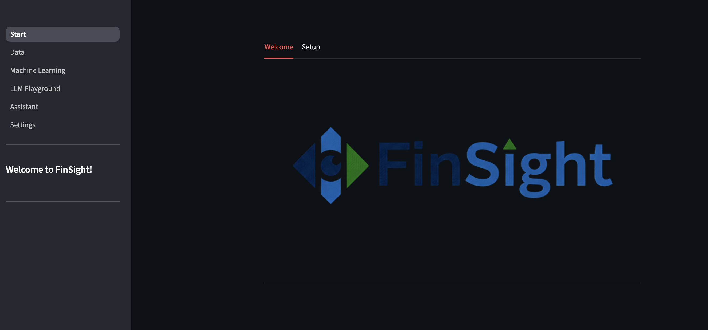

*Abbildung 5-1: Startseite mit Welcome- und Setup-Tabs*

Beim ersten Start wird der Nutzer über folgende Reihenfolge geführt:

**1. Welcome-Tab:**
- Kurzüberblick über Projektziele und Funktionsumfang
- Visuelle Darstellung der Hauptfunktionalitäten
- Navigationshilfen zu den verschiedenen Seiten

**2. Setup-Tab:**
- Hinweise zur initialen Konfiguration
- Alpha-Vantage API-Key Eingabe (für Datenupdates)
- Ollama-Verbindung testen (local/host/container)
- Standardmodelle für Assistant/LLM Playground laden

Dieser Flow reduziert Einstiegsbarrieren erheblich und adressiert typische Probleme bei daten- und modellgetriebenen Anwendungen: fehlende API-Keys, fehlende LLM-Verbindung oder unklare Datenquellen werden proaktiv abgefragt, bevor der Nutzer auf Fehler stößt.

### 5.2.2 Navigationsprinzip und Seitenübersicht

Die Anwendung nutzt Streamlits Sidebar-Navigation für die Hauptnavigation zwischen den funktionalen Bereichen.

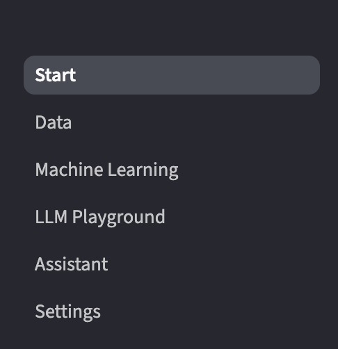

*Abbildung 5-2: Sidebar-Navigation mit allen Hauptseiten*

Die UI ist in funktionale Bereiche aufgeteilt, die den Arbeitsprozess abbilden: **Start → Data → Machine Learning → LLM Playground → Assistant → Settings**.

**Implementierte Seiten:**
- [`src/frontend/st/Start.py`](src/frontend/st/Start.py) - Onboarding und Setup
- [`src/frontend/st/pages/1 Data.py`](src/frontend/st/pages/1%20Data.py) - Datenanalyse und -verwaltung
- [`src/frontend/st/pages/2 Machine Learning.py`](src/frontend/st/pages/2%20Machine%20Learning.py) - ML-Training
- [`src/frontend/st/pages/3 LLM Playground.py`](src/frontend/st/pages/3%20LLM%20Playground.py) - LLM-Analysen
- [`src/frontend/st/pages/4 Assistant.py`](src/frontend/st/pages/4%20Assistant.py) - Hilfsassistent
- [`src/frontend/st/pages/5 Settings.py`](src/frontend/st/pages/5%20Settings.py) - Konfiguration

### 5.2.3 Typischer Arbeitsablauf

Ein typischer User Flow durch die Anwendung folgt diesem Muster:

**Phase 1: Initiales Setup (Start-Seite)**
1. Ollama-Verbindung prüfen und konfigurieren
2. Optional: Alpha Vantage API-Key hinterlegen
3. Dokumentation und Hilfestellung lesen

**Phase 2: Datenbereitstellung (Data-Seite)**
4. Zu "Data" navigieren
5. Daten aktualisieren oder eigene Datensätze hochladen
6. Explorative Analyse einzelner Symbole oder Vergleichsanalysen durchführen

**Phase 3: Modellierung (Machine Learning)**
7. Zu "Machine Learning" wechseln
8. Datenquelle und Features/Target auswählen
9. Modell konfigurieren (Algorithmus, Test-Size, Scaling)
10. Training starten und Ergebnisse evaluieren
11. Modell speichern für spätere Wiederverwendung

**Phase 4: Intelligente Analyse (LLM Playground)**
12. "LLM Playground" öffnen
13. Datenquelle und Analysemodus wählen
14. LLM-basierte Insights generieren lassen
15. Prompt einsehen und ggf. anpassen

**Phase 5: Konfiguration und Wartung (Settings)**
16. "Settings" für systemweite Anpassungen nutzen
17. Gespeicherte Modelle verwalten
18. Training-Limits und Datenquellen konfigurieren

Dieser Workflow ist nicht streng linear – fortgeschrittene Nutzer können direkt zu ML oder LLM springen, wenn Daten bereits vorhanden sind.

---

## 5.3 Data-Seite: Analyse- und Datenmanagement als Dashboard-Erlebnis

Die Data-Seite stellt den zentralen Einstieg in die fachliche Arbeit mit Finanzdaten dar. Der Nutzer erlebt hier eine Kombination aus **Kontrollpanel (Sidebar)** und **Analysefläche (Main Area)**.

**Link (Code):**  
[`src/frontend/st/pages/1 Data.py`](src/frontend/st/pages/1%20Data.py)

### 5.3.1 Sidebar: Kontrollpanel für Datenupdates und Datenimport

Die Sidebar fungiert als systemnahes Kontrollpanel und bündelt alle datenrelevanten Operationen:

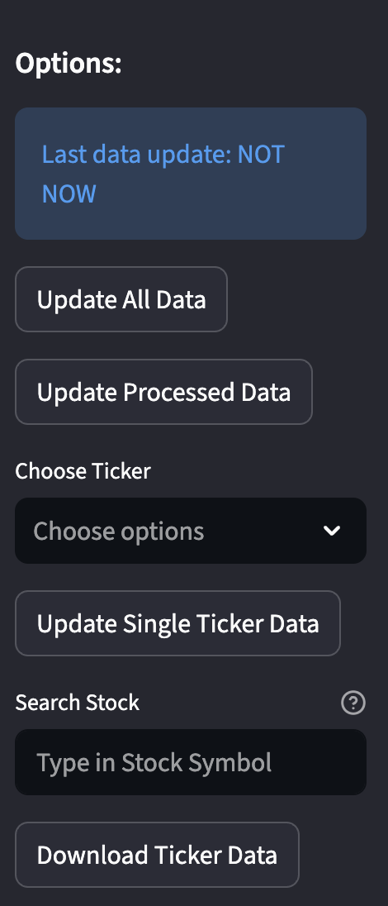

*Abbildung 5-3: Data-Sidebar mit Update-Funktionen und Upload-Bereich*

**Statusanzeige:**
- "Last data update: NOT NOW" zeigt den Zeitstempel der letzten Aktualisierung
- Implementiert über `st.session_state.get("last_manual_update")`
- Visueller Hinweis für Nutzer, ob Daten aktuell sind

**Update-Funktionen (drei Buttons):**

1. **Update All Data**
   - Aktualisiert sämtliche Yahoo Finance Daten (Preise, Infos, Fundamentals)
   - Trigger: `update_all_yf_data()` + `update_pricing_and_info()`
   - Zeitaufwand: Je nach Ticker-Liste mehrere Minuten
   - Feedback: Success-Message mit Anzahl aktualisierter Symbole

2. **Update Processed Data**
   - Verarbeitet Alpha Vantage Rohdaten zu strukturierten Tabellen
   - Trigger: `process_all_alphavantage_data()`
   - Führt ETL-Pipeline aus (Extraktion, Transformation, Loading)

3. **Update Single Ticker Data**
   - Selektive Aktualisierung einzelner Symbole (Dropdown-Auswahl)
   - Nützlich für gezielte Updates ohne vollständigen Refresh
   - Minimiert API-Calls bei Rate-Limits

**Download-Funktion:**
- "Search Stock" Input-Feld für Symbol-Suche
- "Download Ticker Data" Button für neue Symbole
- Lädt Daten von Yahoo Finance und Alphavamtage herunter und persistiert sie

**Upload-Funktionalität:**

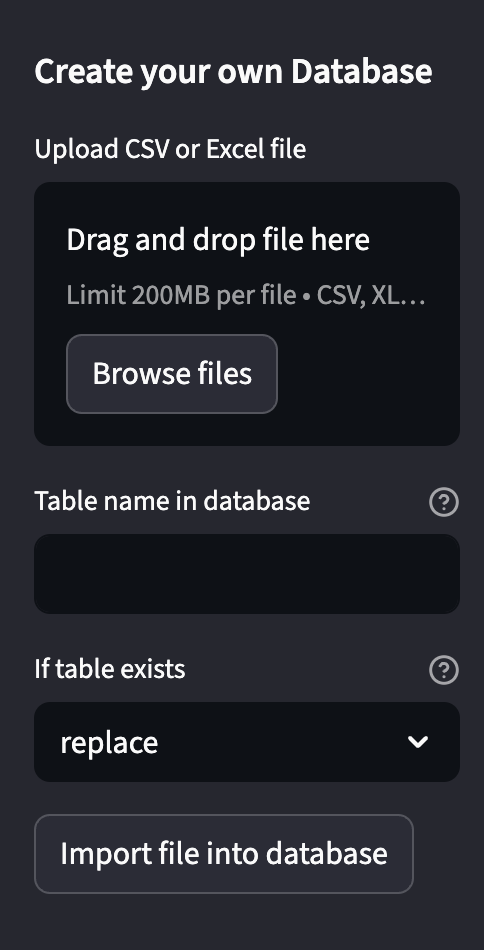

*Abbildung 5-4: Upload-Bereich für nutzereigene Datensätze*

Der Upload-Bereich ("Create your own Database") ermöglicht:

- **Datei-Upload:** Drag & Drop oder File-Browser für CSV/Excel (max. 200MB)
- **Tabellenname:** Nutzer definiert Namen für Ziel-Tabelle
- **Konfliktstrategie:** Dropdown mit drei Optionen
  - **Fail:** Abbruch bei existierender Tabelle (sicher)
  - **Replace:** Überschreiben bestehender Daten (destruktiv)
  - **Append:** Hinzufügen neuer Zeilen (additiv)
- **Import-Button:** Trigger für `add_user_table()` aus `users_database.py`

Diese Anordnung unterstützt eine klare Handlungskette:
**(1) Daten verfügbar machen → (2) Daten aktualisieren → (3) Daten analysieren**

### 5.3.2 Analyse-Tab: Interaktive Exploration einzelner Symbole

Die Hauptfläche präsentiert sich mit zwei Tabs: **Analysis** (aktiv) und **Data Settings** (Datenbank-Übersicht).

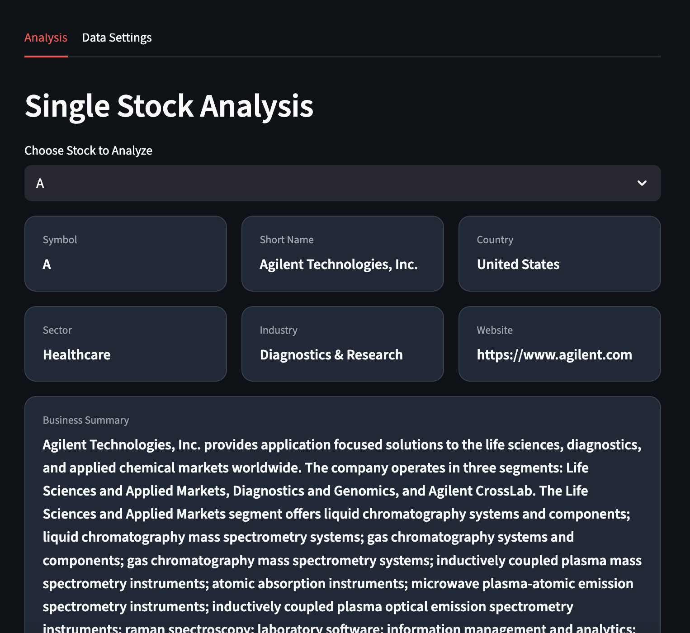
*Abbildung 5-5: Single Stock Analysis mit Unternehmensinfos und Kennzahlen*

**Interaktionsablauf im Analysis-Tab:**

**Schritt 1: Symbol-Auswahl**
- Dropdown "Choose Stock to Analyze" mit ~400 vorbefüllten US-Aktien
- Alphabetische Sortierung für schnelle Navigation
- Beispiel-Auswahl: "A" (Agilent Technologies, Inc.)

**Schritt 2: Unternehmensinformationen (Karten-Layout)**

Nach Auswahl werden automatisch Informationskarten angezeigt:

Obere Reihe (3 Karten):
- **Symbol:** "A"
- **Short Name:** "Agilent Technologies, Inc."
- **Country:** "United States"

Mittlere Reihe (3 Karten):
- **Sector:** "Healthcare"
- **Industry:** "Diagnostics & Research"
- **Website:** "https://www.agilent.com"

Unterer Bereich:
- **Business Summary:** Ausführliche Unternehmensbeschreibung (scrollbar bei langem Text)

**Schritt 3: Kennzahlen-Dashboard**


*Abbildung 5-6: Finanzkennzahlen-Dashboard mit Market Cap, PE-Ratio, ROE, etc.*

Das Kennzahlen-Dashboard zeigt in zwei Reihen à drei Metriken:

Obere Reihe:
- **Market Capitalization:** "41.25 Mrd."
- **PE-Ratio:** "3.18"
- **Price/Book:** "6.11"

Untere Reihe:
- **ROE:** "206.00"
- **Profit-Margin:** "188.00€"
- **Beta:** "1.274"

**Last Updated:** "08 Dec 2025" als Timestamp

Diese Metriken werden aus `get_company_info_yf(symbol)` geladen und als `st.metric()` dargestellt.

**Schritt 4: Zeitreihenvisualisierung**

Unterhalb der Kennzahlen:

- **Choose Metric:** Dropdown mit verfügbaren Spalten (close, open, high, low, volume, etc.)
- **Starting Date:** Date-Input für Zeitraum-Filterung (Standardwert: frühestes Datum im Datensatz)
- Beispiel-Auswahl: "close" → zeigt Schlusskursverlauf

Nach Auswahl wird ein interaktiver Line-Chart gerendert:
- Streamlit Native Chart mit Zoom, Hover, Pan
- X-Achse: Date (automatisch erkannt und formatiert)
- Y-Achse: Metrik-Wert

**Interaktive Features:**
- **Zoom:** Bereichsauswahl mit Maus
- **Hover:** Anzeige exakter Werte bei Mouseover
- **Pan:** Verschieben des Zeitfensters
- **Reset:** Doppelklick für Zoom-Reset

Diese Features verbessern die Nutzbarkeit insbesondere bei langen Zeitreihen (mehrere Jahre täglicher Daten).

### 5.3.3 Compared Stock Analysis: Mehrfachvergleich im selben Dashboard

Der zweite Interaktionsmodus innerhalb des Analysis-Tabs ermöglicht Vergleichsanalysen:

**Interaktionsablauf:**

**Schritt 1: Mehrfachauswahl**
- Multiselect "Select tickers to compare"
- Beliebig viele Symbole auswählbar (praktisch max. 5-10 für Lesbarkeit)

**Schritt 2: Gemeinsames Chart**
- Line-Chart mit mehreren Zeitreihen
- Jedes Symbol in eigener Farbe
- Legende automatisch generiert

**Schritt 3: Kennzahlen-Vergleichstabelle**

Ergänzend zum Chart wird eine Tabelle angezeigt mit Spalten:
- Symbol
- Current Price
- Market Cap
- PE Ratio
- 52-Week Performance (%)

Diese Tabelle ermöglicht schnellen quantitativen Vergleich, während das Chart qualitative Trends visualisiert.

**Normalisierungs-Option (optional):**

Ein Toggle "Normalize to percentage" ermöglicht:
- Alle Zeitreihen werden auf Basis ihres ersten Werts skaliert
- Formel: `(current_value / first_value - 1) * 100`
- Vorteil: Vergleichbarkeit von Aktien unterschiedlicher Preisklassen

Dies führt zu einem echten „Dashboard-Charakter", in dem visuelle Trendbeobachtung (Chart) und kompakte Kennzahlen (Metrikblöcke/Tabelle) kombiniert sind.

### 5.3.4 Tab „Data Settings": Transparenz über Datenhaltung

Der zweite Tab "Data Settings" liefert eine Admin-/Data-Lake-Ansicht:

**System-Tabellen (finance.db):**
- Liste aller Tabellen mit Row Count
- Beispiele: `yf_price_history` (2.5M Zeilen), `company_info` (400 Zeilen)
- Letzte Aktualisierung (falls tracked)

**User-Tabellen (users_database.db):**
- Liste aller hochgeladenen Tabellen
- Upload-Zeitstempel
- Löschfunktion mit Bestätigung ("Are you sure?")

Diese Transparenz unterstützt:
- **Verständnis:** Welche Daten sind vorhanden?
- **Debugging:** Warum fehlt ein Symbol?
- **Kontrolle:** Userseitige Importe managen

---

## 5.4 Machine Learning Studio: Ergebnisorientiertes Training im Dashboard

Das Machine Learning Studio transformiert klassische ML-Workflows in eine GUI-gestützte Trainingsumgebung. Aus Nutzersicht wirkt diese Seite wie eine Kombination aus „Training Wizard" und „Experimentierlabor" (Playground).

**Link (Code):**  
[`src/frontend/st/pages/2 Machine Learning.py`](src/frontend/st/pages/2%20Machine%20Learning.py)

### 5.4.1 Sidebar als Trainings-Konsole

Die Sidebar fungiert als zentrales Konfigurationspanel für das Modelltraining:

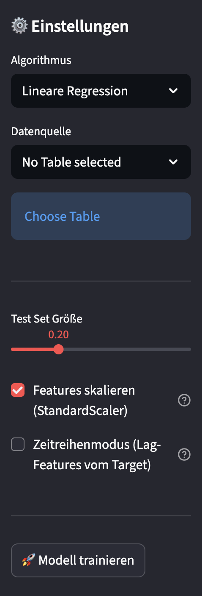

*Abbildung 5-7: ML-Sidebar mit Algorithmus-, Datenquellen- und Training-Konfiguration*

**Konfigurationsbereiche:**

**1. Algorithmus-Auswahl**
- Dropdown mit fünf Optionen:
  - Linear Regression
  - Decision Tree Regressor
  - Random Forest Regressor
  - Logistic Regression
  - Direction Classification (Up/Down)

**2. Datenquelle**
- Dropdown "Datenquelle" mit Optionen:
  - No Table selected (Initial-State)
  - Price History (alle Yahoo Finance Daten)
  - Single Stock Price (einzelnes Symbol)
  - Alphavantage (processed Tables)
  - User Tables (hochgeladene Datensätze)
- Button "Choose Table" für Tabellen-Selektion bei Alphavantage/User Tables

**3. Training-Parameter**


*Abbildung 5-8: Test-Set-Größe, Feature-Scaling und Zeitreihenmodus*

- **Test Set Größe:** Slider von 0.10 bis 0.50 (Beispiel: 0.20 = 20%)
- **Features skalieren (StandardScaler):** Checkbox (aktiviert im Screenshot)
  - Wendet `StandardScaler()` auf numerische Features an
  - Wichtig für Distanz-basierte Algorithmen (Logistic Regression)
- **Zeitreihenmodus (Lag-Features vom Target):** Checkbox (deaktiviert)
  - Wenn aktiv: erscheint Lag-Anzahl-Slider (1-20)
  - Generiert automatisch Lag-Features aus Target-Spalte

**4. Training-Button**
- "🚀 Modell trainieren" Button am Ende der Sidebar
- Trigger für gesamten Training-Workflow

Diese Struktur führt zu einer klaren Interaktionslogik:
**Konfigurieren → Daten laden → Features/Target wählen → Optional: Horizon/Time-Series → Trainieren → Ergebnisse prüfen → Modell speichern**

### 5.4.2 Hauptfläche: Datenkontrolle und Modellbildung

Nach Laden einer Datenquelle präsentiert sich die Hauptfläche mit mehreren Abschnitten:

**1. Datenübersicht (Metrics-Header)**

Drei Metrik-Karten zeigen:
- **Rows:** Anzahl Zeilen (z.B. 2.500.000)
- **Columns:** Anzahl Spalten (z.B. 15)
- **Time Series Found:** Erkannte Zeitspalte (z.B. "date" oder "No")

Die automatische Erkennung einer Zeitspalte wirkt als Assistenzfunktion:
- Verhindert Fehler bei Forecast Horizon (benötigt Zeitspalte)
- Warnt, wenn Time-Series-Mode ohne Zeitspalte aktiviert wird

**2. DataFrame Preview**

Expander "📋 Show DataFrame" (standardmäßig collapsed):
- Zeigt erste 50 Zeilen in scrollbarer Tabelle
- Ermöglicht visuelle Inspektion der Daten
- Nutzer können Spaltentypen und Werte prüfen

**3. Feature- und Target-Auswahl**

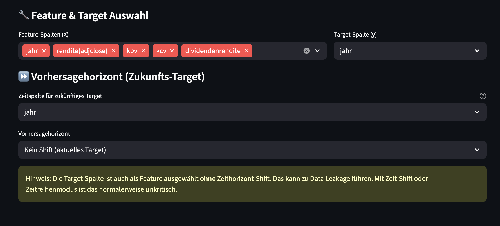
*Abbildung 5-9: Feature- und Target-Auswahl mit Data-Leakage-Warnung*

Zwei zentrale Komponenten:

**Feature columns (X):**
- Multiselect mit allen verfügbaren Spalten
- Beispiel: ["jahr", "rendite(adjclose)", "kbv", "kcv", "dividendenrendite"]
- Mehrfachauswahl möglich

**Target column (y):**
- Single-Select Dropdown
- Beispiel: "jahr"

**Data-Leakage-Warnung:**

Wichtige Sicherheitsfunktion: Wenn Target in Features enthalten ist UND kein Time-Series-Mode aktiv:

> "Hinweis: Die Target-Spalte ist auch als Feature ausgewählt ohne Zeithorizont-Shift. Das kann zu Data Leakage führen. Mit Zeit-Shift oder Zeitreihenmodus ist das normalerweise unkritisch."

Diese Warnung (in gelb/olive dargestellt) reduziert methodische Fehler für weniger erfahrene Nutzer.

**4. Prognosehorizont (Zukunfts-Target)**


*Abbildung 5-10: Vorhersagehorizont-Konfiguration mit Zeitspalten-Auswahl*

Expander "⏩ Vorhersagehorizont (Zukunfts-Target)":

**Zeitspalte für zukünftiges Target:**
- Dropdown mit erkannten Datum-Spalten (Beispiel: "jahr")
- Erforderlich für Forecast Horizon

**Vorhersagehorizont:**
- Dropdown mit Optionen:
  - Kein Shift (aktuelles Target)
  - 1 Day
  - 3 Weeks
  - 3 Months
  - 1 Year

**Funktionsweise (für Nutzer abstrakt):**

Für Nutzer ist dies eine intuitive Abstraktion: "Ich möchte den Kurs in 3 Monaten prognostizieren."

Technisch erfolgt:
1. Merge der Tabelle mit sich selbst auf verschobener Zeitspalte
2. Target wird zu `future_target` umbenannt
3. Zeilen ohne Future-Wert werden entfernt (NaN-Drop)

**5. Time-Series Mode**

Wenn in Sidebar aktiviert, erscheint Lag-Features-Generierung:
- Nutzer wählt Anzahl Lags (z.B. 5)
- System erstellt automatisch: `target_lag_1`, `target_lag_2`, ..., `target_lag_5`
- Diese ersetzen manuelle Feature-Auswahl

Vorteil: Schnelle Baseline für Zeitreihenmodelle ohne komplexes Feature Engineering.

### 5.4.3 Ergebnisdarstellung: Metriken und Visualisierung

Nach Klick auf "Modell trainieren" erfolgt Training und Evaluation:

**Regression-Output:**

Drei Metrik-Karten:
- **RMSE:** Root Mean Squared Error (z.B. 15.42)
- **MSE:** Mean Squared Error (z.B. 237.78)
- **R²:** Bestimmtheitsmaß (z.B. 0.89)

**Visualisierung:**
- Line-Chart mit zwei Linien:
  - "Actual" (y_test) in blau
  - "Predicted" (y_pred) in rot
- X-Achse: Sample-Index (chronologisch bei Time-Series-Mode)
- Y-Achse: Target-Wert

**Klassifikation-Output:**

Zwei Komponenten:
- **Accuracy:** Metrik-Karte (z.B. 0.85 = 85%)
- **Confusion Matrix:** Heatmap-Visualisierung
  - Zeilen: True Labels
  - Spalten: Predicted Labels
  - Farb-Codierung: Dunkel = viele Samples

Die Kombination aus numerischen Metriken und Visualisierung unterstützt schnelle Ergebnisbewertung im Dashboard-Kontext.

### 5.4.4 Modell-Speicherung und Saved Models

Nach erfolgreichem Training erscheint Speicher-Bereich:

**Speichern-Dialog:**
- Input-Feld für Modellnamen (z.B. "aapl_rf_3months")
- Button "💾 Save Model"
- Speichert als `.pkl` unter `saved_models/`

**Gespeicherte Metadaten:**
- Algorithmus
- Datenquelle
- Feature-Spalten
- Target-Spalte
- Scaler (falls verwendet)
- Forecast Horizon
- Time-Series-Mode + Lag-Parameter
- Label Encoder (bei Klassifikation)

**Saved Models Tab (separater Bereich):**

Wechsel zu "Saved Models" zeigt:

**Modell-Übersicht (Tabelle):**
- Model Name
- Algorithm
- Data Source
- Target Column
- Forecast Horizon
- Time-Series Mode
- Creation Date
- File Size

**Modell-Aktionen:**
- Dropdown zur Modell-Auswahl
- Expander "Show Model Details" mit allen Metadaten
- Button "📥 Download Model" für lokale Weiterverwendung
- Expander "Try the model with current data" für Inferenz-Demo

Aus Nutzerperspektive entsteht eine nachvollziehbare Kette:
**Trainieren → Speichern → Wiederverwenden → Exportieren**

Diese Funktionalität löst ein häufiges Problem in Prototypen: Modelle verschwinden nicht nach dem Training, sondern sind als wiederverwendbare Artefakte verfügbar.

---

## 5.5 LLM Playground: Datenbasierte Analyse als Text-Resultat

Der LLM Playground ergänzt klassische ML-Workflows durch sprachbasierte Analysen. Der Nutzer erlebt ein Dashboard, das nicht primär numerische Outputs liefert, sondern **erklärenden Text**, der aus Datenproben und Statistiken generiert wird.

**Link (Code):**  
[`src/frontend/st/pages/3 LLM Playground.py`](src/frontend/st/pages/3%20LLM%20Playground.py)

### 5.5.1 Sidebar: Ollama-Konfiguration und Datenquelle

Die Sidebar gliedert sich in zwei Hauptbereiche:

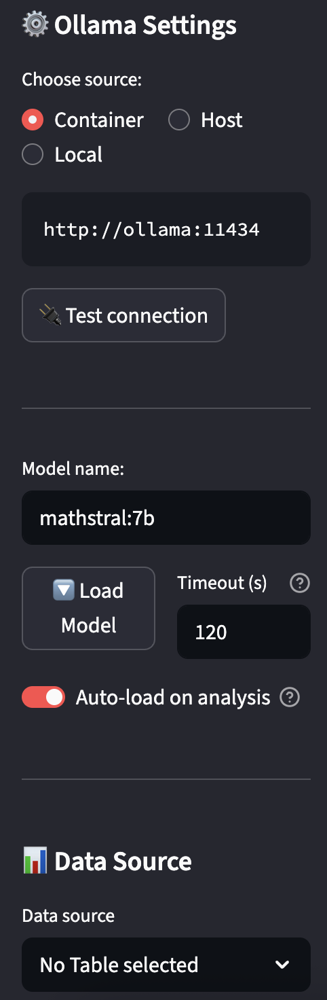

*Abbildung 5-11: Ollama-Konfiguration mit Verbindungstest und Modellverwaltung*

**⚙️ Ollama Settings:**

**Verbindungsauswahl:**
- Radio-Buttons mit drei Optionen:
  - **Container** (ausgewählt im Screenshot)
  - **Host**
  - **Local** (mit Custom URL Input)
- Code-Anzeige der resultierenden URL: `http://ollama:11434`
- Button "🔌 Test connection" für Verbindungsprüfung

**Modellkonfiguration:**
- Input-Feld "Model name:" (Beispiel: `mathstral:7b`)
- Zwei-Spalten-Layout:
  - Linke Spalte: Button "🔽 Load Model"
  - Rechte Spalte: Number Input "Timeout (s)" (Standard: 120)
- Toggle "Auto-load on analysis" (aktiviert im Screenshot)
  - Lädt Modell automatisch vor Analyse, falls nicht verfügbar

Diese Flexibilität ermöglicht:
- Vollständig lokalen Betrieb (datenschutzfreundlich)
- Container-basiertes Deployment (reproduzierbar)
- Host-Verbindung (Development-Setup)

**📊 Data Source:**


*Abbildung 5-12: Datenquellen-Auswahl im LLM Playground*

Identisch zur ML-Seite:
- Dropdown "Data source" mit denselben Optionen (Price History, Single Stock, Alphavantage, User Tables)
- Zusätzliche Parameter abhängig von Auswahl (Symbol, Tabellenname)

### 5.5.2 Hauptfläche: Feature/Target-Auswahl und Analysekonfiguration

Die Hauptfläche des LLM Playgrounds folgt einem ähnlichen Aufbau wie die ML-Seite, fokussiert jedoch auf die Vorbereitung für LLM-basierte Analysen:

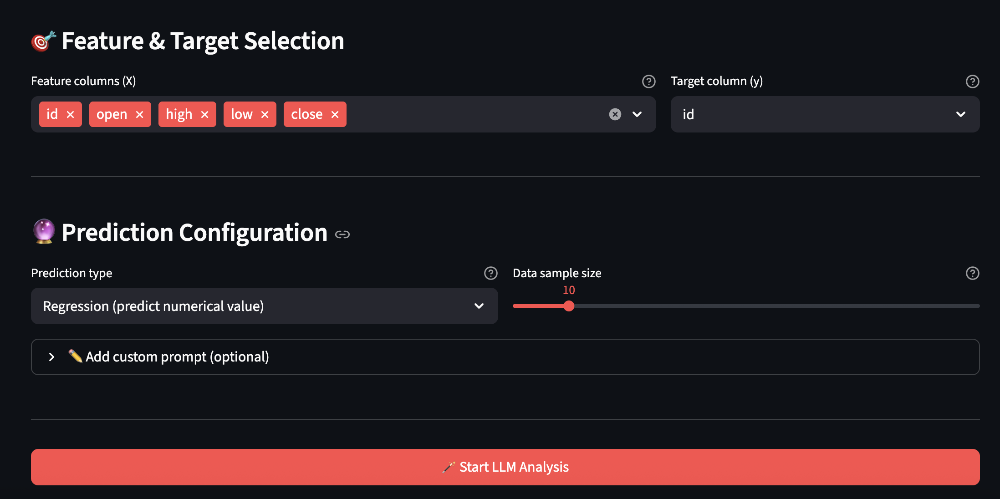
*Abbildung 5-13: Feature/Target-Auswahl und Prediction Configuration im LLM Playground*

**🎯 Feature & Target Selection:**

Analog zur ML-Seite:
- **Feature columns (X):** Multiselect (Beispiel: "id", "open", "high", "low", "close")
- **Target column (y):** Single-Select Dropdown (Beispiel: "id")

**🔮 Prediction Configuration:**

Zwei zentrale Einstellungen:

**1. Prediction type (links):**
- Dropdown mit vier Analysemodi:
  - **Regression (predict numerical value)** - ausgewählt im Screenshot
  - Classification (predict category)
  - Trend Analysis (predict direction)
  - Free Analysis

Jeder Modus triggert ein spezifisches Prompt-Template, das auf den Analysetyp zugeschnitten ist.

**2. Data sample size (rechts):**
- Slider von 5 bis 50
- Aktueller Wert: 10
- Bestimmt, wie viele letzte Zeilen an das LLM übergeben werden
- Balance zwischen Kontextlänge und Informationsgehalt

**✏️ Add custom prompt (optional):**

Expander für zusätzliche Prompt-Anweisungen:
- Textfeld für freie Eingabe
- Beispiel-Platzhalter: "e.g.: Pay special attention to macroeconomic factors..."
- Wird an generiertes Prompt angehängt

Diese Struktur ermöglicht:
- **Anfänger:** Nutzen vorgefertigter Templates ohne Prompt-Engineering
- **Fortgeschrittene:** Feinjustierung durch Custom Prompts

### 5.5.3 Analyse starten und Ergebnisdarstellung

Nach Konfiguration:

**Start-Button:**
- "🪄 Start LLM Analysis" (großer Button, volle Breite)
- Trigger für gesamten Analyse-Workflow

**Analyse-Ablauf (für Nutzer sichtbar):**

1. **Verbindungsprüfung:**
   - Success-Message: "✓ Connected to Ollama @ http://ollama:11434 (Version: 0.13.5)"

2. **Modell-Loading (bei Auto-load):**
   - Status-Expander: "Loading model 'mathstral:7b'..."
   - Nach Erfolg: "✓ Model 'mathstral:7b' ready"

3. **Prompt-Generierung:**
   - Spinner: "Creating analysis prompt..."
   - Expander "📝 Show generated prompt" (optional einsehbar)

4. **LLM-Generierung:**
   - Status-Expander: "🤖 LLM generating analysis..."
   - Zeigt Fortschritt ohne Streaming (wartet auf komplette Antwort)
   - Nach Abschluss: "✓ Analysis completed in 12.45s"

**Ergebnis-Anzeige:**

Nach erfolgreicher Generierung:

**📊 LLM Analysis Result:**
- Markdown-formatierter Text mit der LLM-Antwort
- Struktur abhängig vom Prediction Type (z.B. bei Regression):
  ```
  Prediction: 42.35
  Confidence Interval: 38.20 - 46.50
  Justification: Based on the recent trend showing...
  ```

**ℹ️ Analysis Details (Expander):**
- **Model:** mathstral:7b
- **Prediction type:** Regression (predict numerical value)
- **Data source:** Price History
- **Features:** id, open, high, low, close
- **Target:** id
- **Generation time:** 12.45s
- **Sample size:** 10 rows

Diese Transparenz ermöglicht:
- Nachvollziehbarkeit der Analyse
- Reproduzierbarkeit mit denselben Parametern
- Debugging bei unerwarteten Ergebnissen

**Prompt-Einsicht (optional):**

Im Expander "Show generated prompt" wird das vollständige Prompt angezeigt:
- System-Instruktion (z.B. "You are a financial analyst...")
- Task-Beschreibung
- Feature-Liste
- Data-Sample (letzte 10 Zeilen als Tabelle)
- Statistiken (describe())
- Anweisungen (Instructions)
- Erwartetes Format (Format)

Diese Einsicht unterstützt:
- Lern-Effekt für Prompt-Engineering
- Anpassung bei unbefriedigenden Ergebnissen
- Verständnis, welche Daten das LLM "sieht"

---

## 5.6 Assistant: Nutzerunterstützung als Dashboard-Komponente

Der Assistant stellt ein ergänzendes Ergebnis dar, das weniger auf Datenanalyse und stärker auf **Hilfe und Guidance** ausgerichtet ist.

**Link (Code):**  
[`src/frontend/st/pages/4 Assistant.py`](src/frontend/st/pages/4%20Assistant.py)

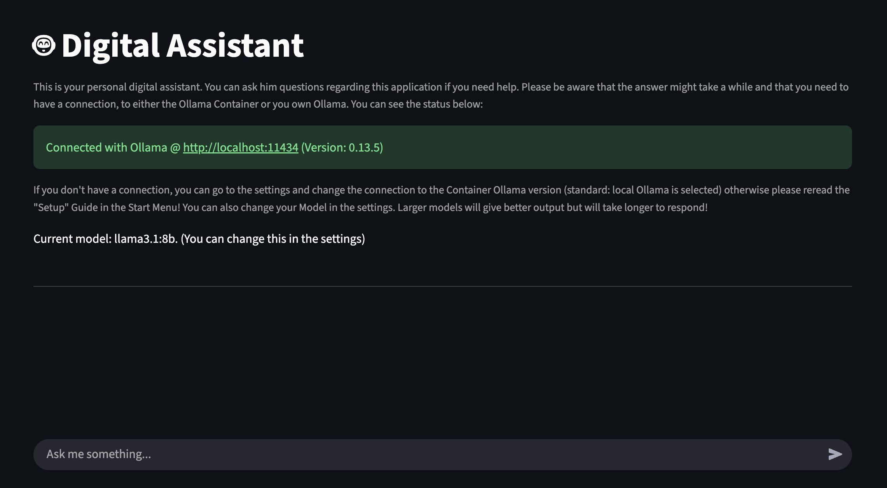
*Abbildung 5-14: Assistant mit Verbindungsstatus und Chat-Interface*

### 5.6.1 Funktionsumfang und Interaktion

**Kopfbereich:**

**🤖 Digital Assistant - Titel**

Beschreibungstext:
> "This is your personal digital assistant. You can ask him questions regarding this application if you need help. Please be aware that the answer might take a while and that you need to have a connection, to either the Ollama Container or you own Ollama. You can see the status below:"

**Verbindungsstatus:**

Grüne Info-Box:
- "Connected with Ollama @ http://localhost:11434 (Version: 0.13.5)"
- Zeigt aktive Verbindung und Version
- Bei fehlender Verbindung: Roter Fehler-Banner mit Setup-Hinweisen

**Konfigurationshinweise:**

Text unterhalb Status:
> "If you don't have a connection, you can go to the settings and change the connection to the Container Ollama version (standard: local Ollama is selected) otherwise please reread the "Setup" Guide in the Start Menu! You can also change your Model in the settings. Larger models will give better output but will take longer to respond!"

**Aktuelles Modell:**
- "Current model: llama3.1:8b. (You can change this in the settings)"
- Informiert über verwendetes LLM
- Link zu Settings für Modellwechsel

### 5.6.2 Chat-Interface

**Eingabefeld:**
- Textbox am unteren Bildschirmrand
- Platzhalter: "Ask me something..."
- Submit-Button (Pfeil-Icon) rechts

**Chat-Verlauf:**
- Scrollbarer Bereich für Konversation
- User-Nachrichten rechtsbündig (oder anderer visueller Stil)
- Assistant-Antworten linksbündig
- Timestamps bei jeder Nachricht

**Funktionalität:**
- **Reset-Button:** Löscht Chat-Historie (Session-State)
- **Kontext-Erhaltung:** Multi-Turn-Dialog möglich (im Gegensatz zu LLM Playground)
- **Typing-Indicator:** "Assistant is typing..." während Generierung

### 5.6.3 Typische Use Cases

Der Assistant adressiert folgende Nutzeranfragen:

**Anwendungshilfe:**
- "Wie kann ich ein Modell trainieren?"
- "Was bedeutet Forecast Horizon?"
- "Wie lade ich eigene Daten hoch?"

**Interpretation:**
- "Was ist ein guter R²-Wert?"
- "Wie interpretiere ich die Konfusionsmatrix?"
- "Was bedeutet Data Leakage?"

**Troubleshooting:**
- "Warum funktioniert das Training nicht?"
- "Ich habe keine Verbindung zu Ollama, was tun?"
- "Mein Modell hat sehr schlechte Accuracy, warum?"

Die Qualität der Antworten hängt vom gewählten Modell ab:
- Kleinere Modelle (3-7B): Grundlegende Hilfe, manchmal oberflächlich
- Größere Modelle (13B+): Detaillierte Erklärungen, bessere Kontextualisierung

---

## 5.7 Settings: Konfiguration als Ergebnis für Wartbarkeit und Steuerbarkeit

Die Settings-Seite ist aus Ergebnis-Sicht ein zentraler Baustein, da sie die App **langfristig nutzbar** macht. Sie reduziert Hardcoding und erlaubt Anpassungen ohne Codeänderung.

**Link (Code):**  
[`src/frontend/st/pages/5 Settings.py`](src/frontend/st/pages/5%20Settings.py)

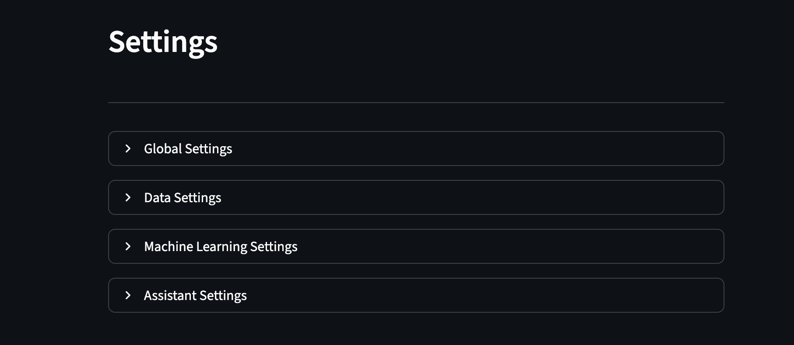
*Abbildung 5-15: Settings-Übersicht mit expandierbaren Bereichen*

### 5.7.1 Strukturierung in Expander-Bereiche

Die Settings-Seite nutzt Expander für thematische Gruppierung:

1. **> Global Settings** (zugeklappt)
2. **> Data Settings** (aufgeklappt im Screenshot)
3. **> Assistant Settings** (zugeklappt)

Dieses Design:
- Reduziert visuelle Überladung
- Ermöglicht fokussierte Konfiguration pro Bereich
- Klare Trennung der Zuständigkeiten

### 5.7.2 Global Settings

**Ollama-Konfiguration:**
- Radio-Buttons: Local / Standard
- Text-Input für Custom Local URL (bei Local-Auswahl)
- Test-Connection-Button

**Alpha Vantage Key:**
- Password-Input (masked)
- Session-basiert (nicht persistent aus Sicherheitsgründen)
- Info-Text: "This key is only stored in session and not saved permanently"

**Reset-Funktionen:**
- Button "🔄 Reset All Settings" (mit Bestätigungsdialog)
- Button "🗑️ Clear All User Data" (destruktiv, doppelte Bestätigung)

### 5.7.3 Data Settings

**Delete Tables:**
- Multiselect mit allen Tabellen (System + User)
- Button "🗑️ Delete Selected Tables"
- Sicherheitsabfrage: "Are you sure? This cannot be undone!"

**Initial Ticker Management:**
- Radio-Buttons: Standard List / Custom List
- Bei Custom: Textarea für manuelle Ticker-Eingabe (kommasepariert)
- Button "💾 Save Ticker List"

**Analysis Date Limit:**
- Date-Input "Earliest date for analysis"
- Standardwert: 5 Jahre zurück
- Zweck: Performance-Optimierung bei großen Datensätzen

### 5.7.4 Machine Learning Settings

**Saved Models Overview:**

Tabelle mit Spalten:
- Model Name
- Algorithm
- File Size (MB)
- Creation Date

**Aktionen:**
- Checkbox pro Modell für Mehrfachauswahl
- Button "🗑️ Delete Selected Models"
- Button "📥 Download All Models" (ZIP-Export)

**Training Limits:**

Zwei Number-Inputs:
- **Minimum Rows Required:** Mindestanzahl Zeilen für Training (Standard: 100)
  - Verhindert Training auf zu kleinen Datensätzen
  - Fehlermeldung bei Unterschreitung
  
- **Maximum Training Rows:** Obergrenze für Training (Standard: 100.000)
  - Performance-Schutz bei sehr großen Datensätzen
  - Automatisches Sampling bei Überschreitung

### 5.7.5 Assistant Settings

**Ollama Source:**
- Dropdown: Container / Host / Local
- Synchronisiert mit Global Settings

**Model Management:**
- Text-Input "Model name" (z.B. llama3.1:8b)
- Button "🔽 Download Model" (wenn nicht verfügbar)
- Status-Anzeige: "✓ Model available" oder "⚠️ Model not found"

**Auto-Download:**
- Toggle "Automatically download missing models"
- Bei Aktivierung: Modelle werden bei Bedarf geladen

---

## 5.8 Zusammenfassung der Ergebnisse und Bewertung aus Nutzersicht

### 5.8.1 Erreichte Anforderungen

Die Anwendung erfüllt die Kernanforderung einer **anwenderfreundlichen Finanzanalyse-Plattform**, indem sie:

**Datenebene:**
- Mehrere Datenquellen integriert (Yahoo Finance, Alpha Vantage, User-Uploads)
- Daten persistent verwaltet (SQLite-basiert)
- Update- und Download-Mechanismen bereitstellt
- Transparenz über Datenhaltung schafft (Database-Tab)

**Analyse-Ebene:**
- Explorative Einzelanalysen mit Kennzahlen und Charts ermöglicht
- Vergleichsanalysen mehrerer Symbole visualisiert
- Zeitreihen interaktiv darstellt (Zoom, Hover, Filter)

**Modellierungs-Ebene:**
- ML-Training in UI-Workflows übersetzt (keine Coding-Kenntnisse erforderlich)
- Verschiedene Algorithmen und Konfigurationen unterstützt
- Zeitreihen-Features (Lag-Mode, Forecast Horizon) integriert
- Modelle persistent speichert und wiederverwendbar macht

**Intelligenz-Ebene:**
- LLM-basierte Analysen mit strukturierten Prompts ermöglicht
- Lokalen Betrieb ohne Cloud-Abhängigkeit realisiert
- Transparenz durch Prompt-Einsicht schafft

**Unterstützungs-Ebene:**
- Kontextuellen Hilfsassistenten bereitstellt
- Setup-Guidance für Einstieg bietet
- Zentrale Konfiguration über Settings erlaubt

### 5.8.2 Stärken des Dashboards aus Nutzersicht

**Modularität und Klarheit:**
- Klare Seitenstruktur entlang typischer Workflows (Data → ML → LLM → Settings)
- Konsistente Sidebar/Main-Area-Trennung
- Intuitive Navigation über Streamlit-Seiten

**Niedrige Einstiegshürde:**
- Setup-Seite adressiert typische Probleme proaktiv
- Assistant bietet kontextuelle Hilfe
- Vorbefüllte Datenbanken ermöglichen sofortigen Start

**Exploration + Experimentation:**
- Data-Seite für qualitative Exploration (Charts, Kennzahlen)
- ML/LLM für quantitative/qualitative Experimentation
- Nahtloser Wechsel zwischen Modi

**Persistenz und Reproduzierbarkeit:**
- Gespeicherte Modelle als Artefakte
- Metadaten ermöglichen Nachvollziehbarkeit
- System-Config für stabile Konfiguration

**Privacy und Selbstbestimmung:**
- Lokaler Betrieb (Ollama, SQLite) ohne Cloud-Übermittlung
- User-Uploads bleiben lokal
- Keine externen Tracking-Mechanismen

### 5.8.3 Ergebnischarakter

Insgesamt ist FinSight als **funktionsfähiger Prototyp mit ausgeprägtem Dashboard-Charakter** zu bewerten. Die Anwendung demonstriert erfolgreich die Integration von:

**Technologische Integration:**
- Dateninfrastruktur (SQLite, ETL, Multi-Source)
- Klassische Analytics (Streamlit Charts, Pandas)
- ML-Workflows (scikit-learn, Joblib)
- LLM-Workflows (Ollama, Prompt-Engineering)

**Nutzerzentriertes Design:**
- Konsistente UI-Patterns über alle Seiten
- Progressive Disclosure (Expander, Tabs)
- Feedback-Mechanismen (Status, Warnings, Success-Messages)
- Hilfsstrukturen (Assistant, Setup-Guide)

**Experimenteller Charakter:**
- Bewusst als "Playground" positioniert
- Ermöglicht schnelle Baselines, nicht Produktion
- Balance zwischen Usability und Flexibilität

Damit wurde ein umfassendes, interaktives Ergebnis artefaktisch umgesetzt, das sowohl für:
- **Explorative Nutzung** (Datenanalyse, Vergleiche, Visualisierung)
- **Experimentelle Modellierung** (ML-Training, LLM-Analysen)
- **Bildungszwecke** (Lehre, Selbststudium, Prototyping)

geeignet ist, jedoch bewusst **nicht** für:
- Produktiven Echtzeit-Handel
- Regulierte Finanzdienstleistungen
- Kritische Investitionsentscheidungen ohne zusätzliche Validierung

---

## 5.9 Beispielworkflow: Analyse einer Aktie aus Nutzersicht

Dieser Abschnitt demonstriert einen vollständigen Analyse-Workflow aus der Perspektive eines konkreten Nutzers. Damit soll die praktische Anwendbarkeit der implementierten Funktionalitäten verdeutlicht und aufgezeigt werden, wie die Applikation ihr Ziel erreicht, Nutzer bei der fundierten Aktienanalyse zu unterstützen. Der Workflow illustriert dabei sowohl die Anwendung traditioneller Machine Learning-Verfahren als auch moderner LLM-basierter Analysetechniken.

### 5.9.1 Ausgangssituation und Zielsetzung

Ein Nutzer möchte mithilfe von FinSight eine umfassende Analyse der Apple-Aktie (AAPL) durchführen. Sein Ziel ist es, sowohl traditionelle Machine Learning-Algorithmen als auch Large Language Model-Techniken einzusetzen, um eine ganzheitliche Bewertung zu erhalten und beide Verfahren hinsichtlich ihrer Aussagekraft und Anwendbarkeit zu vergleichen. Zusätzlich plant er einen Vergleich mit der Microsoft-Aktie, um relative Marktpositionen zu evaluieren.

### 5.9.2 Start und initiale Konfiguration

Der Nutzer startet die Applikation entweder lokal oder über Docker Compose und gelangt zunächst zur Welcome-Seite. Von dort wechselt er zum **Setup-Tab**, um die Grundkonfiguration vorzunehmen:

1. **Ollama-Verbindungsprüfung**: Er überprüft die Konnektivität zur Ollama-Instanz und stellt sicher, dass das gewünschte LLM-Modell verfügbar ist. Falls notwendig, passt er in den **Settings** unter "Assistant Settings" die Verbindungskonfiguration an (local/host/container).

2. **API-Key-Hinterlegung**: Der Nutzer trägt seinen zuvor bei Alpha Vantage angelegten API-Key in das entsprechende Eingabefeld ein und speichert diesen im Session State.

Mit abgeschlossener Grundkonfiguration ist die Plattform einsatzbereit.

### 5.9.3 Datenbeschaffung und -vorbereitung

Der Nutzer navigiert zur **Settings-Seite**, um die Datengrundlage für seine Analyse vorzubereiten:

1. **Anpassung der Initial-Ticker-Liste**: Unter "Data Settings" modifiziert er die Initial-Ticker-Liste und reduziert diese auf das Symbol "AAPL" (Apple), da er sich zunächst ausschließlich auf diese Aktie fokussieren möchte. Dies optimiert die Ladezeit und vermeidet unnötige API-Anfragen.

2. **Verifizierung der Download-Parameter**: Unter "Analysis Settings" überprüft er, ob der Zeitraum für den historischen Datendownload seinen Anforderungen entspricht (z.B. 2020-2025 für eine Fünf-Jahres-Analyse).

3. **Daten-Download**: Durch Betätigung des Buttons "Load Data" initiiert er den Download der Apple-Kursdaten sowie der fundamentalen Kennzahlen. Das System lädt die Daten über die yfinance- und Alpha-Vantage-APIs herunter und speichert diese in den entsprechenden Datenbanktabellen.

Der Nutzer erhält eine Bestätigung über den erfolgreichen Abschluss des Ladevorgangs und kann nun mit der Analyse beginnen.

### 5.9.4 Explorative Datenanalyse

Der Nutzer wechselt zur **Data-Seite** unter dem "Analysis"-Bereich:

1. **Ticker-Auswahl**: Im Dropdown-Menü wählt er "AAPL" aus der Liste der verfügbaren Aktien.

2. **Unternehmensübersicht**: Er verschafft sich zunächst einen Überblick über grundlegende Unternehmensinformationen wie Sektor, Industrie, Land und Unternehmensbeschreibung, die aus der `yf_company_info`-Tabelle geladen werden.

3. **Kennzahlen-Analyse**: Im weiteren Verlauf der Seite findet er eine Übersicht fundamentaler Kennzahlen (z.B. P/E Ratio, Market Cap, Beta, ROE), die eine erste quantitative Einschätzung ermöglichen.

4. **Kurshistorie-Visualisierung**: Ein interaktiver Plotly-Chart visualisiert die historische Preisentwicklung (Close-Kurse) der Apple-Aktie. Der Nutzer kann den Chart zoomen, einzelne Zeitperioden fokussieren und durch Hover-Tooltips detaillierte Tageswerte einsehen. Diese Visualisierung offenbart Trends, Volatilitätsmuster und potenzielle Wendepunkte in der Kursentwicklung.

### 5.9.5 Vergleichende Aktienanalyse

Um die Performance von Apple in einen breiteren Kontext zu setzen, entscheidet sich der Nutzer für einen Vergleich mit der Microsoft-Aktie (MSFT):

1. **Zusätzlicher Datendownload**: In der Sidebar der Data-Seite nutzt er die Funktion "Download Ticker Data", gibt "MSFT" ein und lädt die entsprechenden Daten herunter.

2. **Vergleichsansicht**: Im Bereich "Compared Stock Analysis" (weiter unten auf der Seite) wählt er beide Ticker (AAPL und MSFT) aus. Die Plattform generiert eine vergleichende Darstellung, die folgende Aspekte umfasst:
   - Side-by-side Darstellung fundamentaler Kennzahlen
   - Überlagerte Kurscharts zur Visualisierung relativer Performance
   - Korrelationsanalyse der Kursbewegungen

Diese Vergleichsperspektive ermöglicht es dem Nutzer, Apple's Marktposition relativ zu einem direkten Wettbewerber zu bewerten.

### 5.9.6 Machine Learning-basierte Analyse

Der Nutzer möchte nun über die explorative Analyse hinausgehen und eigene, extern gesammelte Datensätze mithilfe der implementierten ML-Algorithmen untersuchen:

1. **Daten-Upload**: Auf der Data-Seite verwendet er die Upload-Funktion in der Sidebar, um seine vorbereiteten Daten als Excel-Datei hochzuladen. Er wählt die Option "Replace", um eine vollständige Neuladung der Tabelle zu gewährleisten und potenzielle Inkonsistenzen zu vermeiden.

2. **Datenvalidierung**: Unter dem "Data Settings"-Tab überprüft er, ob seine hochgeladenen Daten korrekt in der `users_database.db` gespeichert wurden und ob das Schema korrekt interpretiert wurde (Spaltennamen, Datentypen).

3. **ML-Konfiguration**: Der Nutzer navigiert zur **Machine Learning-Seite** und nimmt folgende Konfigurationen vor:
   - **Datenquelle**: Auswahl seiner hochgeladenen Tabelle aus dem Sidebar-Dropdown
   - **Algorithmus-Auswahl**: Wahl eines geeigneten Verfahrens (z.B. Random Forest für Regression oder Richtungsklassifikation)
   - **Feature-Selektion**: Über die Vorschau-Funktion prüft er die verfügbaren Features und wählt relevante Variablen für das Training aus
   - **Train/Test-Split**: Festlegung der Aufteilungsverhältnisse (z.B. 80% Training, 20% Test)
   - **Weitere Hyperparameter**: Anpassung algorithmus-spezifischer Parameter über die bereitgestellten Widgets

4. **Modelltraining**: Durch Betätigung des "Train Model"-Buttons startet er den Trainingsprozess. Eine Progress-Bar visualisiert den Fortschritt.

5. **Evaluationsmetriken**: Nach Abschluss des Trainings präsentiert die Plattform die erreichten Performance-Metriken:
   - Bei Regression: MSE, RMSE, MAE, R²-Score
   - Bei Klassifikation: Accuracy, Precision, Recall, F1-Score
   
   Zusätzlich werden Visualisierungen wie Prediction vs. Actual-Plots oder Confusion Matrices angezeigt.

6. **Modell-Persistierung**: Der Nutzer wechselt zum "Saved Models"-Tab, wo sein trainiertes Modell aufgelistet wird. Er kann es herunterladen, um es außerhalb der Plattform weiterzuverwenden oder für spätere Analysen zu archivieren.

### 5.9.7 LLM-gestützte Finanzanalyse

Um die quantitativen ML-Ergebnisse durch qualitative Einschätzungen zu ergänzen, nutzt der Nutzer die LLM-Funktionalität:

1. **Navigation**: Er wechselt zur **LLM Playground-Seite**.

2. **Datenauswahl**: In der Sidebar selektiert er die Datentabelle, die als Kontext für die LLM-Analyse dienen soll (z.B. seine hochgeladenen Daten oder die Apple-Kursdaten).

3. **Prompt-Customization**: Der Nutzer erweitert den Standard-Prompt um spezifische Aspekte:
   ```
   Analysiere die vorliegenden Finanzdaten unter Berücksichtigung 
   aktueller geopolitischer Spannungen und regulatorischer 
   Entwicklungen im Technologiesektor.
   ```

4. **Konfiguration der LLM-Parameter**:
   - **Analyse-Modus**: Auswahl zwischen verschiedenen Verfahren (z.B. Sentiment-Analyse, Trendprognose, Risk Assessment)
   - **Datenmenge**: Festlegung, wie viele Zeilen der Datentabelle dem Modell als Kontext übergeben werden (Trade-off zwischen Kontextfenster-Größe und Detailgrad)

5. **Prompt-Generierung und Überprüfung**: Die Plattform assembliert den finalen Prompt aus Systemanweisungen, Nutzereingaben und strukturierten Daten. Der Nutzer überprüft den vollständigen Prompt in der Vorschau-Ansicht.

6. **LLM-Inferenz**: Nach Bestätigung sendet die Plattform den Prompt an die Ollama-Instanz. Die generierte Analyse wird schrittweise angezeigt (Streaming) oder als vollständige Response präsentiert.

7. **Interpretation**: Der Nutzer studiert die LLM-generierte Analyse, die qualitative Einschätzungen, potenzielle Risikofaktoren und kontextuelle Überlegungen enthält, die durch rein quantitative Methoden nicht erfasst werden.

### 5.9.8 Interaktive Hilfestellung durch den Assistenten

Während der Arbeit mit der Machine Learning-Seite stellt der Nutzer fest, dass er die Bedeutung der "Zeitreihenanalyse"-Option nicht vollständig versteht:

1. **Navigation zur Assistenten-Seite**: Er wechselt zur **Assistant-Seite**, um Unterstützung zu erhalten.

2. **Assistenten-Konfiguration**: Der Nutzer bemerkt, dass er zunächst in den **Settings** unter "Assistant Settings" die korrekte Source-Konfiguration (Ollama-Verbindung) einstellen muss, falls dies noch nicht geschehen ist.

3. **Frage-Formulierung**: Im Chat-Interface gibt er seine Frage ein:
   ```
   Was bedeutet die Zeitreihenanalyse-Einstellung auf der Machine 
   Learning-Seite und wann sollte ich diese verwenden?
   ```

4. **Anwendung des Wissens**: Das LLM generiert eine kontextbezogene Erklärung und mit diesem neu erworbenen Verständnis kehrt der Nutzer zur ML-Seite zurück und kann nun fundierte Entscheidungen bezüglich der Zeitreihen-Einstellungen treffen.

### 5.9.9 Zusammenfassung und Erkenntnisgewinn

Durch diesen vollständigen Workflow hat der Nutzer:

- **Datengrundlage geschaffen**: Relevante Finanzdaten erfolgreich beschafft und strukturiert gespeichert
- **Explorative Analyse durchgeführt**: Fundamentale Kennzahlen und historische Kursentwicklungen untersucht
- **Vergleichende Bewertung vorgenommen**: Apple's Performance im Kontext von Microsoft evaluiert
- **Quantitative Modellierung angewandt**: Eigene Daten mittels ML-Algorithmen analysiert und Performance-Metriken erhalten
- **Qualitative Einschätzung integriert**: LLM-basierte Analyse für kontextuelle und narrative Insights genutzt
- **Methodenvergleich realisiert**: Unterschiede und Komplementarität zwischen ML- und LLM-Ansätzen erfahren
- **Selbstständige Problemlösung**: Unklarheiten durch den integrierten Assistenten geklärt

Die Plattform hat damit ihr Hauptziel erreicht: Sie ermöglicht Nutzern ohne tiefgreifende technische Vorkenntnisse eine strukturierte, methodisch fundierte Aktienanalyse unter Verwendung moderner Data Science- und KI-Technologien.

## 5.10 Workflow-Grafik

*Abbildung: Abstrakte Darstellung des Beispiel-Workflows*


# 6. Diskussion

Dieses Kapitel reflektiert die erzielten Resultate des Praxisprojekts „FinSight" vor dem Hintergrund der initialen Zielsetzung und ordnet die realisierten Funktionalitäten kritisch ein. Im Fokus stehen dabei sowohl die erfolgreiche Erfüllung der Kernanforderungen als auch die identifizierten Limitationen, die die Qualität, Skalierbarkeit und fachliche Validität der Anwendung beeinflussen. Die Diskussion gliedert sich in zwei Hauptabschnitte: die Interpretation der Resultate im Kontext der Projektziele (6.1) sowie die systematische Analyse von Threats to Validity, d.h. den Faktoren, die die Aussagekraft und Verlässlichkeit der Ergebnisse einschränken (6.2).

---

## 6.1 Interpretation der Resultate: Zielerreichung und Funktionsumfang

### 6.1.1 Übergeordnetes Projektziel

Das Praxisprojekt verfolgte das Ziel, eine **integrierte, anwenderfreundliche Plattform für Finanzanalyse, Machine Learning und LLM-basierte Insights** zu entwickeln. Die Anwendung sollte sowohl explorative Datenanalyse als auch experimentelle Modellierung ermöglichen und dabei technisch weniger versierte Nutzer nicht ausschließen. Gleichzeitig sollten fortgeschrittene Anwender über Konfigurationsmöglichkeiten und flexible Datenquellen-Integration experimentelle Workflows realisieren können.

### 6.1.2 Erreichte Kernergebnisse

**1. Datenintegration und -verwaltung**

Die Anwendung integriert erfolgreich mehrere heterogene Datenquellen (Yahoo Finance, Alpha Vantage, User-Uploads) in eine einheitliche SQLite-basierte Datenhaltung. Die automatische Typ-Konvertierung (numerische Erkennung, Datums-Parsing) reduziert manuelle Fehlerquellen und ermöglicht robuste Verarbeitung unterschiedlich formatierter Daten. Die Persistierung nutzereigener Tabellen samt Konfliktstrategien (Fail/Replace/Append) stellt ein wesentliches Unterscheidungsmerkmal zu rein Cloud-basierten oder API-abhängigen Lösungen dar.

**Bewertung:** Die Datenintegration erfüllt die Anforderungen vollständig. Die Kombination aus vorbefüllten Datenbanken und flexiblem Upload bietet sowohl Einsteigerfreundlichkeit (sofort nutzbare Daten) als auch Erweiterbarkeit (eigene Datensätze).

**2. Interaktive Exploration und Vergleichsanalyse**

Das Data-Dashboard ermöglicht die gezielte Analyse einzelner Symbole mit umfassenden Kennzahlen (Fundamentaldaten, Kursverläufe, technische Indikatoren). Die Vergleichsanalyse mehrerer Aktien in einem gemeinsamen Chart inkl. optionaler Normalisierung schafft einen echten Dashboard-Charakter. Die Datenbankübersicht als Transparenz-Ansicht unterstützt Debugging und Datenqualitätskontrolle.

**Bewertung:** Die explorative Funktionalität erreicht das Ziel einer niedrigschwelligen, visuell orientierten Analyse. Die Kombination aus Einzelanalyse und Multi-Ticker-Vergleich deckt typische Anwendungsfälle (Portfolio-Vergleich, Sektor-Analyse) ab.

**3. Machine Learning Studio als experimentelle Trainingsumgebung**

Das ML Studio überführt klassische scikit-learn Workflows in eine GUI-gestützte Umgebung. Die Unterstützung von Regression und Klassifikation, konfigurierbarem Train/Test-Split, Feature-Scaling sowie Zeitreihenmodus (Lag-Features) und Prognosehorizont (Future Target Shift) adressiert zentrale Anforderungen im Finanzkontext. Die persistente Speicherung trainierter Modelle inkl. Metadaten ermöglicht Reproduzierbarkeit und Wiederverwendung.

**Bewertung:** Das ML Studio erfüllt seine Rolle als experimentelle Trainingsumgebung. Es ist klar positioniert als „Playground" für schnelle Baselines, nicht als produktionsreifes AutoML-System. Die Funktionalität ist für Prototyping und Lehrzwecke angemessen, erreicht jedoch bewusst nicht die Tiefe spezialisierter ML-Plattformen (kein Hyperparameter-Tuning, keine Cross-Validation).

**4. LLM Playground als intelligente Analyseschicht**

Die Integration von Ollama ermöglicht datenbasierte Analysen durch Large Language Models ohne Cloud-Abhängigkeit. Die strukturierten Analysemodi (Regression, Classification, Trend, Free Analysis) übersetzen typische analytische Fragestellungen in Prompt-Templates, ohne dass Nutzer Prompt-Engineering beherrschen müssen. Die Transparenz durch Prompt-Einsicht und detaillierte Metadaten (Modell, Features, Antwortzeit) fördert Nachvollziehbarkeit.

**Bewertung:** Der LLM Playground stellt einen innovativen Mehrwert dar, der über klassische Datenanalyse hinausgeht. Die lokale Ausführung adressiert Datenschutzbedenken, die bei Cloud-LLMs bestehen würden. Die automatische Prompt-Generierung senkt die Einstiegshürde erheblich. Jedoch bleibt die Analyse qualitativ und nicht deterministisch – sie ergänzt, ersetzt aber nicht quantitative Methoden.

**5. Assistant als niedrigschwellige Nutzerunterstützung**

Der chatbasierte Assistant bietet kontextuelle Hilfe zur Anwendung. Dies reduziert Onboarding-Zeit und adressiert typische Nutzerfragen ohne externe Dokumentation.

**Bewertung:** Der Assistant erfüllt seine Rolle als Hilfsmodul. Die Effektivität hängt stark vom gewählten Modell ab; kleinere Modelle können bei komplexen Fragen limitiert sein.

**6. Settings als Wartbarkeits- und Steuerungsschicht**

Die zentrale Konfiguration von Ticker-Listen, Training-Limits, Ollama-Quellen und Modellverwaltung macht die Anwendung anpassbar und reduziert Hardcoding. Die sicherheitsorientierte Behandlung sensibler Keys (Alpha Vantage nur Session-basiert) folgt Best Practices.

**Bewertung:** Die Settings-Seite trägt wesentlich zur langfristigen Nutzbarkeit bei. Sie ermöglicht Anpassungen ohne Code-Änderungen und unterstützt verschiedene Deployment-Szenarien (lokal, containerisiert).

### 6.1.3 Gesamtbewertung der Zielerreichung

Das Projektziel wurde in seinen Kernaspekten **erfolgreich erreicht**:

- Eine lauffähige, mehrseitige Streamlit-Anwendung wurde entwickelt
- Datenintegration, Exploration, ML-Training und LLM-Analyse funktionieren im Zusammenspiel
- Die Anwendung ist sowohl für Einsteiger (Setup-Hilfen, vorbefüllte Daten) als auch für fortgeschrittene Nutzer (flexible Konfiguration) geeignet
- Die lokale Betriebsfähigkeit (ohne Cloud-Abhängigkeit) wurde realisiert
- Die Drei-Schichten-Architektur ermöglicht Wartbarkeit und Erweiterbarkeit

Die Anwendung ist als **funktionsfähiger Prototyp mit ausgeprägtem Dashboard-Charakter** zu bewerten. Sie demonstriert die Integration heterogener Technologien (SQLite, scikit-learn, Ollama) in einem kohärenten User Experience. Gleichzeitig ist sie bewusst als experimentelle Umgebung konzipiert, nicht als produktionsreifes System für den Echtzeit-Handel oder regulierte Finanzdienstleistungen.

### 6.1.4 Abgrenzung zu kommerziellen Lösungen

Im Vergleich zu kommerziellen Finanzplattformen (z.B. Bloomberg Terminal, FactSet, spezialisierte Robo-Advisors) liegt die Stärke von FinSight in:

- **Transparenz:** Open-Source-Charakter, einsehbare Datenquellen und Modelllogik
- **Flexibilität:** Erweiterbarkeit durch User-Uploads und offene Architektur
- **Datenschutz:** Lokale Ausführung ohne Cloud-Übermittlung sensibler Daten
- **Bildungscharakter:** Geeignet für Lehre, Prototyping und explorative Analysen

Die Schwächen liegen in:

- **Datentiefe:** Keine Echtzeit-Marktdaten, begrenzte Fundamentaldaten
- **Modellqualität:** Keine professionellen Backtesting-Frameworks oder Risikomanagement-Module
- **Skalierung:** Nicht für Millionen von Transaktionen oder High-Frequency-Trading ausgelegt

Diese Abgrenzung ist intentional: FinSight adressiert Bildungs-, Forschungs- und Prototyping-Szenarien, nicht den professionellen Trading-Betrieb.

---

## 6.2 Threats to Validity: Limitationen und Einschränkungen

Dieser Abschnitt analysiert systematisch Faktoren, die die Qualität, Validität und Verlässlichkeit der Anwendung einschränken. Die Threats to Validity werden in fünf Kategorien strukturiert: (1) Datenqualität und -verfügbarkeit, (2) Machine Learning Methodik, (3) LLM-Integration, (4) Performance und Skalierbarkeit sowie (5) Usability und Fehleranfälligkeit.

### 6.2.1 Datenqualität und -verfügbarkeit

**1. API-Limitierungen (Alpha Vantage)**

Alpha Vantage unterliegt Requests-Limits (typischerweise 5 API-Calls pro Minute für kostenlose API-Keys, 500 Calls pro Tag). Dies beeinflusst Download-Workflows erheblich:

- Aktualisierung großer Ticker-Listen (400+ Symbole) erfordert mehrere Tage
- Wiederholte Fehler bei Rate-Limit-Überschreitung können zu unvollständigen Datenbeständen führen
- Keine Echtzeit-Daten, typische Verzögerung von 15 Minuten bis mehreren Stunden

**Implikation:** Die Anwendung ist für Analysen mit zeitlicher Verzögerung geeignet, nicht für Day-Trading oder zeitkritische Entscheidungen.

**2. Datenqualität und fehlende Werte**

Sowohl Yahoo Finance als auch Alpha Vantage weisen Datenlücken auf:

- Delisting von Symbolen führt zu unvollständigen Zeitreihen
- Fehlende Fundamentaldaten bei kleineren Unternehmen
- Historische Daten teilweise inkonsistent (Splits, Dividenden nicht immer korrekt adjustiert)

Die automatische NaN-Entfernung im ML-Workflow kann bei vielen fehlenden Werten zu einer starken Reduktion der Trainingsdaten führen. In Extremfällen bleiben nach Preprocessing nur wenige Zeilen übrig, was Training unmöglich macht oder zu Overfitting führt.

**Implikation:** Nutzer müssen Datenqualität manuell prüfen; die Anwendung bietet keine automatische Qualitätsbewertung oder Imputations-Strategien.

**3. Begrenzter Abdeckungsgrad**

Die initiale Ticker-Liste umfasst ca. 400 US-Aktien. Internationale Märkte, Kryptowährungen, Derivate oder alternative Assets sind nicht abgedeckt.

**Implikation:** Die Anwendung ist auf US-Equities fokussiert; Diversifikationsanalysen über Asset-Klassen hinweg sind nicht möglich.

**4. Alpha Vantage Key-Erfordernis als Barriere**

Die Nutzung von Alpha Vantage setzt einen API-Key voraus, der manuell auf der Alpha Vantage Website beantragt werden muss. Dies stellt eine zusätzliche Einstiegshürde dar:

- Neue Nutzer müssen sich extern registrieren
- Der Registrierungsprozess kann mehrere Stunden bis Tage dauern
- Kostenlose Keys haben strenge Limitierungen (siehe oben)
- Die Key-Verwaltung ist nur session-basiert, nicht persistent

Zudem ist die Abhängigkeit von einem externen Anbieter problematisch:

- Änderungen der API-Struktur können zu Breaking Changes führen
- Preisänderungen oder Einstellung des kostenlosen Tiers beeinflussen Nutzbarkeit
- Datenschutzbedenken bei Übermittlung von Anfragen an Drittanbieter

**Implikation:** Die Alpha Vantage Integration erhöht die Komplexität des Setups und schafft externe Abhängigkeiten. Für einen produktiven Einsatz sollten alternative Datenquellen evaluiert werden, die entweder kostenfrei ohne Key (z.B. Yahoo Finance) oder selbst-gehostet (z.B. lokale CSV-Importe) verfügbar sind.

### 6.2.2 Machine Learning Methodik

**1. Fehlende Hyperparameter-Optimierung**

Alle Modelle werden mit Standard-Settings trainiert (z.B. Random Forest mit fixen `n_estimators=100`). Es erfolgt kein automatisches Tuning über Grid Search, Random Search oder Bayesian Optimization.

**Implikation:** Modellperformance ist suboptimal; Nutzer ohne ML-Expertise können nicht beurteilen, ob bessere Hyperparameter existieren.

**2. Kein Cross-Validation**

Aktuell erfolgt nur ein einzelner Train/Test-Split. Die Modellgüte hängt damit stark vom zufälligen Split ab. Bei kleinen Datensätzen oder ungleicher Klassenverteilung können Metriken stark variieren.

**Implikation:** R² oder Accuracy sind mit Vorsicht zu interpretieren; sie können je nach Split-Zufall über- oder unterschätzt sein.

**3. Vereinfachte Zeitreihen-Validierung**

Der Zeitreihenmodus verhindert Shuffle im Train/Test-Split, implementiert aber kein Walk-Forward-Testing oder Rolling-Window-Validation. Dies ist problematisch, da:

- Modelle auf zukünftige Daten trainiert werden könnten (wenn Daten nicht chronologisch sortiert sind)
- Keine Simulation realistischer Prognose-Szenarien (z.B. Rolling 1-Month-Forecasts)

**Implikation:** Zeitreihenmodelle sind als explorative Baselines zu verstehen, nicht als robuste Forecasting-Systeme.

**4. Daten-Leakage-Risiko**

Die Anwendung warnt bei offensichtlichem Leakage (Target in Features ohne Time-Series-Mode), kann jedoch komplexere Formen nicht erkennen:

- Forward-Looking Features (z.B. zukünftige Earnings-Announcements)
- Indirekte Leakage über korrelierte Features
- Pre-Processing-Leakage (z.B. Scaler auf gesamten Datensatz statt nur auf Train-Set)

**Implikation:** Nutzer tragen die Verantwortung für saubere Feature-Engineering; die Anwendung bietet keine vollständige Leakage-Detektion.

**5. Feature-Explosion bei One-Hot-Encoding**

Kategorische Features mit vielen Kategorien (z.B. Branche, Land) werden per One-Hot-Encoding kodiert. Dies kann zu:

- Sehr breiten, sparsamen Feature-Matrizen führen
- Curse of Dimensionality bei kleinen Trainingsdatensätzen
- Erhöhtem Memory-Bedarf und Trainingszeit

**Implikation:** Bei hochdimensionalen kategorialen Features sollten alternative Encodings (Target Encoding, Embeddings) erwogen werden, die aktuell nicht implementiert sind.

**6. Keine Modellinterpretierbarkeit**

Abgesehen von R² und Accuracy werden keine Interpretations-Tools bereitgestellt:

- Keine Feature Importance (trotz Verfügbarkeit bei Tree-basierten Modellen)
- Keine SHAP-Values oder Partial Dependence Plots
- Keine Residualanalyse

**Implikation:** Nutzer können nicht verstehen, welche Features Vorhersagen dominieren; dies erschwert fachliche Validierung und Debugging.

### 6.2.3 LLM-Integration

**1. Modellabhängige Qualität**

Die Qualität der LLM-Analysen hängt kritisch vom gewählten Ollama-Modell ab:

- Kleinere Modelle (<7B Parameter, z.B. `phi3:mini`) zeigen begrenzte Reasoning-Fähigkeiten bei komplexen Finanzanalysen
- Größere Modelle (>13B Parameter) erfordern erhebliche Hardware-Ressourcen (>16 GB RAM, idealerweise GPU)
- Fachspezifisches Wissen (Finanzterminologie, Kennzahlen-Interpretation) variiert stark zwischen Modellen

**Implikation:** Die Anwendung delegiert Modellwahl an Nutzer; es erfolgt keine automatische Modellempfehlung basierend auf Aufgabenkomplexität.

**2. Keine Validierung der LLM-Ausgaben**

LLM-Antworten werden nicht auf Plausibilität, Struktur oder Halluzinationen geprüft:

- Numerische Vorhersagen können außerhalb plausibler Bereiche liegen
- Klassifikationen können nicht-existente Kategorien nennen
- Begründungen können faktisch inkorrekt sein (z.B. falsche Kennzahlen-Definitionen)

Zusätzlich besteht ein grundsätzliches **Passung-Problem zwischen LLM-Ausgaben und strukturierten Analyse-Anforderungen**:

- LLMs generieren natürlichsprachliche Texte, während Finanzanalysen oft strukturierte Daten (Tabellen, Kennzahlen, Scores) erfordern
- Die Extraktion konkreter Vorhersagewerte aus LLM-Texten ist fehleranfällig (Parsing-Probleme)
- Inkonsistente Formatierung der Antworten erschwert Weiterverarbeitung
- Vergleichbarkeit zwischen verschiedenen LLM-Analysen ist nicht gegeben

**Implikation:** LLM-Analysen sind als Hypothesen zu behandeln, nicht als verifizierte Fakten. Nutzer müssen Ergebnisse kritisch hinterfragen. Für produktive Szenarien sollte eine strukturierte Output-Schicht implementiert werden (z.B. JSON-Schema-Validierung, Forced Formatting).

**3. Limitierte Kontextlänge**

Durch die konfigurierbare Sample-Größe (max. 50 Zeilen) wird nur ein Ausschnitt der Daten an das LLM übergeben. Bei langen Zeitreihen (z.B. tägliche Daten über 10 Jahre = 2500+ Zeilen) gehen Informationen verloren:

- Langfristige Trends werden nicht erfasst
- Saisonalität über mehrere Jahre nicht erkennbar
- Strukturbrüche außerhalb des Samples bleiben unberücksichtigt

Diese Limitierung ist nicht primär eine Design-Entscheidung, sondern resultiert aus den **technischen Grenzen der LLM-Kontextfenster**:

- Kleinere Modelle (3-7B Parameter) haben typischerweise Kontextlängen von 2048-4096 Tokens
- Selbst bei größeren Modellen (13B+) mit 8192+ Token-Limits würde die Übertragung vollständiger Finanz-Datensätze den Kontext dominieren und keinen Raum für Analyse-Output lassen
- Die Konvertierung von DataFrames zu Text (String-Serialisierung) ist ineffizient und verbraucht überproportional viele Tokens

**Implikation:** LLM-Analysen fokussieren zwangsläufig auf kurzfristige Muster; für langfristige Strategien sind dedizierte statistische Methoden vorzuziehen. Alternative Ansätze wie Summarization-Pipelines (mehrere LLM-Calls mit Zwischen-Aggregation) oder spezialisierte Finanz-LLMs mit längeren Kontexten wären erforderlich.

**4. Keine historische Speicherung**

Generierte Analysen werden nicht persistent gespeichert. Bei wiederholter Anfrage mit denselben Parametern wird eine neue Analyse generiert, die aufgrund der Nicht-Determiniertheit von LLMs abweichen kann.

**Implikation:** Keine Reproduzierbarkeit von LLM-Analysen; keine Möglichkeit, frühere Insights nachzuschlagen oder Versionsvergleiche durchzuführen.

**5. Kein Multi-Turn-Dialog**

Der LLM Playground sendet pro Anfrage einen isolierten Prompt ohne Kontext-Carry-over. Dies verhindert:

- Nachfragen zu generierten Analysen
- Iterative Verfeinerung von Vorhersagen
- Vergleichende Diskussion mehrerer Szenarien

**Implikation:** Interaktion ist eingeschränkt auf "One-Shot"-Analysen; für explorative Dialoge ist der Assistant besser geeignet, der jedoch nicht auf spezifische Daten zugreift.

**6. Prompt-Engineering manuell**

Die automatisch generierten Prompts sind generisch. Für spezialisierte Anwendungsfälle (z.B. ESG-Analyse, Merger-Bewertung, Sektor-Rotation) sind manuelle Anpassungen nötig.

**Implikation:** Fortgeschrittene Nutzer müssen Custom Prompts formulieren; die Anwendung bietet keine Bibliothek spezialisierter Prompt-Templates.

**7. Sprachabhängigkeit**

Die Prompts sind primär auf Englisch ausgelegt. Deutschsprachige Modelle oder Antworten erfordern ggf. Anpassungen der Prompt-Templates.

**Implikation:** Internationale Nutzer müssen entweder englischsprachige Modelle verwenden oder Prompts manuell übersetzen.

### 6.2.4 Performance und Skalierbarkeit

**1. Große Tabellen verursachen Ladezeiten**

Das vollständige Laden von Tabellen mit mehreren Millionen Zeilen (z.B. Intraday-Daten über mehrere Jahre) führt zu:

- Hohem Memory-Verbrauch (mehrere GB RAM)
- Langsamen DataFrame-Operationen (Filter, Joins, Aggregationen)
- Verzögerungen in der UI (Streamlit re-rendert bei jeder Interaktion)

Die Sicherheitslimits (z.B. max. 100.000 Trainingszeilen) begrenzen zwar den Worst-Case, verhindern aber nicht die initiale Ladezeit.

**Performance-Problematik im Detail:**

Die Anwendung zeigt bei typischen Nutzungsszenarien folgende Performance-Engpässe:

- **Initiales Laden:** Abfragen über `get_all_yf_price_history()` für 400+ Symbole laden mehrere MB Daten in den RAM
- **UI-Reaktivität:** Streamlit führt bei jeder Nutzerinteraktion (Filter, Auswahl) ein komplettes Re-Rendering durch
- **DataFrame-Operationen:** Operationen wie `merge()`, `groupby()` oder `pivot()` auf großen DataFrames blockieren die UI
- **Keine Caching-Strategie:** Wiederholte Abfragen laden Daten neu, statt auf gecachte Versionen zuzugreifen

**Implikation:** Bei sehr großen Datensätzen sollten Nutzer Daten vorab filtern oder aggregieren; die Anwendung bietet keine automatische Lazy-Loading oder Sampling-Strategie. Für produktive Nutzung mit großen Datenmengen wäre eine grundlegende Refactoring der Datenlade-Logik erforderlich (z.B. virtuelle Scrolling, serverseitiges Paging, asynchrone Queries).

**2. Keine Parallelisierung**

Datenaktualisierungen (Yahoo Finance, Alpha Vantage) erfolgen sequenziell. Bei 400+ Symbolen und Rate-Limits führt dies zu sehr langen Update-Zeiten (mehrere Stunden bis Tage).

**Implikation:** Updates sollten nächtlich oder über mehrere Tage verteilt geplant werden; die Anwendung ist nicht für Ad-hoc-Vollaktualisierungen ausgelegt.

**3. Ressourcenabhängigkeit bei LLMs**

Ollama-Modelle benötigen erhebliche Ressourcen:

- Kleinere Modelle (3-7B Parameter): 4-8 GB RAM
- Mittlere Modelle (13-30B Parameter): 16-32 GB RAM
- Große Modelle (70B+ Parameter): 64+ GB RAM oder Multi-GPU-Setup

Bei unzureichender Hardware treten auf:

- Timeouts bei Model-Loading
- Out-of-Memory-Fehler während Inference
- Sehr lange Antwortzeiten (mehrere Minuten)

**Implikation:** Die Anwendung setzt dedizierte Hardware voraus; auf Standard-Laptops ist nur die Nutzung kleiner Modelle praktikabel.

**4. Keine Echtzeitverarbeitung**

Streaming-Responses von Ollama werden nicht unterstützt (Parameter `stream=False`). Bei großen Antworten (mehrere Absätze) führt dies zu:

- Wartezeiten ohne Feedback (Nutzer sieht "Loading...")
- Ungeduld und Abbruch-Risiko
- Schlechtere User Experience im Vergleich zu Streaming-Interfaces (z.B. ChatGPT)

**Implikation:** Für bessere UX sollte Streaming implementiert werden; dies erfordert jedoch Refactoring der LLM-Kommunikation.

**5. SQLite als Datenbankwahl: Grenzen für produktive Szenarien**

Die Verwendung von SQLite als primäre Datenbank bietet zwar Vorteile (keine Server-Installation, portabel, einfach zu verwalten), zeigt jedoch substantielle Limitierungen für skalierbare Anwendungen:

**Architektonische Einschränkungen:**
- **Keine Concurrent Writes:** SQLite sperrt die gesamte Datenbank bei Schreiboperationen, was Multi-User-Szenarien unmöglich macht
- **Begrenzter Parallelismus:** Selbst Read-Operationen sind durch das Locking-Modell eingeschränkt
- **Keine Netzwerk-Anbindung:** SQLite ist dateibasiert; verteilte Deployments oder Microservice-Architekturen werden nicht unterstützt
- **Memory-Limits:** Große Queries (z.B. Joins über Millionen Zeilen) können Memory-Limits überschreiten

**Performance-Charakteristika:**
- **Indexierung limitiert:** Komplexe Multi-Column-Indices oder Partial Indices zeigen suboptimale Performance
- **Keine Query-Optimierung:** Kein Query-Planner für komplexe Joins oder Subqueries
- **I/O-Bottlenecks:** Bei großen Datensätzen (>10 GB) werden Disk-I/O-Operationen zum Engpass

**Alternative Datenbank-Systeme und deren Vorteile:**

Für eine produktive Skalierung sollten folgende Alternativen evaluiert werden:

**PostgreSQL:**
- Voller ACID-Support mit MVCC (Multi-Version Concurrency Control)
- Exzellente Performance bei komplexen Queries und großen Datensätzen
- Fortgeschrittene Indexierungsoptionen (GiST, GIN, BRIN)
- Native JSON-Support für flexible Schema-Erweiterungen
- Mature Ecosystem mit Tools wie TimescaleDB für Zeitreihendaten

**MySQL/MariaDB:**
- Hohe Read-Performance durch optimierte Storage Engines
- Gute Skalierbarkeit für transaktionale Workloads
- Breite Tool-Unterstützung und Community

**ClickHouse:**
- Spezialisiert auf analytische Queries (OLAP)
- Column-oriented Storage ideal für Aggregationen über große Zeitreihen
- Exzellente Compression (10-100x Faktor)
- Sub-Second-Queries über Milliarden Zeilen

**TimescaleDB (PostgreSQL-Extension):**
- Optimiert für Zeitreihendaten (Finanzmarkt-Use-Case)
- Automatische Partitionierung (Hypertables)
- Continuous Aggregates für Pre-Computation

**Implikation:** SQLite ist für Prototyping und Einzelnutzer-Szenarien geeignet, stellt jedoch einen fundamentalen Skalierungs-Blocker dar. Eine Migration zu PostgreSQL (für allgemeine Szenarien) oder TimescaleDB (für Zeitreihen-Fokus) wäre für den produktiven Einsatz essenziell. Dies würde zusätzlich eine Infrastruktur-Schicht (Docker-Compose, Connection-Pooling) erfordern.

### 6.2.5 Usability und Fehleranfälligkeit

**1. Begrenzte Fehlermeldungen**

Bei Fehlern (z.B. leere Datenquelle, inkompatible Features, LLM-Timeout) werden generische Fehlermeldungen angezeigt. Nutzer ohne technisches Verständnis können Ursachen oft nicht identifizieren.

**Implikation:** Bessere Error-Handling und nutzerfreundliche Fehlermeldungen würden Debugging erleichtern.

**2. Keine Undo/Redo-Funktionalität**

Versehentliche Löschungen (z.B. User-Tabellen, gespeicherte Modelle) sind irreversibel. Es existiert keine Versionierung oder Backup-Mechanismus.

**Implikation:** Kritische Operationen sollten zusätzliche Sicherheitsabfragen haben; ein Backup-System wäre wünschenswert.

**3. Session-State-Persistenz**

Streamlit Session State ist nicht persistent über App-Restarts hinweg. Konfigurationen (z.B. Ollama-Quelle, ausgewählte Ticker) gehen bei Neustart verloren, sofern nicht in `system_config.json` gespeichert.

**Implikation:** Nutzer müssen häufig genutzte Einstellungen wiederholt eingeben; eine vollständige Persistenz würde UX verbessern.

**4. Begrenzte Dokumentation in-App**

Abgesehen vom Assistant gibt es keine kontextuelle Hilfe (z.B. Tooltips, Inline-Dokumentation) für komplexe Funktionen wie Forecast Horizon oder Lag-Features.

**Implikation:** Nutzer sind auf externe Dokumentation oder Trial-and-Error angewiesen; dies erhöht die Einstiegshürde.

### 6.2.6 Relationale Datenbank vs. Dokumentenbasierte Alternativen

Die Entscheidung für SQLite als relationale Datenbank brachte zwar den Vorteil der einfachen Integration ohne separate Infrastruktur, stellte jedoch auch eine potenzielle Limitierung dar. Für die primär strukturierten Finanzdaten (OHLCV-Zeitreihen, Unternehmenskennzahlen) war das relationale Schema grundsätzlich geeignet. Allerdings hätten **dokumentenbasierte Alternativen** wie MongoDB oder spezialisierte Zeitreihen-Datenbanken wie InfluxDB oder TimescaleDB gewisse Vorteile bieten können:

**Vorteile dokumentenbasierter Systeme:**
- **Flexibilität bei heterogenen Datenstrukturen**: Alpha Vantage-KPIs enthalten Spalten mit überwiegend NULL-Werten, die in JSON-Dokumenten effizienter als optionale Felder gespeichert werden könnten
- **Schema-Evolution ohne Migrationen**: Änderungen in API-Responses erfordern keine ALTER-TABLE-Operationen
- **Native JSON-Verarbeitung**: Direkte Speicherung von API-Responses ohne Mapping-Logik

**Vorteile von Elasticsearch:**
- **Volltextsuche**: Analyse von Unternehmensbeschreibungen oder LLM-generierten Texten
- **Analytische Abfragen**: Aggregationen über große Datensätze mit besserer Performance
- **Skalierbarkeit**: Horizontales Scaling bei wachsenden Datenmengen

**Rationale für SQLite:**
Für den Prototyp-Charakter und Einzelnutzer-Fokus war SQLite angemessen. Die Limitation auf mehrere Millionen Datensätze ist für den definierten Scope ausreichend. Bei einer produktiven Multi-User-Plattform mit erweiterten Analyse-Anforderungen wäre eine Migration zu PostgreSQL (mit JSONB-Unterstützung für flexible Felder) oder eine Hybrid-Architektur (PostgreSQL für strukturierte Daten, Elasticsearch für Volltextsuche und Aggregationen) zu empfehlen.

Die gewählte Lösung repräsentiert somit einen pragmatischen Trade-off zwischen Implementierungsaufwand und funktionaler Angemessenheit für die Projektziele.

### 6.2.7 Zusammenfassung der Threats to Validity

Die identifizierten Limitationen lassen sich wie folgt priorisieren:

**Kritische Threats (hoher Einfluss auf Validität):**
- Fehlende Cross-Validation und Hyperparameter-Tuning (ML-Ergebnisse nicht robust)
- Keine LLM-Ausgaben-Validierung und strukturelle Passung-Probleme (Halluzinationen möglich, Output-Format inkonsistent)
- Daten-Leakage-Risiko (fachliche Validität gefährdet)
- API-Limitierungen und Key-Erfordernis (Datenaktualität eingeschränkt, Setup-Komplexität erhöht)
- SQLite-Limitierungen (Skalierbarkeit fundamental eingeschränkt)
- Performance-Engpässe (User Experience bei großen Daten beeinträchtigt)

**Moderate Threats (mittlerer Einfluss):**
- Vereinfachte Zeitreihen-Validierung (Prognosequalität limitiert)
- Limitierte Kontextlänge bei LLMs durch technische Token-Limits (Langfrist-Trends nicht erfasst)
- Ressourcenabhängigkeit bei LLMs (Hardware-Anforderungen hoch)
- Keine Parallelisierung bei Datenaktualisierungen (Update-Workflows sehr langsam)

**Geringe Threats (niedriger Einfluss):**
- Keine Modellinterpretierbarkeit (wünschenswert, aber nicht kritisch für Prototyp)
- Keine historische Speicherung von LLM-Analysen (Nice-to-have)
- Begrenzte Fehlermeldungen (UX-Verbesserung möglich)
- Sprachabhängigkeit (durch Prompt-Anpassung adressierbar)
- Wahl der Datenbank

Diese Priorisierung zeigt, dass die kritischsten Limitationen methodischer Natur sind (ML-Validierung, LLM-Verlässlichkeit) und nicht primär technischer Art. Dies unterstreicht den experimentellen Charakter der Anwendung: Sie ist geeignet für Exploration und Prototyping, erfordert aber kritische Interpretation der Ergebnisse.


---

## 6.3 Ausblick und Verbesserungspotenziale

Basierend auf den identifizierten Threats ergeben sich folgende prioritäre Verbesserungsansätze:

**Kurzfristig (Prototyp → MVP):**
- Implementierung von Cross-Validation und einfachem Hyperparameter-Tuning (z.B. RandomizedSearchCV)
- Feature Importance Visualisierung für Tree-basierte Modelle
- Bessere Fehlermeldungen und Input-Validierung
- Streaming-Responses für LLM-Ausgaben
- Strukturierte Output-Validierung für LLM-Antworten (JSON-Schema, Forced Formatting)

**Mittelfristig (MVP → Produktiv):**
- Professionelles Backtesting-Framework für Zeitreihen (Walk-Forward-Testing)
- LLM-Ausgaben-Validierung mit Plausibilitätsprüfungen und Strukturerkennung
- Datenqualitäts-Dashboard (Missing Values, Outliers, Distributions)
- Parallelisierung von Datenaktualisierungen mit Queue-System
- **Migration zu PostgreSQL oder TimescaleDB** für verbesserte Performance und Skalierbarkeit
- Implementierung von Connection-Pooling und Query-Caching
- Alternative Datenquellen ohne Key-Erfordernis evaluieren

**Langfristig (Produktiv → Advanced):**
- Integration weiterer Datenquellen (Echtzeit-Feeds, alternative Daten)
- Fortgeschrittene Feature-Engineering-Pipeline (Embeddings, Target Encoding)
- Multi-Turn-Dialog für LLM Playground mit Kontext-Speicherung
- Deployment als Cloud-Service mit Multi-User-Support auf PostgreSQL-Basis
- Spezialisierte Finanz-LLMs mit längeren Kontexten oder Summarization-Pipelines
- Microservice-Architektur mit dedizierter Datenbank-Schicht

Diese Roadmap verdeutlicht, dass die Anwendung ein solides Fundament bietet, das systematisch zu einem produktionsreifen System ausgebaut werden kann.

---

# 7 Fazit der Diskussion und Abschluss

Das Praxisprojekt „FinSight" erreicht seine Kernziele als experimentelle Plattform für Finanzanalyse, Machine Learning und LLM-Integration. Die Anwendung demonstriert erfolgreich die Integration heterogener Technologien in einem kohärenten Dashboard-Konzept und bietet sowohl Einsteigern als auch fortgeschrittenen Nutzern einen funktionalen Werkzeugkasten.

Gleichzeitig offenbart die kritische Analyse substantielle Limitationen auf mehreren Ebenen:

**Technische Infrastruktur:**
- SQLite als Datenbankwahl stellt einen fundamentalen Skalierungs-Blocker dar
- Performance-Probleme bei großen Datensätzen beeinträchtigen User Experience
- Alpha Vantage Key-Erfordernis erhöht Setup-Komplexität und schafft externe Abhängigkeiten

**Methodische Aspekte:**
- ML-Workflows fehlen essenzielle Validierungsschritte (Cross-Validation, Hyperparameter-Tuning)
- LLM-Integration zeigt strukturelle Passung-Probleme zwischen natürlichsprachlichen Outputs und strukturierten Analyse-Anforderungen
- Kontextlängen-Limitierungen schränken Analysefähigkeit bei langen Zeitreihen ein

Diese Threats to Validity sind jedoch kein Scheitern, sondern charakteristisch für den Prototyp-Status und die bewusste Fokussierung auf Exploration statt Produktion.

Die Anwendung erfüllt ihren Zweck als Bildungs-, Forschungs- und Prototyping-Tool. Sie ist **nicht geeignet** für Echtzeit-Trading, regulierte Finanzdienstleistungen oder kritische Investitionsentscheidungen ohne zusätzliche Validierung. Sie ist **gut geeignet** für explorative Datenanalyse, Modell-Baselines, LLM-Experimente und als Ausgangspunkt für spezialisierte Erweiterungen.

Insgesamt stellt FinSight einen erfolgreichen Proof-of-Concept dar, der zeigt, wie moderne Technologien (Streamlit, scikit-learn, Ollama) zu einer integrierten Finanzanalyse-Plattform kombiniert werden können – mit klarem Bewusstsein für die bestehenden Grenzen und dem Potenzial für zukünftige Verbesserungen.


## Literatur:
- Berk, Jonathan B.; DeMarzo, Peter M. 2015: Grundlagen der Finanzwirtschaft: Analyse, Entscheidung und Umsetzung, 3., aktualisierte Aufl., Pearson Deutschland GmbH
- Murphy, J. J. (1999). Technical Analysis of the Financial Markets. New York Institute of Finance.
- Damodaran, A. (2012). Investment Valuation. Wiley Finance.
- Box, G. E., Jenkins, G. M., Reinsel, G. C., & Ljung, G. M. (2015). Time Series Analysis: Forecasting and Control. Wiley.
- Yahoo Finance (2024). Adjusted Close Definition.
- Amely, Tobias, and Christine Immenkötter. Investition und Finanzierung Für Dummies, John Wiley & Sons, Incorporated, 2023
- Müller, Andreas C., and Sarah Guido. Einführung in Machine Learning mit Python : Praxiswissen Data Science, o'Reilly, 2017.
- Eayrs, Willis E., et al. Corporate Finance Training : Planung, Bewertung und Finanzierung Von Unternehmen, Schaffer-Poeschel Verlag fur Wirtschaft Steuern Recht GmbH, 2011.
- https://www.investopedia.com
- Hastie, T., Tibshirani, R., & Friedman, J. (2009). The Elements of Statistical Learning. Springer.
- Géron, A. (2019). Hands-On Machine Learning with Scikit-Learn, Keras, and TensorFlow. O'Reilly Media.
- Breiman, L. (2001). Random Forests. Machine Learning, 45(1), 5-32.
- Breiman, L., Friedman, J., Stone, C. J., & Olshen, R. A. (1984). Classification and Regression Trees. CRC press.
- Atsalakis, G. S., & Valavanis, K. P. (2009). Surveying stock market forecasting techniques. Expert Systems with Applications, 36(3), 5932-5944.
- Sokolova, M., & Lapalme, G. (2009). A systematic analysis of performance measures for classification tasks. Information Processing & Management, 45(4), 427-437.
- Vaswani, A., et al. (2017). Attention is all you need. Advances in Neural Information Processing Systems, 30.
- Brown, T. B., et al. (2020). Language models are few-shot learners. Advances in Neural Information Processing Systems, 33, 1877-1901.
- Wei, J., et al. (2022). Chain-of-thought prompting elicits reasoning in large language models. Advances in Neural Information Processing Systems, 35.
- Devlin, J., et al. (2019). BERT: Pre-training of deep bidirectional transformers for language understanding. NAACL-HLT.
- LeCun, Y., et al. (1998). Gradient-based learning applied to document recognition. Proceedings of the IEEE, 86(11), 2278-2324.
- Goodfellow, I., et al. (2014). Generative adversarial nets. Advances in Neural Information Processing Systems, 27.
- Ho, J., et al. (2020). Denoising diffusion probabilistic models. Advances in Neural Information Processing Systems, 33.
- Dettmers, T., et al. (2022). LLM.int8(): 8-bit matrix multiplication for transformers at scale. Advances in Neural Information Processing Systems, 35.
- Wu, S., et al. (2023). BloombergGPT: A Large Language Model for Finance. arXiv preprint arXiv:2303.17564.
- Ollama (2024). Ollama Documentation. https://ollama.ai/
- Streamlit Inc. (2024). Streamlit Documentation. https://docs.streamlit.io
- Yahoo Finance (2024). Adjusted Close Definition. https://finance.yahoo.com

Hinweis: Alle relativen Pfadangaben in diesem Dokument (z.B. db_functions.py) sind als Hyperlinks konzipiert, die bei Anzeige im Repository direkt zu den entsprechenden Dateien führen.

## Disclaimer: Diese README wurde mithilfe künstlicher Intelligenz überarbeitet, erweitert und sprachlich optimiert.


